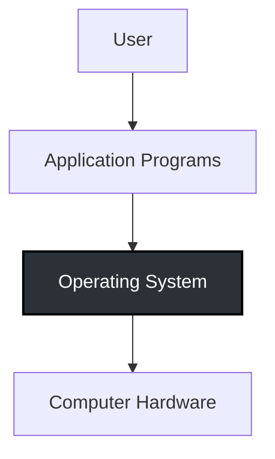
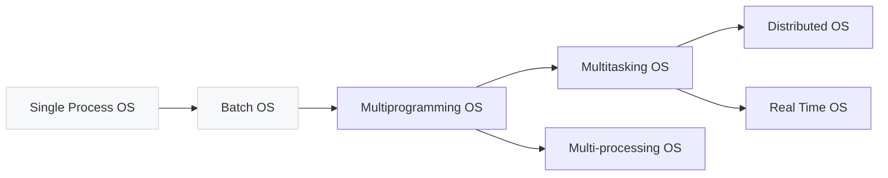
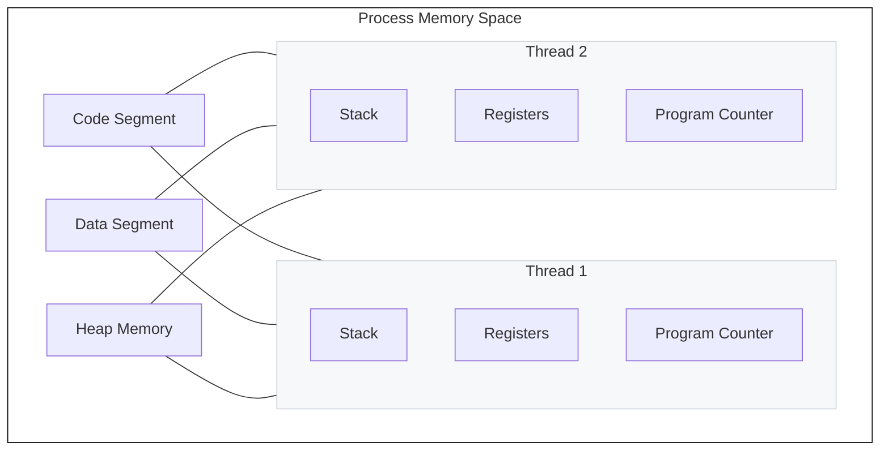

# Day 1: Operating Systems & Concurrency - Ultimate Interview Guide

> **NOTE:**
> Welcome to Day 1 of the ultimate Operating Systems interview preparation guide. This document is engineered for you to confidently crack any high-level technical interview. Memorize this document to confidently address any question related to OS fundamentals.

---

## Topic 1: Introduction to Operating Systems

### Concept Explanation

> **TIP:**
> **Beginner Explanation**
> Imagine a computer hardware system as a massive factory, and the applications (like your browser or text editor) as workers. An Operating System (OS) is the Factory Manager. It tells workers what to do, ensures they do not fight over tools, and makes sure everything runs efficiently.

> **IMPORTANT:**
> **Intermediate Explanation**
> An Operating System is a piece of system software that operates and controls the computer system. It acts as an intermediary between user applications and the computer hardware. Its primary roles are managing all resources (hardware and software) and providing an environment where a user can execute programs conveniently and efficiently.

> **WARNING:**
> **Advanced Explanation & Internal Working**
> At its core, an OS is a collection of system software and an interrupt-driven program. It relies on a kernel operating in a privileged mode. When an application needs hardware access, it executes a system call. The CPU switches from User Mode to Kernel Mode, allowing the OS to safely execute hardware instructions, provide isolation, and manage memory. 

**Why it exists & What problem it solves:**
Without an OS, applications would be bulky and complex, containing custom code for hardware interaction. A single application could exploit all system resources, and there would be zero memory protection between competing applications. 

**Advantages:** 
Hides hardware complexity (Abstraction), prevents resource exploitation, provides memory protection and isolation, and acts as a centralized resource manager (Arbitration).

**Disadvantages:** 
Introduces execution overhead. Context switching and crossing the user-kernel boundary consume CPU cycles.

### Visual Architecture

### Comprehensive Interview Questions

#### Q1. Differentiate between Application Software and System Software.

##### Short Interview Answer
Application software performs specific tasks for the user (like browsing the web). System software operates and controls the computer system itself, providing the underlying platform for application software to run.

##### Detailed Answer
In an interview context, you should highlight that Application Software is dependent on System Software. Application software runs in User Mode and has no direct access to hardware. It must request resources. System software, specifically the Operating System kernel, runs in Kernel Mode, has direct access to hardware, and acts as the resource allocator. 

##### Real Life Analogy
System software is the stage and the theater management. Application software is the actor performing the play. The actor cannot perform without the stage, but the stage exists independently of any specific actor.

##### Real World Example
- **Application Software:** Google Chrome, Microsoft Word.
- **System Software:** Windows 11, Linux Kernel.

##### When should you use it?
Use application software to fulfill specific business needs. Use system software when building the infrastructure for a computing device.

##### When should you NOT use it?
Do not build application software that attempts to bypass system software for direct hardware control.

##### Common Mistakes
Candidates often categorize background applications (like antivirus scanners) as system software. If it does not manage the core hardware resources, it is an application running on top of the OS.

##### Interview Follow-up Questions
- *Cross Question:* Is a device driver an application or system software?
  - *Answer:* It is system software because it directly controls hardware components.

##### Memory Trick
**A**pplication = **A**ction for user. **S**ystem = **S**tage for application.

##### One-Line Revision
Application software serves the user; System software serves the application.

---

#### Q2. What is an Operating System and what are its primary functions?

##### Short Interview Answer
An OS is a collection of system software that manages hardware resources. Its primary functions include hardware access, acting as an interface, resource management (arbitration), hiding hardware complexity (abstraction), and facilitating program execution with isolation.

##### Detailed Answer
The OS is the ultimate Resource Manager. It allocates CPU, memory, files, and security contexts. 
It provides **Abstraction**: hiding the messy details of hardware behind clean interfaces.
It provides **Arbitration**: allocating CPU time and memory space fairly among competing applications to prevent resource exploitation.
It facilitates execution by providing isolation and protection, ensuring one buggy process cannot read or overwrite another process's memory.

##### Real Life Analogy
Think of the OS as the Government. A government does not run businesses directly, but it provides infrastructure, enforces laws (security), and allocates resources (taxes/land) so businesses (applications) can function.

##### Real World Example
- **Google:** Android OS manages mobile battery life efficiently by killing background apps (Resource Management).

##### When should you use it?
Always, on general-purpose computers, servers, smartphones, and IoT devices.

##### When should you NOT use it?
On bare-metal embedded systems (like a simple digital thermometer) where overhead is unacceptable.

##### Common Mistakes
Defining the OS simply as "an interface." Interviewers want to hear precise technical terms: *Resource Allocator*, *Abstraction*, *Arbitration*, and *Isolation*.

##### Interview Follow-up Questions
- *Trick Question:* What is an OS made up of?
  - *Answer:* A collection of system software.

##### Memory Trick
**ARA:** **A**bstraction, **R**esource management, **A**rbitration.

##### One-Line Revision
OS = Hardware Abstraction + Resource Arbitration + Memory Protection.

---

#### Q3. What would exactly happen if a computer had no Operating System?

##### Short Interview Answer
Without an OS, applications would be bulky and complex, requiring custom code for hardware interaction. There would be no memory protection, allowing one app to exploit all resources and crash the system.

##### Detailed Answer
If there were no OS, the concept of a generalized application would disappear. A developer writing a word processor would have to write custom drivers for every keyboard and monitor. 
Furthermore, there would be no **Arbitration**. If Application A decides to loop infinitely, Application B would never get CPU time (Resource Exploitation). There would be no **Isolation**, causing memory corruption.

##### Real Life Analogy
Imagine a busy intersection without traffic lights or a police officer (the OS). Every driver (application) would try to cross at once, leading to collisions (memory corruption) and gridlock (resource exploitation).

##### Real World Example
Early computers in the 1950s ran without operating systems. Programmers physically loaded punch cards and manually mapped memory addresses.

##### When should you use it?
Simulate a "no OS" environment only when writing bare-metal firmware.

##### When should you NOT use it?
Never attempt to bypass the OS in enterprise application development.

##### Common Mistakes
Assuming the computer simply "would not turn on." The hardware would power on, but you would be stuck looking at a blank screen.

##### Interview Follow-up Questions
- *Cross Question:* If an OS prevents resource exploitation, how does it regain control from an infinite loop?
  - *Answer:* Through hardware Timer Interrupts.

##### Memory Trick
No OS = **B.E.N.** ( **B**ulky code, **E**xploitation of resources, **N**o memory protection).

##### One-Line Revision
No OS means zero abstraction, total hardware dependency, and zero application security.

---

### Memory Retention: Topic 1

#### Quick Revision
* **10-second revision:** OS connects apps to hardware. It manages resources and abstracts complexity.
* **30-second revision:** OS acts as a resource allocator and control program. It uses Dual-Mode operation to protect the system. User apps make system calls to request hardware access.
* **1-minute revision:** Without an OS, apps are bulky and complex, exploiting resources with no memory protection. The OS provides isolation, acts as an arbitrator for CPU/Memory, and hides underlying hardware complexity.

#### Interview Cheat Sheet
- **Key Terms:** Abstraction, Arbitration, Kernel, User Mode, System Call.
- **Functions:** Access hardware, interface, resource management, hides complexity, execution facilitation.

#### Common Interview Traps
* **Trap:** "OS executes my code." -> *Correction:* The CPU executes your code. The OS just schedules it.

---

## Topic 2: Types of Operating Systems

### Concept Explanation

> **TIP:**
> **Beginner Explanation**
> Operating Systems have evolved like transportation. First, we had single-seater manual cars (Single Process). Then came buses that wait for passengers to fill up before moving (Batch Processing). Then cars carrying multiple people concurrently (Multiprogramming/Multitasking), and finally fleets of cars working together (Distributed OS).

> **IMPORTANT:**
> **Intermediate Explanation**
> The OS has specific goals: Maximum CPU utilization, less process starvation, and higher priority job execution. To achieve this, OS architectures evolved.
> 1. **Single Process OS:** Only 1 process executes at a time from the ready queue. (Oldest)
> 2. **Batch-processing OS:** Users prepare jobs using punch cards. Operators sort jobs into batches with similar needs and submit them. All jobs of one batch are executed together.
> 3. **Multi-programming OS:** Increases CPU utilization by keeping multiple jobs in memory. Switch happens when the current process goes to a wait state.
> 4. **Multitasking OS:** A logical extension of multiprogramming. Able to run more than one task simultaneously via time sharing.
> 5. **Multi-processing OS:** More than 1 CPU in a single computer.
> 6. **Distributed OS:** Manages bunches of resources across loosely connected autonomous, physically separate nodes.
> 7. **Real Time OS:** Error-free computations within tight-time boundaries.

> **WARNING:**
> **Advanced Explanation & Internal Working**
> In a batch system, CPU becomes idle during I/O operations and may lead to starvation as priorities cannot be set. Multiprogramming reduces CPU idle time through context switching on I/O. Multitasking reduces CPU idle time even further by using context switching based on time-sharing. Multiprocessing increases reliability (if 1 CPU fails, the other can work), ensures better throughput, and results in lesser process starvation. 

### Visual Architecture

### Comprehensive Interview Questions

#### Q4. What are the main goals of an Operating System and what is a Single Process OS?

##### Short Interview Answer
The main goals of an OS are to ensure Maximum CPU utilization, lessen process starvation, and guarantee higher priority job execution. A Single Process OS is the oldest type, where only 1 process executes at a time from the ready queue.

##### Detailed Answer
In early computing, maximizing the expensive CPU's time was critical. A Single Process OS failed at this because it processed one task entirely before starting the next. If that task waited for I/O, the CPU sat completely idle, violating the goal of maximum CPU utilization and causing massive starvation for queued processes.

##### Real Life Analogy
A Single Process OS is like a single-lane drive-through where if one customer takes 20 minutes to decide, every other car behind them is completely stuck (starvation).

##### Real World Example
MS-DOS (1981) was largely a single-tasking operating system.

##### When should you use it?
Only on extremely primitive legacy hardware where concurrent execution is impossible.

##### When should you NOT use it?
On any modern computing architecture.

##### Common Mistakes
Failing to mention the three specific goals of an OS (Max utilization, less starvation, high priority execution) when discussing OS evolution.

##### Interview Follow-up Questions
- *Cross Question:* Does a Single Process OS use context switching?
  - *Answer:* No, because there is no other process to switch to until the current one terminates.

##### Memory Trick
**Single** = **S**tarvation is high, **I**dle time is high.

##### One-Line Revision
Single Process OS runs exactly one job at a time, resulting in poor CPU utilization.

---

#### Q5. Describe a Batch-processing OS. What are its critical limitations?

##### Short Interview Answer
In a Batch-processing OS, users prepare jobs on punch cards and submit them to an operator. The operator sorts jobs with similar needs into batches. All jobs in a batch execute together. Its limitations are that priorities cannot be set, starvation occurs, and the CPU becomes idle during I/O operations.

##### Detailed Answer
The Batch OS was the first attempt to automate job sequencing. Instead of humans loading programs one by one, batches were fed. However, it was strictly sequential within the batch. If Job A in Batch 1 needed to read from a tape drive (I/O), the CPU halted and waited. Furthermore, if a long batch was executing, a short, critical job submitted later could not be prioritized, leading to starvation.

##### Real Life Analogy
Submitting your laundry to a service that washes clothes in batches (whites, colors). If your shirt is in the next batch, you must wait until the current batch is entirely finished, even if it's an emergency.

##### Real World Example
ATLAS at Manchester University (late 1950s - early 1960s) utilized early batch processing concepts.

##### When should you use it?
For massive, non-time-sensitive data processing tasks where user interaction is zero (e.g., end-of-day bank reconciliations).

##### When should you NOT use it?
When user interactivity and responsiveness are required.

##### Common Mistakes
Thinking Batch Processing allows concurrent execution. It does not; jobs execute strictly one after the other within the batch.

##### Interview Follow-up Questions
- *Cross Question:* How did OS designers fix the CPU idle time during I/O in batch systems?
  - *Answer:* By inventing Multiprogramming.

##### Memory Trick
**Batch** = **B**lindly runs together, **A**llows zero priorities, **T**errible idle time, **C**auses starvation, **H**ardly responsive.

##### One-Line Revision
Batch OS sorts similar jobs into sequential batches but suffers from CPU idling during I/O.

---

#### Q6. How does Multiprogramming increase CPU utilization?

##### Short Interview Answer
Multiprogramming increases CPU utilization by keeping multiple jobs (both code and data) in the memory simultaneously. The OS ensures the CPU always has one to execute. A context switch happens only when the current process goes to a wait state (like I/O).

##### Detailed Answer
In multiprogramming, the CPU idle time is drastically reduced. If Process P1 is executing and requires user input or disk read, the CPU does not sit idle. The OS performs a context switch and begins executing Process P2. As long as there are jobs in memory, the CPU is never idle.

##### Real Life Analogy
A chef (CPU) cooking soup (P1) and baking a cake (P2). When the cake is in the oven (wait state/I/O), the chef does not stand idle; they immediately start stirring the soup.

##### Real World Example
THE system by Dijkstra (early 1960s) was an early multiprogramming system.

##### When should you use it?
When you have multiple I/O bound jobs and want to maximize hardware efficiency.

##### When should you NOT use it?
When jobs are purely CPU-bound and never enter a wait state, multiprogramming behaves exactly like a batch system and causes starvation.

##### Common Mistakes
Candidates often confuse the trigger for context switching. In Multiprogramming, the switch occurs strictly due to a wait state (I/O), not a timer.

##### Interview Follow-up Questions
- *Trick Question:* Does Multiprogramming use multiple CPUs?
  - *Answer:* No, it uses a single CPU.

##### Memory Trick
Multi**program**ming = Programs wait for I/O.

##### One-Line Revision
Multiprogramming eliminates CPU idle time by switching processes during I/O wait states.

---

#### Q7. What is Multitasking and how is it a logical extension of Multiprogramming?

##### Short Interview Answer
Multitasking is a logical extension of multiprogramming that enables running more than one task simultaneously. It uses context switching and time sharing to rapidly switch the single CPU between processes, increasing responsiveness and further reducing CPU idle time.

##### Detailed Answer
While multiprogramming maximizes CPU utilization, it fails at user responsiveness if a process never requests I/O. Multitasking solves this by introducing Time Sharing. The OS forcibly preempts the running process after a specific time quantum (e.g., 10ms) and switches to the next process. This context switching happens so fast that it creates the illusion of simultaneous execution for the user.

##### Real Life Analogy
A chef rapidly chopping onions for 10 seconds, then stirring soup for 10 seconds, going back and forth so both dishes progress evenly, creating the illusion that both are being prepared simultaneously.

##### Real World Example
CTSS at MIT (early 1960s) pioneered time-sharing. Modern desktop OS like Windows NT heavily utilize multitasking.

##### When should you use it?
For any interactive computing environment (desktops, mobile phones) where users require immediate responsiveness.

##### When should you NOT use it?
On hard Real-Time systems where forced time-slicing might cause a critical task to miss a strict deadline.

##### Common Mistakes
Saying Multitasking is parallel execution. On a single CPU, it is concurrent execution, not parallel execution.

##### Interview Follow-up Questions
- *Cross Question:* What triggers the context switch in Multitasking?
  - *Answer:* A hardware timer interrupt indicating the time slice has expired.

##### Memory Trick
Multi**task**ing = **T**ime Sharing.

##### One-Line Revision
Multitasking uses time-slicing to guarantee responsiveness and concurrent execution.

---

#### Q8. What is a Multi-processing OS and what are its core advantages?

##### Short Interview Answer
A Multi-processing OS utilizes more than 1 CPU in a single computer. Its core advantages are increased reliability (if 1 CPU fails, others can work), better throughput, and lesser process starvation.

##### Detailed Answer
Unlike multitasking which creates an illusion on a single CPU, multi-processing provides true parallel execution. If the system has 4 CPUs, 4 processes can execute at the exact same physical millisecond. If one CPU is working on a long, heavy process, other queued processes can be executed on the other CPUs, significantly reducing starvation.

##### Real Life Analogy
Instead of one chef switching between tasks rapidly, you hire four separate chefs in the kitchen.

##### Real World Example
Modern servers running Linux with multi-core Intel/AMD processors utilize multi-processing OS architectures.

##### When should you use it?
For high-performance computing, large-scale databases, and servers requiring massive throughput.

##### When should you NOT use it?
When hardware budget or power consumption is strictly limited, as multiple CPUs require complex cache-coherency protocols and power.

##### Common Mistakes
Confusing Multitasking (1 CPU, time-sharing) with Multi-processing (>1 CPU, true parallel).

##### Interview Follow-up Questions
- *Trick Question:* Does a multi-processing OS eliminate the need for multitasking?
  - *Answer:* No. If you have 4 CPUs but 100 processes, the OS must still use multitasking on each individual CPU.

##### Memory Trick
Multi-**process**ing = Multiple **Processors** (CPUs).

##### One-Line Revision
Multi-processing utilizes multiple physical CPUs to achieve true parallelism and high reliability.

---

#### Q9. Describe a Distributed Operating System.

##### Short Interview Answer
A Distributed OS manages bunches of resources (>=1 CPUs, >=1 memory, >=1 GPUs) across loosely connected autonomous, interconnected computer nodes. It acts as a collection of independent, networked, communicating, and physically separate computational nodes.

##### Detailed Answer
In a distributed OS, the user perceives the system as a single cohesive machine, but under the hood, the workload is distributed across multiple physical machines over a network. The OS handles load balancing, data replication, and fault tolerance across these independent nodes automatically.

##### Real Life Analogy
A global corporation (Distributed OS) that operates as a single brand but consists of thousands of independent franchise stores (nodes) communicating with each other.

##### Real World Example
LOCUS was a pioneering distributed OS. Today, massive cloud infrastructures emulate distributed OS behaviors to manage thousands of server racks.

##### When should you use it?
When building highly scalable, fault-tolerant global applications.

##### When should you NOT use it?
For simple, localized applications where network latency between nodes would degrade performance.

##### Common Mistakes
Confusing a Network OS (where nodes are aware they are separate) with a Distributed OS (where the separation is completely abstracted from the user).

##### Interview Follow-up Questions
- *Cross Question:* What is the main bottleneck in a Distributed OS?
  - *Answer:* Network latency and maintaining data consistency across physically separate nodes.

##### Memory Trick
**Distributed** = **D**ecentralized physical nodes acting as one.

##### One-Line Revision
Distributed OS abstracts multiple networked autonomous machines into a single logical system.

---

#### Q10. What is a Real-Time Operating System (RTOS)?

##### Short Interview Answer
An RTOS guarantees error-free computations within strict, tight-time boundaries. It is designed to process data as it comes in, typically without buffering delays.

##### Detailed Answer
In an RTOS, logical correctness is not enough; the result must be produced within a guaranteed time limit (deadline). 
- **Hard RTOS:** Missing the deadline results in total system failure.
- **Soft RTOS:** Missing the deadline degrades performance but is tolerable.

##### Real Life Analogy
Catching a falling glass. It does not matter if you grab perfectly; if you are 1 second late, the glass shatters (Hard RTOS).

##### Real World Example
ATCS (Air Traffic Control Systems), robotics, and automotive braking systems.

##### When should you use it?
For mission-critical embedded systems where timing is a matter of life or death.

##### When should you NOT use it?
For general-purpose computing where user interface richness and throughput are more important than microsecond predictability.

##### Common Mistakes
Assuming RTOS means "incredibly fast." RTOS means "predictable and deterministic," not necessarily high throughput.

##### Interview Follow-up Questions
- *Trick Question:* Can an RTOS use virtual memory?
  - *Answer:* Generally no, because page faults introduce unpredictable delays, violating tight-time boundaries.

##### Memory Trick
**RTOS** = **R**ight **T**ime **O**r **S**hatter.

##### One-Line Revision
RTOS guarantees deterministic execution within strict time deadlines.

---

### Memory Retention: Topic 2

#### Quick Revision
* **10-second revision:** Batch groups jobs. Multiprogramming switches on I/O. Multitasking switches on time. Multiprocessing uses >1 CPUs. Distributed uses networked nodes. RTOS focuses on deadlines.
* **30-second revision:** OS evolution was driven by maximizing CPU utilization. Multitasking is the basis of modern PC operating systems. Distributed OS connects independent nodes loosely. RTOS strictly bounds computation time.

#### Interview Cheat Sheet
- **Batch:** CPU idle on I/O, no priorities.
- **Multiprogramming:** Switch on wait state.
- **Multitasking:** Logical extension, time sharing.
- **Multi-processing:** Better throughput, >1 CPU.
- **Distributed:** Autonomous, interconnected nodes.
- **RTOS:** Tight-time boundaries.

#### Common Interview Traps
* **Trap:** Concurrency vs Parallelism. Concurrency is dealing with lots of things at once (Multitasking). Parallelism is doing lots of things at once (Multiprocessing).

---

## Topic 3: Multi-Tasking vs Multi-Threading

### Concept Explanation

> **TIP:**
> **Beginner Explanation**
> A **Program** is an executable file stored on your disk (like a recipe in a book). 
> A **Process** is that program under execution, residing in your computer's primary memory (RAM) (like a chef actively cooking). 
> A **Thread** is a single sequence stream within that process (like the chef's individual hand). 

> **IMPORTANT:**
> **Intermediate Explanation**
> **Multi-Tasking** is the execution of more than one task simultaneously. It involves more than 1 process being context switched. The OS allocates separate memory and resources to each program. Isolation and memory protection exist.
> **Multi-Threading** achieves parallelism by dividing a process into several different sub-tasks (threads), which have independent paths of execution. There is NO isolation or memory protection; resources and memory allocated to the process are shared among its threads.

> **WARNING:**
> **Advanced Explanation & Internal Working**
> **Thread Scheduling:** Threads execute within the runtime and are assigned processor time slices by the OS based on priority.
> **Process Context Switching:** The OS saves the current state of a process and switches to another by restoring its state. This *includes* switching of the memory address space. It is slow, and the CPU's cache state is flushed.
> **Thread Context Switching:** The OS saves the current state of a thread and switches to another thread of the *same* process. It *doesn't include* switching of memory address space (only Program Counter, registers & stack are included). It is fast, and the CPU's cache state is preserved.

### Visual Architecture

### Comprehensive Interview Questions

#### Q11. Define Program, Process, and Thread.

##### Short Interview Answer
A **Program** is a compiled, executable file stored on disk. A **Process** is a program under execution residing in RAM. A **Thread** is a single sequence stream and independent path of execution within a process, often called a light-weight process.

##### Detailed Answer
A program is passive code. When launched, the OS allocates memory and creates a Process Control Block (PCB), turning it into an active Process. A process is heavyweight and isolated. To achieve parallelism within a process, it is divided into Threads. Threads share the process's memory space but maintain their own execution path (Program Counter, Registers, and Stack).

##### Real Life Analogy
- Program = The script of a play (written down).
- Process = The actual performance happening on stage.
- Thread = The individual actors performing simultaneously on that single stage.

##### Real World Example
- **Text Editor:** When typing, one thread handles the spell-checking, another formats the text, and another saves the text to disk concurrently.

##### When should you use it?
Use processes when you need strict isolation and security. Use threads when tasks are highly cooperative and need to share data rapidly.

##### When should you NOT use it?
Do not use threads for executing untrusted, third-party code within a secure application, as threads lack memory protection.

##### Common Mistakes
Failing to specify that a Program resides on Disk, while a Process resides in RAM.

##### Interview Follow-up Questions
- *Cross Question:* Why are threads called "light-weight processes"?
  - *Answer:* Because they do not require the OS to allocate a new, isolated memory address space upon creation.

##### Memory Trick
**P**rogram = **P**assive on disk. **P**rocess = **P**laying in RAM.

##### One-Line Revision
Programs are static files; Processes are running programs; Threads are concurrent paths within a process.

---

#### Q12. Compare Multi-Tasking and Multi-Threading based on Isolation and Memory Protection.

##### Short Interview Answer
In Multi-Tasking, isolation and memory protection exist; the OS allocates separate memory to each process. In Multi-Threading, there is no isolation or memory protection; all threads of a process share the same memory and resources allocated to that process.

##### Detailed Answer
Multi-Tasking relies heavily on the OS to enforce boundaries. If Process A attempts to access Process B's memory, the OS triggers a Segmentation Fault. 
Multi-Threading relies on developer discipline. Because threads share the exact same memory space (Data segment and Heap), Thread A can freely read or overwrite variables modified by Thread B. This makes communication extremely fast but introduces dangerous race conditions and requires synchronization mechanisms like Mutexes.

##### Real Life Analogy
- Multi-Tasking: Workers in separate, locked rooms. They cannot see or touch each other's work.
- Multi-Threading: Workers sitting at the exact same table, sharing the same documents.

##### Real World Example
- **Browser tabs:** Modern browsers use Multi-Tasking (separate processes for tabs) so if one tab crashes, the others survive (Isolation). 

##### When should you use it?
Use Multi-Threading when large volumes of data need to be processed concurrently by multiple workers without the overhead of Inter-Process Communication (IPC).

##### When should you NOT use it?
When a single crash or memory leak in a sub-task should not bring down the entire application.

##### Common Mistakes
Candidates state that "threads share everything." Interviewers look for the correction: Threads share memory, but they do NOT share their Stack or Registers.

##### Interview Follow-up Questions
- *Trick Question:* If a thread encounters a fatal error, what happens to the process?
  - *Answer:* Because there is no isolation, a fatal error in one thread crashes the entire process.

##### Memory Trick
Multi-**Task**ing = **T**otally Isolated. Multi-**Thread**ing = **T**ogether Shared.

##### One-Line Revision
Multi-Tasking protects memory between tasks; Multi-Threading sacrifices protection for shared memory speed.

---

#### Q13. Explain Thread Scheduling.

##### Short Interview Answer
Even though threads execute within the runtime of a process, they are scheduled for execution based on their priority and are assigned processor time slices by the operating system.

##### Detailed Answer
Thread scheduling determines which thread gets to utilize the CPU at any given moment. In modern OS architectures (Kernel-level threading), the OS scheduler is fully aware of threads. It uses algorithms (like Round Robin or Priority Queues) to assign CPU time slices to each thread. If a high-priority thread becomes ready, it can preempt a lower-priority thread.

##### Real Life Analogy
A manager (OS scheduler) assigning 5-minute speaking slots (time slices) to team members (threads) in a meeting based on their rank (priority).

##### Real World Example
In a video game, the rendering thread is scheduled with a higher priority than the background audio downloading thread to prevent visual lag.

##### When should you use it?
Always configure thread priorities carefully in latency-sensitive applications.

##### When should you NOT use it?
Avoid assigning highest priority to background batch processing threads, as it will starve the user interface threads.

##### Common Mistakes
Assuming that a process manages its own thread scheduling entirely. While true for user-level threads, modern OSs handle scheduling at the kernel level.

##### Interview Follow-up Questions
- *Cross Question:* What happens if a low-priority thread holds a lock that a high-priority thread needs?
  - *Answer:* This causes Priority Inversion, solved via Priority Inheritance.

##### Memory Trick
**S**cheduling = **S**lices based on priority.

##### One-Line Revision
The OS assigns CPU time slices to threads based on their priority.

---

#### Q14. Deep Dive: Thread Context Switching vs Process Context Switching.

##### Short Interview Answer
Process context switching is slow because it involves switching the memory address space and flushing the CPU cache. Thread context switching is fast because it only involves swapping the Program Counter, registers, and stack, leaving the memory address space unchanged and the CPU cache preserved.

##### Detailed Answer
When the OS switches from Process A to Process B, it must save Process A's state. Crucially, it must update the Memory Management Unit (MMU) to point to Process B's page tables. This switching of the memory address space causes the Translation Lookaside Buffer (TLB) and CPU caches to be flushed, resulting in a massive performance penalty (cache misses).
When switching from Thread 1 to Thread 2 within the *same* process, the memory address space is identical. The OS does not flush the cache or TLB. It merely saves the CPU registers and stack pointer. This preserved cache state makes thread switching exceptionally fast.

##### Real Life Analogy
- **Process Switch:** Moving to a new office building. You have to pack your desk, drive, unpack, and set up a new environment. (Slow)
- **Thread Switch:** Swiveling your chair to look at a different monitor on the same desk. (Fast)

##### Real World Example
High-performance web servers (like Nginx) use thread pools to handle thousands of concurrent requests rapidly without the massive overhead of process context switching.

##### When should you use it?
Design systems to rely on thread context switching when handling thousands of concurrent, short-lived tasks.

##### When should you NOT use it?
Do not rely on thread context switching if tasks belong to different, mutually untrusting users.

##### Common Mistakes
Failing to mention the **CPU Cache state** and **Memory Address Space**. These are the definitive technical reasons why thread switching is faster.

##### Interview Follow-up Questions
- *Cross Question:* Which components are included in a Thread Context Switch?
  - *Answer:* Only the Program Counter, CPU registers, and the stack pointer.

##### Memory Trick
**Process Switch** = **P**urges Cache. **Thread Switch** = **T**reasure Cache (Preserved).

##### One-Line Revision
Thread switching is lightweight because it preserves the memory address space and CPU cache.

---

### Memory Retention: Topic 3

#### Quick Revision
* **10-second revision:** Program on disk, Process in RAM, Thread is a path inside a process.
* **30-second revision:** Multitasking uses isolated processes, 1 CPU, context switched. Multithreading divides a process, shares resources without protection, >=1 CPU.
* **1-minute revision:** Process context switching includes switching memory address space and flushing CPU cache, making it slow. Thread context switching preserves memory space and cache state (only PC, registers, stack switch), making it incredibly fast.

#### Interview Cheat Sheet
| Feature | Thread Context Switching | Process Context Switching |
| :--- | :--- | :--- |
| **State Saved** | State of thread | State of process |
| **Memory Address Space** | Doesn't include switching | Includes switching |
| **Speed** | Fast | Slow |
| **CPU Cache State** | Preserved | Flushed |

#### Common Interview Traps
* **Trap:** "Threads do not have context switching overhead." -> *Correction:* They do have overhead (saving registers/stack), but it is significantly *less* than process context switching overhead.

---

## End of File: Day 1 Mastery

### Key Takeaways
1. An Operating System is defined by its ability to act as a Resource Manager and Hardware Abstractor.
2. OS Evolution (Batch -> Multiprogramming -> Multitasking) was driven strictly by the need to maximize CPU utilization and responsiveness.
3. Multi-Tasking isolates; Multi-Threading shares.
4. The speed of Thread Context Switching is derived directly from the preservation of the Memory Address Space and CPU Cache State.

### Most Important Interview Questions
1. Differentiate Process Context Switching and Thread Context Switching.
2. Explain how Multiprogramming increases CPU utilization.
3. Why does Multithreading lack isolation and memory protection?

### 20 Rapid Fire Questions & Answers

1. **Q:** What is an executable compiled code stored in disk? **A:** Program.
2. **Q:** What is a program under execution in primary memory? **A:** Process.
3. **Q:** What is an independent path of execution in a process? **A:** Thread.
4. **Q:** Do threads share the stack? **A:** No, they have their own stack and registers.
5. **Q:** Do threads share the memory allocated to the process? **A:** Yes.
6. **Q:** What happens to the CPU cache state during a process context switch? **A:** It is flushed.
7. **Q:** What happens to the CPU cache state during a thread context switch? **A:** It is preserved.
8. **Q:** How many CPUs are in a Multitasking OS? **A:** 1.
9. **Q:** How many CPUs in a Multi-processing OS? **A:** More than 1.
10. **Q:** Which OS strictly adheres to computations within tight-time boundaries? **A:** Real Time OS (RTOS).
11. **Q:** Who allocates memory to a process? **A:** The Operating System.
12. **Q:** Does Thread context switching include switching memory address space? **A:** No.
13. **Q:** What OS connects multiple autonomous, independent nodes? **A:** Distributed OS.
14. **Q:** What was the oldest OS type where only 1 process executes at a time? **A:** Single process OS.
15. **Q:** In which OS can priorities not be set, leading to starvation? **A:** Batch-processing OS.
16. **Q:** What triggers a context switch in Multiprogramming? **A:** The current process going to a wait state (I/O).
17. **Q:** What concept is used in Multitasking to reduce idle time further? **A:** Time sharing.
18. **Q:** What software performs specific tasks for the user? **A:** Application Software.
19. **Q:** Give an example of an RTOS use case. **A:** Air Traffic control, ROBOTS.
20. **Q:** What happens if a single thread crashes in a multithreaded architecture? **A:** The entire process crashes due to shared memory.

### Top 10 Mistakes Candidates Make
1. Asserting that Threads share everything. (They own their Stack and Registers).
2. Confusing Multitasking (1 CPU, concurrent) with Multi-processing (>1 CPU, parallel).
3. Ignoring the fact that Process Context Switching flushes the CPU cache.
4. Thinking Batch Processing allows jobs to run concurrently.
5. Assuming the OS is constantly running in the background, rather than being interrupt-driven.
6. Failing to differentiate between Application Software (user tasks) and System Software (platform operation).
7. Believing RTOS simply means "fast execution." (It means deterministic deadline execution).
8. Overlooking that Multiprogramming context switches only on I/O wait states.
9. Forgetting that Thread Scheduling is still handled by the OS based on priority and time slices.
10. Describing an OS as merely an interface without mentioning Resource Management and Abstraction.

### Interview Revision Checklist
- <input type="checkbox"> I can define an OS, System Software, and Application Software.
- <input type="checkbox"> I can list the goals of an OS.
- <input type="checkbox"> I can trace OS evolution from Single Process to RTOS.
- <input type="checkbox"> I can clearly define Program, Process, and Thread.
- <input type="checkbox"> I can recite the exact differences in Thread vs Process context switching (Memory Space, Cache State, Speed).
- <input type="checkbox"> I have memorized the Rapid Fire answers and Top 10 mistakes.

### One-Page Cheat Sheet
- **OS:** System software. Hides complexity, acts as resource manager. Prevents resource exploitation.
- **Batch OS:** Similar jobs grouped. CPU idle during I/O. Starvation possible.
- **Multiprogramming OS:** Keeps multiple jobs in memory. Switches on wait state. Increases CPU util.
- **Multitasking OS:** Logical extension. Switches on time sharing. >1 task simultaneously.
- **Multi-processing OS:** >1 CPU. Better throughput, reliability.
- **Distributed OS:** Bunches of resources across autonomous interconnected nodes.
- **RTOS:** Computations within tight-time boundaries (ROBOTS).
- **Process:** Program in RAM. Isolated. Context switch includes memory space switch, cache flush. Slow.
- **Thread:** Path of execution in process. Light-weight. Shared memory. Context switch includes only PC/Registers/Stack, preserves cache. Fast.
