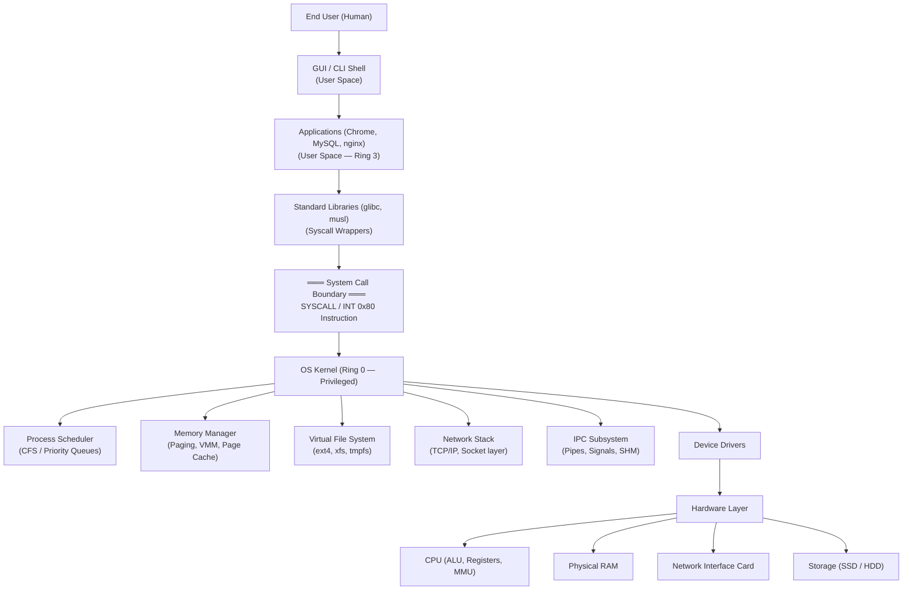
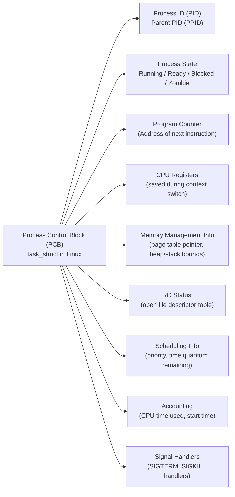
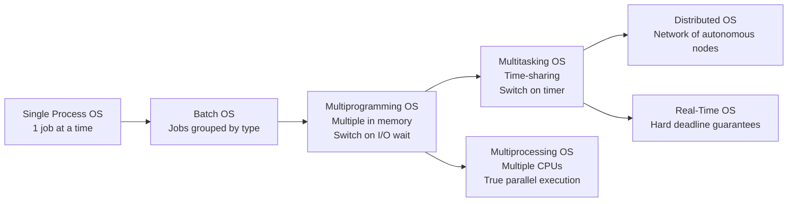
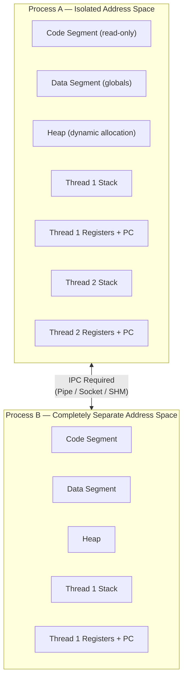
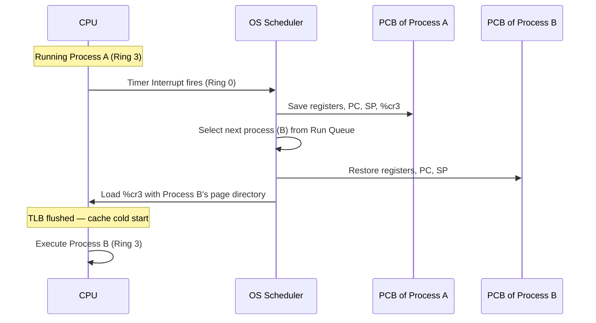
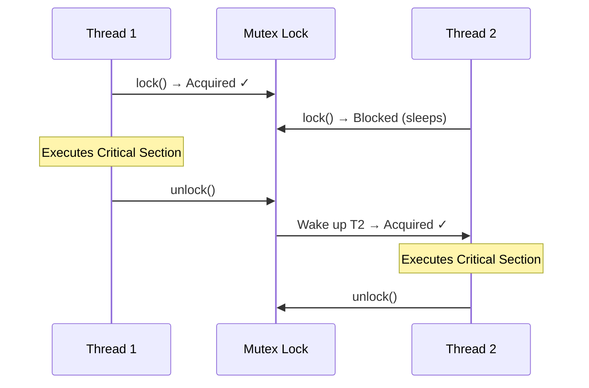
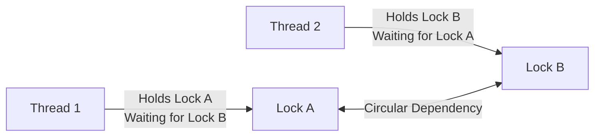
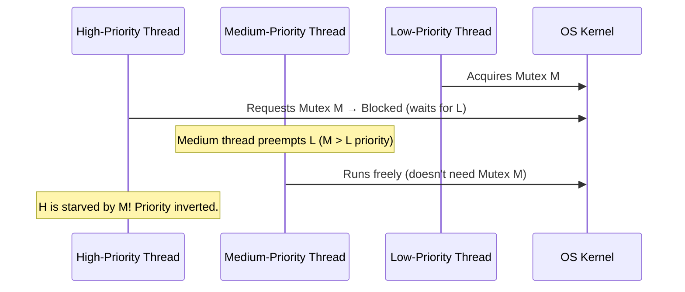
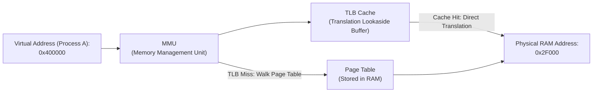
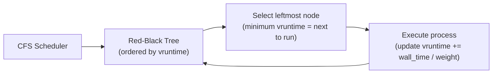

# Day 1: Operating Systems & Concurrency — The Ultimate Interview Encyclopedia

> **NOTE:**
> Welcome to Day 1 of the ultimate Computer Science Interview Encyclopedia. This document covers Operating System fundamentals from first principles to production-grade engineering — designed to prepare you for interviews at Google, Amazon, Meta, Microsoft, Goldman Sachs, Flipkart, Razorpay, Swiggy, Atlassian, and every top product-based company.

---

## Table of Contents

1. [Learning Roadmap — Why OS Knowledge?](#learning-roadmap)
2. [Introduction to Operating Systems](#topic1)
3. [Types of Operating Systems](#topic2)
4. [Multi-Tasking vs Multi-Threading](#topic3)
5. [Concurrency, Synchronization & Deadlocks](#topic4)
6. [Memory Management](#topic5)
7. [CPU Scheduling Algorithms — Theory & Problems](#topic6)
8. [FAANG-Level Interview Q&A](#faang-qa)
9. [Master Comparison Tables](#comparison-tables)
10. [Reinforcement — Rapid Fire & Checklist](#reinforcement)

---

## Section 1: Learning Roadmap — Why OS Knowledge? {#learning-roadmap}

### Why OS Matters in Tech Interviews

Operating System knowledge is tested in **every domain** of software engineering interviews:

| Role | OS Topics That Are Tested |
| :--- | :--- |
| **Backend / SDE** | Processes vs Threads, Context Switching, Deadlocks, Mutex/Semaphore, Scheduling |
| **SRE / DevOps** | Process states, OOM Killer, file descriptors, kernel scheduler tuning |
| **System Design** | Concurrency primitives, IPC mechanisms, memory model for distributed caches |
| **Database Engineering** | Page replacement, virtual memory, buffer pools, I/O scheduling |
| **Embedded / Firmware** | RTOS, interrupt handling, memory-mapped I/O, preemption |
| **Security** | Memory protection, privilege rings, privilege escalation, race conditions |

### OS Knowledge in System Design

*   When designing a high-concurrency API server: you need to know if threads or processes serve clients better and why (isolation vs shared memory overhead).
*   When designing a caching system: LRU vs LFU page replacement is directly borrowed from OS memory management.
*   When explaining database performance: buffer pools, mmap, and huge pages are OS-level concepts.
*   When discussing Kubernetes or Docker: namespaces, cgroups, and fork/exec are the OS primitives that enable containerization.

---

## Topic 1: Introduction to Operating Systems {#topic1}

### Concept Explanation

> **TIP:**
> **Beginner Explanation**
> Imagine a computer hardware system as a massive factory, and applications (browser, music player) as workers. An Operating System (OS) is the **Factory Manager**. It tells workers what to do, ensures they don't fight over tools (resources), and makes sure everything runs efficiently.

> **IMPORTANT:**
> **Intermediate Explanation**
> An OS is system software that operates and controls the computer system. It acts as an **intermediary** between user applications and computer hardware. Its primary roles are managing all resources (hardware and software) and providing a safe, efficient, convenient environment for program execution.

> **WARNING:**
> **Advanced Explanation**
> At its core, an OS is an **interrupt-driven program** residing in memory. It relies on a kernel operating in privileged mode. When an application needs hardware access, it executes a **system call** — the CPU switches from **User Mode (Ring 3)** to **Kernel Mode (Ring 0)**, allows the OS to safely execute hardware instructions, then returns. The OS is not constantly running; it is summoned by interrupts, system calls, and exceptions.

### OS Architecture — Full Diagram



### Process Control Block (PCB) — The OS's Process Identity Card

Every process in the system is represented by a **PCB** (also called the **task_struct** in Linux). It is the kernel's complete record of a process.



*   **Interview Tip:** When the OS performs a context switch, it saves the CPU registers, program counter, and stack pointer **into the PCB** of the outgoing process, then loads the saved values from the **incoming process's PCB**.

### Why the OS Exists — The 5 Core Problems It Solves

| Problem Without OS | OS Solution |
| :--- | :--- |
| Applications must write custom hardware code | **Abstraction** — OS hides hardware complexity behind clean APIs |
| One app can monopolize all CPU time | **Arbitration** — OS scheduler divides CPU time fairly |
| One app can read another app's memory | **Isolation / Memory Protection** — OS enforces virtual address spaces |
| Hardware interface is different per manufacturer | **Portability** — Device driver model standardizes hardware interaction |
| No management of files across power cycles | **Persistence** — File system manages permanent storage organization |

### Comprehensive Interview Questions

#### Q1. What is an OS and what are its primary functions?

##### Short Interview Answer
An OS is system software that acts as a **Resource Manager** and **Hardware Abstractor**. Its core functions are: hardware abstraction, resource arbitration, memory protection, isolation between processes, and facilitating program execution.

##### Detailed Answer
The OS is the ultimate resource manager. The key technical terms to use are:
- **Abstraction:** Hides hardware complexity behind a standardized API (e.g., `write()` works identically on SSD, RAM disk, or network socket).
- **Arbitration:** Allocates CPU, memory, and I/O bandwidth fairly among competing processes.
- **Isolation:** Ensures Process A cannot read or corrupt Process B's memory (via virtual address spaces).
- **Interrupt-Driven:** The kernel does not "run continuously." It is invoked by hardware interrupts, software traps, and system calls.

##### Real Life Analogy
The OS is the **Government**. Businesses (applications) don't manufacture roads (hardware); the government provides infrastructure, enforces laws (security/isolation), and allocates public resources (CPU/memory) so businesses can operate.

##### Real World Example
- Google's Android OS manages mobile battery life by terminating background apps (resource arbitration).
- Linux on AWS EC2 instances uses cgroups (control groups) to enforce per-container CPU/memory limits.

##### Memory Trick
**ARA:** **A**bstraction + **R**esource Management + **A**rbitration.

##### One-Line Revision
OS = Hardware Abstraction + Resource Arbitration + Memory Protection.

---

#### Q2. What would happen if a computer had no OS?

##### Short Interview Answer
Without an OS, applications would be bulky (containing custom hardware drivers), there would be zero memory protection (allowing resource exploitation), and the concept of multiple programs running is impossible.

##### Detailed Answer
- No **Abstraction**: Every application developer must write assembly code to talk directly to each brand of hardware.
- No **Arbitration**: If Application A runs an infinite loop, Application B never gets CPU time.
- No **Isolation**: Any bug in any program corrupts the entire system's memory.
- In the 1950s, this was reality. Programs were physically loaded via punch cards and ran on bare metal with no protection.

##### Interview Follow-up Questions
- *How does an OS forcibly regain control from an infinite loop?*
  - **Answer:** Via **hardware Timer Interrupts**. The OS programs a hardware timer (PIT/APIC) to fire at fixed intervals. When the timer fires, the CPU is forcibly yanked from the running process and delivers control to the kernel scheduler at Ring 0.

##### Memory Trick
No OS = **B.E.N.** — **B**ulky code, **E**xploitation of resources, **N**o memory protection.

---

### Memory Retention: Topic 1

#### Interview Cheat Sheet
- **Key Terms:** Abstraction, Arbitration, Isolation, Interrupt-driven, PCB, System Call.
- **OS is NOT always running** — it is event-driven (interrupts, syscalls, exceptions).
- **PCB** = the kernel's complete data record for every process.

#### Common Interview Traps
- **Trap:** "The OS executes my code." → **Correction:** The **CPU** executes your code. The OS only **schedules** it.
- **Trap:** "The OS is always running." → **Correction:** The kernel runs only when invoked (interrupt-driven design).

---

## Topic 2: Types of Operating Systems {#topic2}

### Concept Explanation

> **TIP:**
> **Beginner Explanation**
> OS types evolved like transportation: First a single horse cart (Single Process), then a train waiting for all passengers (Batch), then a rapid bus with timed stops (Multitasking), then multiple buses simultaneously (Multiprocessing), then a global airline network (Distributed OS).

> **IMPORTANT:**
> **Intermediate Explanation**
> OS evolution was driven by three goals: **Maximum CPU Utilization**, **Minimum Process Starvation**, and **Higher Priority Job Execution First**. Each OS type was invented to solve the failures of the previous one.

> **WARNING:**
> **Advanced Explanation**
> In Batch OS, CPU goes idle on I/O. Multiprogramming fixes idle CPU time but causes starvation for I/O-heavy jobs. Multitasking introduces time-sharing to prevent starvation using timer interrupts. Multiprocessing scales to true parallelism via SMP (Symmetric Multiprocessing). Distributed OS abstracts networked autonomous nodes as a single system. RTOS provides deterministic deadline guarantees.

### OS Evolution Flowchart



### Master OS Types Comparison Table

| OS Type | Trigger for Switch | CPU Count | Priority Support | Starvation Risk | Example |
| :--- | :--- | :--- | :--- | :--- | :--- |
| **Single Process** | Job completion | 1 | None | Extreme | MS-DOS |
| **Batch Processing** | Job completion | 1 | None (batch order) | High | IBM OS/360 |
| **Multiprogramming** | I/O wait state | 1 | Limited | Medium | THE (Dijkstra) |
| **Multitasking** | Timer interrupt | 1 | Yes | Low | Windows NT, macOS |
| **Multiprocessing** | Timer + Load Balancer | >1 | Yes | Very Low | Modern Linux (SMP) |
| **Distributed OS** | Network event | N (networked) | Global | Low | Plan 9, cloud clusters |
| **Real-Time OS** | Deadline scheduling | 1 or >1 | Hard deadlines | Zero tolerated | FreeRTOS, VxWorks |

### Comprehensive Interview Questions

#### Q3. What are the main goals of an OS and what is a Single Process OS?

##### Short Interview Answer
The main goals of an OS are: **Maximum CPU utilization**, **minimum process starvation**, and **guaranteed higher priority job execution**. A Single Process OS runs exactly 1 process at a time — the oldest and simplest architecture.

##### Memory Trick
**Single** = **S**tarvation is high, **I**dle time is high.

---

#### Q4. What is a Batch Processing OS and what are its critical limitations?

##### Short Interview Answer
In Batch OS, users prepare jobs on punch cards. An operator sorts jobs with similar needs into batches. All jobs in a batch execute sequentially. Limitations: **no priority support**, **CPU idles during I/O**, and **starvation** for jobs in later batches.

##### Interview Follow-up
- *How did OS designers fix CPU idle time in Batch OS?*
  - **Answer:** By inventing **Multiprogramming** — keeping multiple jobs in memory and switching to another when one goes to an I/O wait state.

---

#### Q5. How does Multiprogramming increase CPU utilization?

##### Short Interview Answer
Multiprogramming keeps multiple jobs simultaneously in RAM. When the running process enters an I/O wait state (blocked), the OS performs a context switch to another ready process, keeping the CPU busy instead of idle.

##### Detailed Answer
Context switch in multiprogramming is triggered **only by an I/O wait state**, not by a timer. If all processes are CPU-bound (never do I/O), multiprogramming degrades to single-process behavior. The key improvement: **CPU idle time ≈ 0** as long as at least one process is ready.

##### Common Mistakes
Candidates confuse the switch trigger. In **Multiprogramming** → switch on **I/O wait**. In **Multitasking** → switch on **timer**.

---

#### Q6. What is Multitasking and how is it a logical extension of Multiprogramming?

##### Short Interview Answer
Multitasking is Multiprogramming with **time-sharing**. Instead of waiting for a process to enter an I/O wait, the OS uses a hardware timer interrupt to **forcibly preempt** the running process after a time quantum (e.g., 10ms), switching to the next process, creating the illusion of simultaneity.

##### Common Mistakes
Saying Multitasking is parallel execution. On a single CPU, multitasking is **concurrent** (interleaved), not **parallel** (simultaneous).

---

#### Q7. What is a Distributed OS?

##### Short Interview Answer
A Distributed OS manages resources across **loosely coupled, autonomous, networked physical nodes**. The user perceives the entire cluster as a single unified system. It handles load balancing, data replication, and fault tolerance across nodes automatically.

##### Common Mistakes
Confusing a **Network OS** (nodes are explicitly aware they are separate) with a **Distributed OS** (separation is entirely abstracted from the user).

---

#### Q8. What is a Real-Time OS (RTOS)?

##### Short Interview Answer
An RTOS guarantees **deterministic computations within strict time deadlines**. Missing a deadline:
- **Hard RTOS:** System failure (e.g., automotive airbag deployment — 1ms late = fatality).
- **Soft RTOS:** Performance degradation, not failure (e.g., video streaming frame drop).

##### Common Mistakes
Assuming RTOS means "incredibly fast." RTOS means **predictable and deterministic**, not necessarily high throughput. An RTOS typically does NOT use virtual memory because **page faults introduce unpredictable delays** that violate time guarantees.

---

## Topic 3: Multi-Tasking vs Multi-Threading {#topic3}

### Concept Explanation

> **TIP:**
> **Beginner Explanation**
> A **Program** = a recipe written in a book (passive, on disk). A **Process** = a chef actively cooking from that recipe (in RAM). A **Thread** = each hand of that chef (independent execution within the same process).

> **IMPORTANT:**
> **Intermediate Explanation**
> **Multi-Tasking** runs multiple independent processes, each with their own isolated memory. **Multi-Threading** divides a single process into sub-tasks (threads) that share the same memory but maintain independent execution paths (stack, registers, program counter).

> **WARNING:**
> **Advanced Explanation**
> **Process Context Switch**: saves/restores the full PCB including the virtual memory page directory pointer (`%cr3` on x86). Changing `%cr3` flushes the TLB, causing significant cache cold-start penalty on the next process.
> **Thread Context Switch**: saves/restores only the thread's registers, stack pointer, and program counter into the **TCB (Thread Control Block)**. The `%cr3` register remains unchanged (shared address space), so the TLB and CPU L1/L2 caches stay hot.

### Process vs Thread Memory Layout



### Context Switching — Internal Mechanics



### Process vs Thread Comparison Table

| Feature | Process | Thread |
| :--- | :--- | :--- |
| **Memory Space** | Separate, isolated virtual address space | Shares parent process address space |
| **Code/Data/Heap** | Own copy | Shared with all threads |
| **Stack** | Own stack | Each thread has own private stack |
| **Registers** | Own (saved in PCB) | Own (saved in TCB) |
| **Context Switch** | Heavyweight (TLB flush, `%cr3` change) | Lightweight (only registers/stack) |
| **IPC Required** | Yes (pipes, sockets, shared memory) | No (directly share variables) |
| **Isolation** | Full — crash of one doesn't affect others | None — crash in one thread crashes all |
| **Creation Overhead** | High (`fork()` copies address space) | Low (thread API reuses address space) |
| **Crash Impact** | Only that process dies | Entire process dies |
| **Security** | OS enforces memory boundaries | Developer must enforce correctness |

### Comprehensive Interview Questions

#### Q9. Define Program, Process, and Thread.

##### Short Interview Answer
- **Program:** A compiled executable file **stored on disk** (passive).
- **Process:** A program **under execution in RAM** with its own isolated address space (active).
- **Thread:** A single **independent path of execution** within a process, sharing the process's memory (lightweight).

##### Detailed Answer
When a program is launched, the OS creates a **PCB**, allocates virtual memory, and loads the code — this is a Process. A thread is a sub-unit: it reuses the process's code, data, and heap but maintains its own execution context (Program Counter, registers, stack). Threads are called "light-weight processes" because creation does not require allocating a new virtual address space.

##### Memory Trick
**P**rogram = **P**assive (disk). **P**rocess = **P**laying (RAM). **T**hread = **T**ask inside a Process.

---

#### Q10. Deep Dive: Thread vs Process Context Switching.

##### Short Interview Answer
Process context switching is **slow** because it includes switching the virtual memory address space (modifying `%cr3`, flushing TLB). Thread context switching is **fast** because only registers, stack pointer, and program counter change — the address space and TLB remain identical.

##### Detailed Answer

**Process Context Switch (Heavyweight):**
1.  Save registers, PC (`%rip`), stack pointer (`%rsp`) into PCB.
2.  Switch `%cr3` to the new process's page directory base address.
3.  This causes automatic **TLB flush** (all cached virtual→physical translations invalidated).
4.  **CPU cache cold start** — L1/L2 caches now contain data from the old process; the new process suffers cache misses on all initial accesses.

**Thread Context Switch (Lightweight):**
1.  Save only registers, PC, and stack pointer into TCB.
2.  `%cr3` is **not changed** — threads share the same page directory.
3.  **TLB is NOT flushed** — all translations remain valid.
4.  CPU L1/L2 caches remain populated — **no cold start penalty**.

##### Memory Trick
**Process Switch = P**urges Cache. **Thread Switch = T**reasures Cache.

---

#### Q11. Inter-Process Communication (IPC) Mechanisms

Because processes have isolated memory, they need explicit mechanisms to share data. Threads within a process communicate directly via shared variables, but this introduces race conditions.

| IPC Mechanism | Description | Speed | Use Case |
| :--- | :--- | :--- | :--- |
| **Pipe** | Unidirectional byte stream between related processes | Medium | Shell pipelines (`ls \| grep`) |
| **Named Pipe (FIFO)** | Pipe accessible via filesystem path (unrelated processes) | Medium | Simple producer-consumer |
| **Message Queue** | Kernel-managed queue of typed messages | Medium | Async task dispatch |
| **Shared Memory** | Directly mapped page frames shared between processes | **Fastest** | Databases, IPC-heavy apps |
| **Socket** | Bidirectional, network-capable stream | Slowest | Microservices, network apps |
| **Signal** | Asynchronous notification sent to a process | Fast | Process control (SIGTERM, etc.) |
| **Semaphore** | Counter for coordinating access to shared resources | Fast | Producer-consumer synchronization |

---

## Topic 4: Concurrency, Synchronization & Deadlocks {#topic4}

### Why Concurrency Is Hard

When multiple threads share memory and execute concurrently, the order of instruction execution is **non-deterministic** (depending on CPU scheduling). This causes **race conditions** — bugs that occur only under specific timing conditions, making them notoriously difficult to reproduce.

### Race Condition

A **Race Condition** occurs when the correctness of a program depends on the relative ordering of operations across multiple threads.

**Example:**

```c
// Shared variable
int counter = 0;

// Thread A and Thread B both execute:
counter++;   // This is NOT atomic — it is actually 3 operations:
             // 1. Load counter into register (LOAD)
             // 2. Increment register         (ADD)
             // 3. Store register to memory   (STORE)
```

If Thread A executes LOAD, gets `counter = 0`, then Thread B executes LOAD, gets `counter = 0`, both increment to `1`, and both store `1` — the final value is `1` instead of the correct `2`. One increment is **lost**.

### Critical Section Problem

The **Critical Section** is the region of code that accesses shared resources and must not be executed by more than one thread simultaneously. A correct solution must satisfy:

1.  **Mutual Exclusion:** Only one thread in the critical section at a time.
2.  **Progress:** If no thread is in the critical section, a waiting thread must be allowed to enter.
3.  **Bounded Waiting:** A thread must not wait forever to enter the critical section (no starvation).

### Mutex (Mutual Exclusion Lock)



*   **Binary Mutex:** Lock state is either LOCKED (1) or UNLOCKED (0).
*   **Reentrant Mutex (Recursive Mutex):** A thread that already holds the lock can acquire it again without deadlocking on itself.
*   **Blocking:** `pthread_mutex_lock()` puts the thread to sleep if the lock is held. Uses OS sleep/wake mechanism — involves syscalls.
*   **Spinlock:** An alternative where the waiting thread **busy-waits** in a tight CPU loop instead of sleeping. Fast for very short critical sections (no OS scheduling overhead), but wastes CPU cycles if the wait is long.

### Semaphore

A **Semaphore** is a generalized synchronization primitive using a non-negative integer counter. Invented by Edsger Dijkstra.

*   **`wait()` (P operation / down):** Decrement counter. If counter goes below 0, block the calling thread.
*   **`signal()` (V operation / up):** Increment counter. If any thread is blocked, wake one up.

| Type | Initial Value | Use Case |
| :--- | :--- | :--- |
| **Binary Semaphore** | 1 | Equivalent to a Mutex for mutual exclusion |
| **Counting Semaphore** | N | Limit concurrent access to N resources (e.g., connection pool of 10) |

**Semaphore vs Mutex:**

| Property | Mutex | Semaphore |
| :--- | :--- | :--- |
| **Ownership** | Owned by the thread that locked it | No ownership — any thread can signal |
| **Value Range** | Binary (0 or 1) | Non-negative integer (0 to N) |
| **Release Constraint** | Only the locking thread can unlock | Any thread can call `signal()` |
| **Use Case** | Mutual exclusion (protecting critical sections) | Signaling + resource counting |
| **Priority Inversion** | Can cause priority inversion | Can cause priority inversion |

### Monitor

A **Monitor** is a higher-level synchronization construct that combines:
*   A **mutex** (ensuring mutual exclusion on a shared data structure)
*   **Condition variables** (for thread-to-thread signaling within the monitor)

Java's `synchronized` keyword implements a monitor. Condition variables provide `wait()` (release mutex and sleep) and `notify()` / `notifyAll()` (wake sleeping threads).

### Deadlock



**Deadlock** is a state where a set of processes are **permanently blocked**, each waiting for a resource held by another process in the set.

#### Coffman's Four Necessary Conditions for Deadlock

All four must be present simultaneously for a deadlock to occur:

| Condition | Definition | Prevention Strategy |
| :--- | :--- | :--- |
| **Mutual Exclusion** | At least one resource is non-shareable | Use shareable resources where possible (read-only files) |
| **Hold and Wait** | A thread holds resources while waiting for more | Require all resources to be requested at once (all-or-nothing) |
| **No Preemption** | Resources cannot be forcibly taken away | Allow the OS to preempt resources from waiting threads |
| **Circular Wait** | Thread A waits for B, B waits for C, C waits for A | Enforce a strict global ordering of resource acquisition |

#### Deadlock Handling Strategies

| Strategy | Description | Production Usage |
| :--- | :--- | :--- |
| **Prevention** | Design system to violate at least one Coffman condition | Used in database lock acquisition ordering |
| **Avoidance** | Use the **Banker's Algorithm** to dynamically check if granting a resource leads to a safe state | Expensive; used in resource-constrained embedded systems |
| **Detection + Recovery** | Allow deadlocks to occur; detect them using a Resource Allocation Graph (RAG) cycle detection; recover by killing one process (victim selection) | Used in modern database transaction managers (e.g., PostgreSQL deadlock detector) |
| **Ignorance (Ostrich Algorithm)** | Pretend deadlocks don't happen | Linux/Windows user applications (relies on developer discipline) |

#### Deadlock vs Livelock vs Starvation

| Issue | Definition | Example |
| :--- | :--- | :--- |
| **Deadlock** | Threads permanently blocked in circular wait | DB transaction A holds row lock, waits for row lock B holds; B waits for A. |
| **Livelock** | Threads actively change state but make no progress | Two people in a hallway both step left, then right, blocking each other forever. |
| **Starvation** | A thread is perpetually denied CPU/resource despite being ready | Low-priority thread never gets CPU in a Priority scheduler with constant high-priority arrivals. |

### Priority Inversion & Priority Inheritance

**Priority Inversion** is a dangerous anomaly where a **high-priority thread is blocked by a low-priority thread** holding a lock, and the medium-priority thread preempts the low-priority thread, effectively inverting the execution priority.



**Real-World Case:** The **Mars Pathfinder mission (1997)** experienced system resets due to priority inversion. A low-priority data collection task held a shared bus mutex, a high-priority communication task was blocked, and a medium-priority task ran instead.

**Solution — Priority Inheritance:** When a high-priority thread is blocked on a mutex held by a low-priority thread, the OS **temporarily elevates** the low-priority thread's priority to match the highest waiter's priority, preventing the medium thread from preempting it.

---

## Topic 5: Memory Management {#topic5}

### Why Memory Management Exists

*   Programs are larger than physical RAM.
*   Multiple programs must coexist in RAM without interfering.
*   The programmer should not have to worry about physical memory addresses.

### Virtual Memory & Address Translation



### Paging

*   Physical memory is divided into fixed-size **frames** (typically 4KB).
*   A process's virtual address space is divided into **pages** of the same size.
*   The kernel maintains a **Page Table** for each process, mapping virtual page numbers to physical frame numbers.
*   **Advantage:** Eliminates external fragmentation. Processes need not be contiguous in physical RAM.
*   **Disadvantage:** Every memory access requires a page table lookup (overhead solved by TLB cache).

### The TLB (Translation Lookaside Buffer)

The TLB is a **hardware cache** of recent virtual→physical address translations. It is the single most important hardware optimization for virtual memory performance.

| Event | What Happens | Performance |
| :--- | :--- | :--- |
| **TLB Hit** | Translation found in TLB cache | ~1 cycle — near-native speed |
| **TLB Miss** | CPU must "walk" the multi-level page table in RAM | 10–100 cycles — significant penalty |
| **Context Switch (Process)** | TLB is **fully flushed** | Every first access after switch is a miss |
| **Context Switch (Thread)** | TLB is **preserved** | Translations remain valid |

### Page Replacement Algorithms

When RAM is full and a new page must be loaded, the OS must evict an existing page to disk (swap). The page replacement algorithm determines **which page to evict**.

| Algorithm | Policy | Advantage | Disadvantage | Optimal? |
| :--- | :--- | :--- | :--- | :--- |
| **FIFO** | Evict the oldest loaded page | Simple to implement | Suffers Belady's Anomaly | No |
| **LRU** (Least Recently Used) | Evict the page not used for the longest time | Good approximation of optimal | Expensive to implement precisely | Near-optimal |
| **Optimal (OPT)** | Evict the page that will be used furthest in the future | Fewest page faults | Requires future knowledge (theoretical only) | Yes |
| **LFU** (Least Frequently Used) | Evict the least accessed page | Good for frequency-skewed access | New pages may be immediately evicted | No |
| **Clock (Second Chance)** | FIFO with a reference bit; gives pages a "second chance" | Efficient approximation of LRU | Still not perfectly LRU | Approximate |

> **IMPORTANT:**
> **Belady's Anomaly:** In FIFO, **adding more physical memory frames can cause MORE page faults**, not fewer. This counterintuitive result does not occur with LRU or OPT.

### Segmentation vs Paging

| Feature | Segmentation | Paging |
| :--- | :--- | :--- |
| **Division Unit** | Variable-size logical segments (code, stack, heap) | Fixed-size pages (typically 4KB) |
| **External Fragmentation** | Yes (gaps between variable segments) | No |
| **Internal Fragmentation** | No | Yes (last page may be partially filled) |
| **Protection** | Per-segment (code = read-only, stack = read-write) | Per-page |
| **Modern Usage** | Legacy (x86 segmentation is mostly bypassed in 64-bit) | Universal (all modern OSes use paging) |

### Thrashing

**Thrashing** occurs when a system spends more time swapping pages in and out of disk than actually executing processes. The CPU utilization collapses despite high apparent activity.

*   **Cause:** Too many processes competing for insufficient physical RAM. Each process's working set doesn't fit in memory.
*   **Diagnosis:** `vmstat` shows very high `si` (swap in) and `so` (swap out) values alongside high `wa` (I/O wait).
*   **Solutions:** Reduce the number of concurrent processes (degree of multiprogramming), add more RAM, configure the OOM Killer to terminate memory-hungry processes.

---

## Topic 6: CPU Scheduling Algorithms — Theory & Solved Problems {#topic6}

### Core Scheduling Metrics

1.  **Turnaround Time (TAT):** Total time from arrival to completion.
    $$TAT = \text{Completion Time (CT)} - \text{Arrival Time (AT)}$$
2.  **Waiting Time (WT):** Time spent waiting in the ready queue.
    $$WT = TAT - \text{Burst Time (BT)}$$
3.  **Response Time (RT):** Time from arrival to **first CPU execution**.
    $$RT = \text{First Scheduled Time} - \text{Arrival Time}$$
4.  **CPU Utilization:** Percentage of time the CPU is executing processes.
    $$\text{CPU Utilization} = \frac{\text{Total CPU Active Time}}{\text{Total Time}} \times 100\%$$
5.  **Throughput:** Rate of process completions.
    $$\text{Throughput} = \frac{\text{Total Processes Completed}}{\text{Total Time}}$$

### Algorithm Theory Deep Dive

#### First-Come-First-Serve (FCFS)
*   **Type:** Non-preemptive.
*   **Policy:** Processes execute in strict arrival order.
*   **Data Structure:** FIFO queue.
*   **Strengths:** Simple, no starvation (every process eventually runs).
*   **Weaknesses:** Convoy Effect — a long CPU-bound process delays all shorter processes behind it. Poor average waiting time.
*   **Best For:** Simple batch processing systems, print queues.

#### Shortest Job First (SJF) — Non-Preemptive
*   **Type:** Non-preemptive.
*   **Policy:** At scheduling points, select the process with the **shortest burst time**.
*   **Strengths:** Provably **optimal** average waiting time among all non-preemptive algorithms.
*   **Weaknesses:** Requires knowing burst time in advance (impractical). Can cause **starvation** of long processes if short jobs continuously arrive.
*   **Burst Time Estimation:** In practice, **Exponential Averaging** is used: $\tau_{n+1} = \alpha \cdot t_n + (1-\alpha) \cdot \tau_n$

#### Shortest Remaining Time First (SRTF) — Preemptive SJF
*   **Type:** Preemptive.
*   **Policy:** Preempt the running process if a newly arriving process has a **shorter remaining burst time**.
*   **Strengths:** Optimal average waiting time (even compared to non-preemptive SJF).
*   **Weaknesses:** Higher context-switching overhead. Severe starvation of long processes. Requires knowing remaining burst time.

#### Round Robin (RR)
*   **Type:** Preemptive.
*   **Policy:** Each process gets exactly one **time quantum (TQ)** of CPU time in circular order.
*   **Strengths:** **Fair** — no starvation. Best average **response time** for interactive processes.
*   **Weaknesses:** If TQ is too large, degrades to FCFS. If TQ is too small, excessive context-switching overhead.
*   **Optimal TQ:** Should be slightly larger than a typical CPU burst (80% of bursts should complete within one TQ).

#### Priority Scheduling
*   **Type:** Preemptive or Non-preemptive.
*   **Policy:** Each process has a priority; higher priority runs first.
*   **Strengths:** Supports urgent task execution.
*   **Weaknesses:** **Starvation** of low-priority processes if high-priority tasks continuously arrive.
*   **Solution for Starvation:** **Aging** — gradually increase the priority of waiting processes over time.

#### Multi-Level Feedback Queue (MLFQ)
*   **Type:** Preemptive.
*   **Policy:** Multiple queues with different time quanta. Processes start in the highest-priority queue. If they use their full quantum without completing, they are moved to the next lower-priority queue. I/O-bound processes (short CPU bursts) naturally stay in high queues.
*   **Strengths:** Approximates SJF without knowing burst times. Excellent for interactive systems (keyboard/mouse inputs get high priority).
*   **Used by:** Modern Unix/Linux schedulers (historically). **Approximated by CFS in modern Linux.**

#### CFS — Completely Fair Scheduler (Linux)
The **Completely Fair Scheduler** is the default process scheduler in Linux since kernel 2.6.23. It does NOT use fixed time quanta.

*   **Core Concept:** Instead of fixed time slices, CFS tracks each process's **virtual runtime** (`vruntime`) — how much CPU time (in nanoseconds) the process has consumed, weighted by its priority (nice value).
*   **Algorithm:** At each scheduling point, CFS selects the process with the **minimum `vruntime`** (the process that has received the least CPU time relative to its priority).
*   **Data Structure:** A **Red-Black Tree** (self-balancing BST) ordered by `vruntime`. The left-most node (minimum `vruntime`) is always the next process to run.
*   **Priority:** The Linux `nice` value (−20 to +19) scales how quickly `vruntime` grows. A low-nice (high-priority) process's `vruntime` grows more slowly, so it gets scheduled more often.



### Solved Problems Dataset

| Process | Arrival Time (AT) | Burst Time (BT) |
| :--- | :--- | :--- |
| P1 | 0 ms | 6 ms |
| P2 | 1 ms | 4 ms |
| P3 | 2 ms | 2 ms |
| P4 | 3 ms | 3 ms |

---

#### Problem 1: FCFS (Non-Preemptive)

```text
+------------------------+-----------------+----------+--------------+
|          P1            |       P2        |    P3    |      P4      |
+------------------------+-----------------+----------+--------------+
0                        6                10         12             15
```

| Process | AT | BT | CT | TAT | WT | RT |
| :--- | :--- | :--- | :--- | :--- | :--- | :--- |
| P1 | 0 | 6 | 6 | 6 | 0 | 0 |
| P2 | 1 | 4 | 10 | 9 | 5 | 5 |
| P3 | 2 | 2 | 12 | 10 | 8 | 8 |
| P4 | 3 | 3 | 15 | 12 | 9 | 9 |

*   **Avg TAT:** (6+9+10+12)/4 = **9.25 ms**
*   **Avg WT:** (0+5+8+9)/4 = **5.50 ms**

---

#### Problem 2: Non-Preemptive SJF

**Step-by-step trace:**
1.  t=0: Only P1 arrived. Run P1 (0→6).
2.  t=6: P2(4), P3(2), P4(3) ready. Shortest is P3. Run P3 (6→8).
3.  t=8: P2(4), P4(3) ready. Shortest is P4. Run P4 (8→11).
4.  t=11: P2 only. Run P2 (11→15).

```text
+------------------------+----------+--------------+------------------+
|          P1            |    P3    |      P4      |        P2        |
+------------------------+----------+--------------+------------------+
0                        6         8              11                 15
```

| Process | AT | BT | CT | TAT | WT |
| :--- | :--- | :--- | :--- | :--- | :--- |
| P1 | 0 | 6 | 6 | 6 | 0 |
| P2 | 1 | 4 | 15 | 14 | 10 |
| P3 | 2 | 2 | 8 | 6 | 4 |
| P4 | 3 | 3 | 11 | 8 | 5 |

*   **Avg TAT:** (6+14+6+8)/4 = **8.50 ms**
*   **Avg WT:** (0+10+4+5)/4 = **4.75 ms**

---

#### Problem 3: SRTF (Preemptive SJF)

**Step-by-step trace:**
1.  t=0: P1 runs (rem=6). t=1: P2(4) < P1(5). Preempt P1. Run P2.
2.  t=2: P3(2) < P2(3). Preempt P2. Run P3.
3.  t=3: P4(3) arrives, P3 rem=1 < 3. P3 continues.
4.  t=4: P3 done. Ready: P1(5), P2(3), P4(3). P2 wins (earlier arrival). Run P2.
5.  t=7: P2 done. Ready: P1(5), P4(3). Run P4.
6.  t=10: P4 done. Run P1 (rem=5). t=15: P1 done.

```text
+----+----+---------+-----------+-----------+-------------------+
| P1 | P2 |   P3    |     P2    |     P4    |        P1         |
+----+----+---------+-----------+-----------+-------------------+
0    1    2         4           7           10                  15
```

| Process | AT | BT | CT | TAT | WT | RT |
| :--- | :--- | :--- | :--- | :--- | :--- | :--- |
| P1 | 0 | 6 | 15 | 15 | 9 | 0 |
| P2 | 1 | 4 | 7 | 6 | 2 | 0 |
| P3 | 2 | 2 | 4 | 2 | 0 | 0 |
| P4 | 3 | 3 | 10 | 7 | 4 | 4 |

*   **Avg TAT:** (15+6+2+7)/4 = **7.50 ms**
*   **Avg WT:** (9+2+0+4)/4 = **3.75 ms**

---

#### Problem 4: Round Robin (TQ = 2 ms)

**Ready Queue Trace:**
*   t=0: [P1]. Run P1 (rem=4).
*   t=1: P2 joins. Queue: [P2].
*   t=2: P3 joins. P1 preempted. Queue: [P2, P3, P1].
*   t=3: P4 joins. Queue: [P3, P1, P4].
*   t=4: P2 done (rem=0). Run P3. Queue: [P1, P4].
*   t=6: P3 done. Run P1. Queue: [P4].
*   t=8: P1 rem=2. P1 preempted. Queue: [P4, P1].
*   t=10: P4 rem=1. Preempted. Queue: [P1, P4].
*   t=12: P1 done. Queue: [P4].
*   t=13: P4 done.

```text
+----+----+----+----+----+----+----+--+
| P1 | P2 | P3 | P1 | P4 | P2 | P1 |P4|
+----+----+----+----+----+----+----+--+
0    2    4    6    8   10   12   14  15
```

| Process | AT | BT | CT | TAT | WT | RT |
| :--- | :--- | :--- | :--- | :--- | :--- | :--- |
| P1 | 0 | 6 | 14 | 14 | 8 | 0 |
| P2 | 1 | 4 | 12 | 11 | 7 | 1 |
| P3 | 2 | 2 | 6 | 4 | 2 | 2 |
| P4 | 3 | 3 | 15 | 12 | 9 | 5 |

*   **Avg TAT:** (14+11+4+12)/4 = **10.25 ms**
*   **Avg WT:** (8+7+2+9)/4 = **6.50 ms**
*   **Avg RT:** (0+1+2+5)/4 = **2.00 ms** ← Best response time of all algorithms

---

#### Problem 5: Amdahl's Law

**Formula:**
$$S = \frac{1}{(1-p) + \frac{p}{N}}$$

Where `p` = parallelizable fraction, `N` = CPU cores.

**Question:** 60% of an app is parallelizable. What is speedup on 4 cores? What is the theoretical max?

**Part 1 (N=4):**
$$S = \frac{1}{0.40 + \frac{0.60}{4}} = \frac{1}{0.40 + 0.15} = \frac{1}{0.55} \approx \mathbf{1.82\times}$$

**Part 2 (N → ∞):**
$$S_{\max} = \frac{1}{1-p} = \frac{1}{0.40} = \mathbf{2.5\times}$$

**Key Insight:** The sequential bottleneck (40%) limits speedup to a maximum of 2.5×, no matter how many CPUs are added.

---

#### Problem 6: Context Switch Overhead Efficiency

**Formula:**
$$\text{CPU Efficiency} = \frac{T_{\text{execution}}}{T_{\text{execution}} + T_{\text{overhead}}} \times 100\%$$

**Question:** RR system, TQ = 10ms, context switch overhead = 200μs. What is CPU efficiency?

$$\text{Efficiency} = \frac{10,000}{10,000 + 200} \times 100\% = \frac{10,000}{10,200} \approx \mathbf{98.04\%}$$

**Overhead %** = 1.96%. Acceptable. If TQ = 0.5ms, efficiency = 500/(500+200) = 71.4% — catastrophically bad.

---

## Section 7: FAANG-Level Interview Q&A {#faang-qa}

#### Q. What is Priority Inversion? Give a real-world example and describe the solution.
**Answer:** Priority Inversion is when a high-priority thread is blocked waiting for a resource held by a low-priority thread, and a medium-priority thread preempts the low-priority thread, effectively inverting the execution order. This was the root cause of the **NASA Mars Pathfinder (1997) system resets**. The solution is **Priority Inheritance** — the OS temporarily raises the low-priority thread's priority to match the highest-priority waiter until the lock is released.

---

#### Q. You have a Java web server handling 10,000 concurrent requests. Threads or processes?
**Answer:**
*   **Use threads.** Each request maps to a thread within the server JVM process.
*   **Why not processes?** Process creation is expensive (fork() + exec()). Context switching between processes flushes the TLB and CPU cache, adding latency for every request.
*   **Why threads?** Threads share heap memory (allowing request-to-request session caches), are cheap to create (no new address space), and the JVM garbage collector manages memory across all threads.
*   **Modern alternative:** For ultra-high concurrency, use an **async/non-blocking model** (Project Loom virtual threads or epoll-based event loop) to reduce context-switching overhead entirely.

---

#### Q. Explain Belady's Anomaly with an example.
**Answer:**
Belady's Anomaly is the counterintuitive observation that in FIFO page replacement, **adding more physical memory frames can result in more page faults, not fewer**.

Example: Reference string 1, 2, 3, 4, 1, 2, 5, 1, 2, 3, 4, 5
- With 3 frames: 9 page faults
- With 4 frames: 10 page faults (more!)

LRU and Optimal replacement do NOT suffer Belady's Anomaly — only FIFO.

---

#### Q. Describe Deadlock detection and recovery in a database context.
**Answer:**
PostgreSQL and MySQL InnoDB both implement deadlock detection:
1.  A background **lock monitor thread** runs every ~1 second.
2.  It builds a **Wait-For Graph (WFG)** where nodes are transactions and edges represent "Transaction A is waiting for a lock held by Transaction B."
3.  It performs **cycle detection** on the WFG using DFS.
4.  If a cycle exists, one transaction is selected as the **victim** (typically the one that has done the least work) and rolled back.
5.  The rolled-back transaction returns an error to the client (`ERROR: deadlock detected`), and the other transaction(s) can proceed.

---

#### Q. How does the OS prevent a process from starving in a Priority Scheduling system?
**Answer:** Through **Aging** — the OS periodically increments the priority of processes that have been waiting in the ready queue for a long time. Eventually, even the lowest-priority process gets a high enough priority to be scheduled. Linux's CFS avoids this entirely by design: `vruntime` grows continuously; a process that has received less CPU will always have a lower `vruntime` and will be selected next.

---

#### Q. What is the difference between Concurrency and Parallelism?
**Answer:**
*   **Concurrency** is about **structure** — a system that can deal with multiple tasks by interleaving their execution (context switching). A single-CPU multitasking system is concurrent but not parallel.
*   **Parallelism** is about **execution** — multiple tasks are physically executing at the exact same hardware clock tick (multiple CPU cores, GPU cores, vector units).
*   **Rob Pike's quote:** "Concurrency is about dealing with lots of things at once. Parallelism is about doing lots of things at once."
*   In Java, a `ThreadPoolExecutor` with 4 threads on an 8-core machine is both concurrent AND parallel. On a 1-core machine, the same code is only concurrent.

---

## Section 8: Master Comparison Tables {#comparison-tables}

### CPU Scheduling Algorithm Master Table

| Algorithm | Type | Switch Trigger | Starvation? | Best For | Avg WT (Our Dataset) |
| :--- | :--- | :--- | :--- | :--- | :--- |
| **FCFS** | Non-preemptive | Job completion | No (FIFO order) | Simple batch | 5.50 ms |
| **SJF** | Non-preemptive | Job completion | Yes (long jobs) | Minimize avg WT | 4.75 ms |
| **SRTF** | Preemptive | New arrival / completion | Yes (severe) | Optimal avg WT | **3.75 ms** |
| **Round Robin** | Preemptive | Timer quantum | No | Interactive/time-sharing | 6.50 ms |
| **Priority** | Both | Priority / Timer | Yes | Mission-critical tasks | Varies |
| **MLFQ** | Preemptive | Quantum exhaustion | Rare (aging) | General-purpose OS | Near-optimal |
| **CFS (Linux)** | Preemptive | Vruntime / preempt | No (by design) | Linux production | — |

### Page Replacement Algorithm Table

| Algorithm | Optimal? | Belady's Anomaly | Implementation | Best When |
| :--- | :--- | :--- | :--- | :--- |
| **FIFO** | No | Yes | Easy | Simple embedded systems |
| **LRU** | Near-optimal | No | Moderate (counter/stack) | General-purpose OS |
| **Optimal (OPT)** | Yes (theoretical) | No | Impossible (oracle needed) | Benchmarking algorithms |
| **Clock (2nd Chance)** | Approximate | No | Easy | Linux page cache |
| **LFU** | No | No | Moderate (frequency counter) | Skewed-frequency workloads |

### Mutex vs Semaphore vs Monitor

| Feature | Mutex | Semaphore | Monitor |
| :--- | :--- | :--- | :--- |
| **Ownership** | Thread that locked it | None | Implicit (whoever holds lock) |
| **Count** | Binary (0/1) | 0 to N | Binary |
| **Unlock by others** | No | Yes (any thread can signal) | Via condition variable |
| **Condition Wait** | No | No | Yes (wait/notify) |
| **Language Support** | POSIX, C++ | POSIX | Java, Python |
| **Use Case** | Critical section protection | Resource counting / signaling | High-level OOP synchronization |

### Concurrency Problems Cheat Sheet

| Problem | Description | Solution |
| :--- | :--- | :--- |
| **Race Condition** | Outcome depends on thread scheduling order | Mutex around critical section |
| **Deadlock** | Circular wait — all threads permanently blocked | Break Coffman conditions (ordering, timeout) |
| **Livelock** | Threads active but making no progress | Randomized retry with backoff |
| **Starvation** | Thread perpetually denied access | Aging, Fair Mutex (FIFO queue) |
| **Priority Inversion** | High-priority blocked by low-priority | Priority Inheritance |
| **Thundering Herd** | All waiting threads wake up, only one proceeds | `pthread_cond_signal()` instead of `broadcast()` |

---

## Section 9: Reinforcement — Rapid Fire & Checklist {#reinforcement}

### 30-Question Rapid Fire Q&A

1.  **Q:** What is stored in a PCB? **A:** PID, state, PC, registers, memory info, I/O info, scheduling info.
2.  **Q:** What triggers context switch in Multiprogramming? **A:** I/O wait state.
3.  **Q:** What triggers context switch in Multitasking? **A:** Hardware timer interrupt.
4.  **Q:** What is flushed during process context switch? **A:** TLB and effectively CPU cache state.
5.  **Q:** What is preserved during thread context switch? **A:** TLB and CPU cache.
6.  **Q:** What register controls virtual memory mappings? **A:** `%cr3` on x86-64.
7.  **Q:** All 4 Coffman conditions for deadlock? **A:** Mutual Exclusion, Hold & Wait, No Preemption, Circular Wait.
8.  **Q:** Can SIGKILL be caught or ignored? **A:** No — only SIGKILL and SIGSTOP cannot be caught.
9.  **Q:** What is Belady's Anomaly? **A:** In FIFO, more frames can cause more page faults.
10. **Q:** What data structure does Linux CFS use? **A:** Red-Black Tree ordered by vruntime.
11. **Q:** Mutex vs Semaphore main difference? **A:** Mutex has ownership; Semaphore does not.
12. **Q:** Can a high-priority thread be blocked by a low-priority thread? **A:** Yes — Priority Inversion.
13. **Q:** What fixes Priority Inversion? **A:** Priority Inheritance.
14. **Q:** What is Thrashing? **A:** System spends more time swapping pages than executing processes.
15. **Q:** What causes Thrashing? **A:** Excessive multiprogramming with insufficient RAM.
16. **Q:** RTOS Hard vs Soft? **A:** Hard: missing deadline = system failure. Soft: degraded performance.
17. **Q:** Can RTOS use virtual memory / swap? **A:** No — page faults introduce unpredictable delay.
18. **Q:** What is the Convoy Effect? **A:** In FCFS, short jobs queued behind one long job causing high wait.
19. **Q:** Thread vs Process: which shares heap? **A:** Threads within the same process share heap.
20. **Q:** What does `fork()` return in the child? **A:** 0. In the parent: child's PID.
21. **Q:** What is a Zombie process? **A:** Terminated process whose exit code hasn't been collected by parent.
22. **Q:** Algorithm to avoid deadlock at runtime? **A:** Banker's Algorithm.
23. **Q:** What is aging in Priority Scheduling? **A:** Gradually increasing priority of long-waiting processes.
24. **Q:** MLFQ distinguishing characteristic? **A:** Processes degrade to lower queues if they use full quantum.
25. **Q:** What is the working set of a process? **A:** The set of pages actively used in a recent time window.
26. **Q:** Optimal page replacement is impractical because? **A:** Requires knowledge of future page references.
27. **Q:** Which IPC mechanism is fastest? **A:** Shared Memory (no data copying between processes).
28. **Q:** Concurrency vs Parallelism in one sentence? **A:** Concurrency = structure for multiple tasks; Parallelism = simultaneous execution of multiple tasks.
29. **Q:** What is a Spinlock? **A:** A lock where the waiting thread busy-waits (loops) instead of sleeping.
30. **Q:** What is a Monitor? **A:** A high-level synchronization construct combining a mutex with condition variables.

### Top 10 Interview Mistakes — Day 1

1.  Saying "threads share everything" → They own their **Stack and Registers**.
2.  Confusing Multitasking (1 CPU, concurrent) with Multiprocessing (>1 CPU, parallel).
3.  Ignoring CPU cache flush during process context switch (the biggest performance cost).
4.  Saying RTOS means "fast" → It means **deterministic and deadline-guaranteed**.
5.  Forgetting that Deadlock requires ALL 4 Coffman conditions simultaneously.
6.  Not knowing what triggers context switch: **I/O wait** (multiprogramming) vs **timer** (multitasking).
7.  Describing Priority Inversion without mentioning Priority Inheritance as the solution.
8.  Forgetting Belady's Anomaly affects only FIFO, not LRU or Optimal.
9.  Saying Distributed OS is a Network OS — they differ in **abstraction level**.
10. Not mentioning `vruntime` and Red-Black Tree when discussing CFS.

### Interview Revision Checklist

- [ ] I can explain what an OS is using Abstraction, Arbitration, and Isolation.
- [ ] I can draw and explain the PCB structure.
- [ ] I can list and explain all 7 OS types with switch triggers.
- [ ] I can differentiate Process vs Thread context switching with `%cr3` and TLB.
- [ ] I can list all 4 Coffman deadlock conditions from memory.
- [ ] I can explain Priority Inversion with a real-world example.
- [ ] I can solve FCFS, SJF, SRTF, and RR scheduling problems with Gantt charts.
- [ ] I can explain Amdahl's Law and calculate max speedup.
- [ ] I can explain LRU, FIFO, and Optimal page replacement.
- [ ] I can describe the Linux CFS algorithm and its data structure.

### One-Page Cheat Sheet

| Topic | Key Fact |
| :--- | :--- |
| OS = | Hardware Abstraction + Resource Arbitration + Memory Protection |
| PCB contains | PID, state, PC, registers, memory map, FD table, scheduling info |
| Batch OS | CPU idles on I/O, no priorities |
| Multiprogramming | Switches on I/O wait, 1 CPU |
| Multitasking | Switches on timer, 1 CPU, time-sharing |
| Multiprocessing | >1 CPU, true parallelism |
| RTOS | Deterministic deadlines, no VM/swap |
| Process switch | TLB flushed, `%cr3` changed — SLOW |
| Thread switch | TLB preserved, only PC/regs/stack — FAST |
| Deadlock conditions | Mutual Exclusion + Hold&Wait + No Preemption + Circular Wait |
| Priority Inversion fix | Priority Inheritance |
| Best avg WT algorithm | SRTF (optimal) |
| Best response time | Round Robin |
| No starvation algorithms | FCFS, Round Robin, CFS |
| LRU vs FIFO | LRU ≈ optimal; FIFO suffers Belady's Anomaly |
| Thrashing cause | Too many processes, insufficient RAM |
| CFS data structure | Red-Black Tree, ordered by `vruntime` |
| Fastest IPC | Shared Memory (no copy) |
| Concurrency vs Parallelism | Structure vs simultaneous execution |
