# Day 2: Components of OS, Kernels, System Calls, and the Boot Process — The Ultimate Interview Encyclopedia

> **NOTE:**
> Welcome to Day 2 of the ultimate Computer Science Interview Encyclopedia. This document covers OS kernel architectures, CPU privilege rings, mode transitions, the boot process, system calls, process control, and I/O management — from fundamentals to production-grade engineering. Designed to prepare you for FAANG, SRE, DevOps, and backend engineering interviews.

---

## Table of Contents

1. [Learning Roadmap — Why These Topics Matter](#learning-roadmap)
2. [OS Components, User Space vs Kernel Space, Mode Transition](#topic1)
3. [Kernel Architectures — Monolithic, Microkernel, Hybrid, Exokernel](#topic2)
4. [The Boot Process — POST to Shell](#topic3)
5. [System Calls — Complete Reference](#topic4)
6. [I/O Management — Programmed, Interrupt-Driven, DMA](#topic5)
7. [Process Creation — fork, exec, Copy-on-Write](#topic6)
8. [Kernel Architecture Master Comparison Table](#kernel-table)
9. [Linux Syscall Category Reference](#syscall-ref)
10. [I/O Scheduler Comparison](#io-sched)
11. [FAANG-Level Interview Q&A](#faang-qa)
12. [Reinforcement — Rapid Fire & Checklist](#reinforcement)

---

## Section 0: Learning Roadmap — Why These Topics Matter {#learning-roadmap}

### Where Day 2 Topics Appear in Interviews

| Role | Day 2 Topics Tested |
| :--- | :--- |
| **Backend / SDE** | System calls, file descriptors, fork/exec, copy-on-write |
| **SRE / Platform** | Boot sequence, kernel panics, dmesg, OOM Killer, /proc |
| **DevOps** | systemd, service management, boot troubleshooting |
| **Security** | CPU privilege rings, Meltdown/Spectre, KPTI, privilege escalation |
| **Database Engineering** | Direct I/O (O_DIRECT), mmap, huge pages, DMA, I/O schedulers |
| **Cloud / Virtualization** | Hypervisor rings (-1), UEFI, VMX root mode, container isolation |

### Key Mental Models for Day 2

1. **The CPU is always in a privilege level** — Ring 3 (user) or Ring 0 (kernel). Mode transitions have overhead.
2. **The kernel is interrupt-driven** — it doesn't run constantly; it's invoked by traps, exceptions, and hardware interrupts.
3. **System calls are the only legal boundary** — user applications cannot touch hardware directly; they must cross the kernel boundary via the syscall interface.
4. **The boot sequence is a privilege escalation chain** — firmware → bootloader → kernel → init → userspace, each level handing off control to the next.

---

## Topic 1: OS Components, User Space vs. Kernel Space, and the Mode Transition

### Concept Explanation

> **TIP:**
> **Beginner Explanation**
> A computer is like a high-security bank. The **Hardware** is the vault containing physical money. The **Kernel** is the highly trusted bank manager who alone has the key to the vault. **User Space** is the public lobby where normal customers (like web browsers or music players) stand. If a customer wants to withdraw money (write to storage, send network packets, print a document), they cannot run into the vault themselves. They must fill out a specific slip (a **System Call**) and hand it to the teller at the counter (the **Interface**), who hands it to the manager. The manager verifies the slip, steps into the vault, retrieves the money, and brings it back out to the customer.

> **IMPORTANT:**
> **Intermediate Explanation**
> An Operating System splits memory and processor privileges into two main domains to ensure system safety and hardware isolation:
> 1. **User Space:** A restricted area of virtual memory where application software runs. Applications operate in a non-privileged processor execution mode (User Mode, typically CPU Ring 3). They have no direct access to physical memory addresses or I/O ports.
> 2. **Kernel Space:** A protected, high-privilege virtual memory space where the core OS kernel and device drivers execute. The kernel runs in the most privileged mode (Kernel/Supervisor Mode, Ring 0) and has unrestricted access to hardware, CPU instructions, and physical RAM.
>
> When a user application needs to perform an I/O operation or allocate memory, it issues a **System Call**. This triggers a transition from User Mode to Kernel Mode via a software interrupt or a dedicated hardware instruction.

> **WARNING:**
> **Advanced Explanation & Internal Working**
> Modern CPU architectures enforce memory protection using hardware-level privilege rings (x86 uses Rings 0 to 3, plus negative rings for virtualization and firmware). 
> - **Ring 0 (Supervisor Mode):** Has complete control over hardware registers, controls page tables (CR3 register in x86), enables/disables interrupts, and handles hardware exceptions.
> - **Rings 1 & 2 (Semi-Privileged):** Historically designed for device drivers and middleware to protect the kernel from driver crashes, but modern OS architectures (Linux/Windows/macOS) do not use them to ensure cross-architecture portability (as ARM/RISC-V only support two privilege modes) and to eliminate mode transition performance overhead.
> - **Ring 3 (User Mode):** Restricts execution. Attempting to execute privileged instructions (such as `CLI` to clear interrupts or modifying CR3) directly triggers a General Protection Fault (`#GP`).
> - **Negative Rings (Rings -1 to -3):** Deep hardware modes below Ring 0, including Ring -1 (Hypervisor Mode/VMX Root for virtual machine execution), Ring -2 (System Management Mode/SMM for transparent motherboard BIOS routines), and Ring -3 (chipset co-processors like Intel ME / AMD PSP running their own firmware).
>
> When an application invokes a system call (e.g., `write()`):
> 1. It writes arguments to registers or pushes them onto the user stack.
> 2. It puts the system call identifier in a designated register (e.g., `rax` in x86-64).
> 3. It executes a hardware instruction: `SYSCALL` (x86-64) or `SYSENTER` (legacy x86), or an interrupt like `INT 0x80`.
> 4. The CPU hardware automatically switches execution to a predefined handler in kernel space (read from Model Specific Registers like `IA32_LSTAR` during boot), switches the stack pointer from the User Stack to the Kernel Stack, and raises the CPU privilege level to Ring 0.
> 5. The kernel processes the request, restores registers, and executes `SYSRET` or `SYSEXIT` to switch the CPU back to Ring 3.

### Visual Architecture

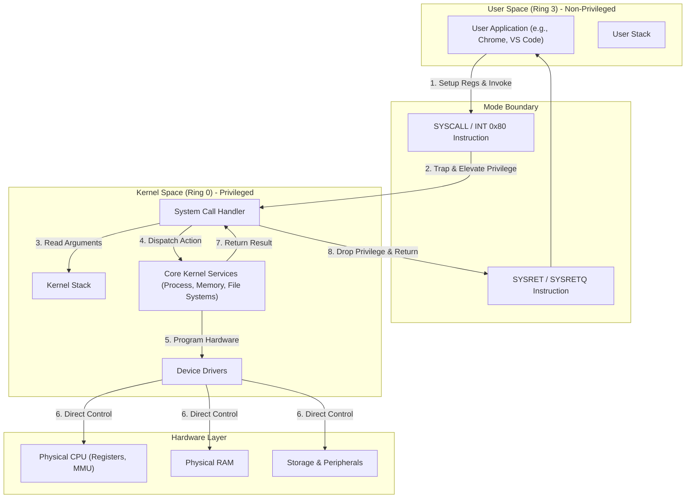

---

### Comprehensive Interview Questions

## Question 1

### Difficulty
Easy

### Interview Question
What are the fundamental components of an Operating System, and how do they divide the user and hardware worlds?

### Short Interview Answer (30 Seconds)
An operating system is divided into two primary zones: **User Space** and **Kernel Space**. User Space is where application software and command-line utilities (like shells and GUIs) run without direct hardware access. Kernel Space contains the core Kernel, which acts as the heart of the OS. The kernel directly interfaces with the hardware and performs critical tasks such as process scheduling, memory mapping, file system management, and I/O routing. The boundary between these zones is maintained by hardware-level CPU execution modes.

### Detailed Interview Answer
To separate user programs from the underlying hardware, the OS architecture is split into components:
1. **User Interface (GUI/CLI/Shell):** Interfaces that collect commands from users and interpret them for execution. The shell is a command interpreter running inside the User Space.
2. **System Libraries:** Libraries (like `glibc` in Linux) that provide wrapper APIs for system calls.
3. **The Kernel:** The central core of the operating system that runs with supervisor privileges. Its sub-components include:
   - **Process Scheduler:** Manages thread allocation on CPU cores.
   - **Memory Manager:** Handles virtual-to-physical address translation (paging) and allocation.
   - **File System:** Organizes persistent data blocks into logical directory and file structures.
   - **Device Drivers:** Software components tailored to translate general OS commands into device-specific hardware signals.
   - **I/O Subsystem:** Manages buffers, caches, queues, and device operations.

This separation ensures that user applications are completely insulated from hardware complexities, allowing them to remain simple and portable.

### Internal Working
At boot time, the kernel initializes hardware controllers, sets up the virtual memory paging system, and enters a state of waiting for interrupts. When an application runs, the shell forks a process and loads the executable into a restricted virtual memory layout. Whenever the user application requires hardware-dependent actions, it makes a standard library call, which wraps the hardware system call. The CPU shifts execution control flow from the user program to the kernel's system call dispatch table, allowing the kernel to handle the hardware access.

### Real Life Analogy
Think of a busy restaurant. The customers in the dining area are "User Space Applications." The kitchen is the protected "Kernel Space." The customers cannot walk into the kitchen, grab raw ingredients, and cook on the stoves themselves (hardware access). Instead, they look at a menu (API) and tell the waiter (System Call wrapper) their order. The waiter passes the order through a small window to the chef (Kernel), who compiles the dish using the kitchen's resources, and hands the prepared plate back to the waiter to deliver to the customer.

### Real World Example
When you run the command `ls` in a Linux terminal:
1. The shell (User Space) interprets the string `ls`.
2. The shell requests file listings by invoking the `readdir()` library function, which calls the `sys_getdents` system call.
3. The kernel (Kernel Space) accesses the hard drive controller via the filesystem driver.
4. The kernel reads raw directory blocks, formats them, and copies them to the user space buffer allocated for `ls`.
5. The shell displays the output to the terminal window.

### Production Perspective
In production database environments (like PostgreSQL or MySQL), direct interaction with OS components is carefully tuned. For instance, databases bypass the standard file system cache using flags like `O_DIRECT` or raw partitions to avoid double-buffering between the OS kernel cache and the database's buffer pool. This ensures predictable write latencies and prevents kernel-level resource starvation under high I/O throughput.

### Advantages
* **Fault Isolation:** If an application crashes, it only crashes its own user space segment; the core kernel and other programs remain unaffected.
* **Security:** Normal applications cannot access memory belonging to other processes or read unauthorized files.
* **Hardware Abstraction:** Developers do not need to write custom assembly code to interface with thousands of different SSD or GPU models.

### Limitations
* **Execution Overhead:** Crossing the user-kernel boundary requires saving registers, switching stacks, flushing TLB entries, and loading kernel contexts, which wastes CPU cycles.
* **Memory Footprint:** The kernel must reserve physical memory page frames for its own code, stacks, structures, and buffers, which cannot be paged out to disk.

### Trade-offs
The primary trade-off is **Security/Abstraction vs. Raw Performance**. Bypassing the kernel (e.g., using frameworks like DPDK for networking or SPDK for storage) allows applications to achieve near-hardware speeds by executing drivers directly in User Space. However, this eliminates memory protection and multi-tenant resource scheduling, making the application highly complex and prone to catastrophic system-wide crashes if a bug occurs.

### Best Practices
* Keep user applications lightweight by avoiding unnecessary or repetitive system calls (e.g., buffer writes in memory and perform one large `write()` call instead of thousands of single-byte writes).
* Run daemon processes with the lowest necessary operating system privileges (non-root users) to prevent exploitation if a user-space security vulnerability is compromised.

### Common Mistakes
* **Believing the Shell is Part of the Kernel:** The shell is merely an application running in user space. It possesses no privileged hardware authority and interacts with the kernel exactly like any other program.
* **Assuming Drivers are Always in User Space:** Almost all performance-critical device drivers run directly in Kernel Space (Ring 0) to ensure low-latency communication with hardware.

### Common Interview Traps
* **Trap:** The interviewer asks: *"Does the operating system kernel execute user code?"*
* **Correction:** No. The CPU executes user code directly at Ring 3 privilege. The kernel only handles process scheduling, hardware dispatch, and interrupts, stepping in to manage hardware transitions.

### Interview Follow-up Questions
* *How does the kernel prevent a user application from taking over the CPU forever?*
  - **Answer:** It programs a hardware interval timer (using the PIT or APIC) to issue periodic hardware interrupts. When the timer interrupts the CPU, control is forcibly yanked back to the kernel scheduler in Ring 0, allowing it to context switch the running application.

### Cross Questions
* *If the kernel is the only component running in Ring 0, where do graphics card drivers run?*
  - **Answer:** Historically, performance requirements dictated that graphics drivers run fully in Ring 0. However, modern OS architectures split them: a lightweight, stable kernel-mode driver handles memory allocation and command execution, while a large user-mode driver (like OpenGL/Vulkan/Direct3D runtimes) compiles shaders and prepares render states in Ring 3 to limit kernel crashes.

### Memory Trick
* **U**ser = **U**nprivileged (Lobby).
* **K**ernel = **K**ey-holder (Vault).

### Revision Note
The OS is divided into User Space (unprivileged, Ring 3, runs applications) and Kernel Space (privileged, Ring 0, controls hardware). Applications request hardware resources via System Calls, traversing the user-kernel boundary.

---

## Question 2

### Difficulty
Medium / FAANG

### Interview Question
Explain User Space vs. Kernel Space. Why do we need this segregation, and how does the CPU enforce it?

### Short Interview Answer (30 Seconds)
User Space and Kernel Space are virtual memory zones separated by hardware enforcement. The segregation exists to prevent buggy or malicious user applications from modifying kernel memory, crashing the computer, or reading other processes' data. The CPU enforces this via **Page Tables** and **Hardware Privilege Levels (Rings)**. Every page table entry contains a flag indicating whether it requires Supervisor privileges. When the CPU executes in Ring 3 (User Mode), any instruction that accesses a supervisor-marked memory page or attempts to execute restricted CPU commands immediately raises a hardware exception (trap), halting the instruction.

### Detailed Interview Answer
Operating systems create a virtual memory abstraction for every process. The virtual address space is split: 
- In a typical 64-bit Linux system, the lower address range ($0$ to $0x00007fffffffffff$) represents **User Space**, unique to each process.
- The upper address range ($0xffff800000000000$ to $0xffffffffffffffff$) maps to **Kernel Space**, which remains identical and mapped across all running processes to allow fast transition handling.

**Why the segregation is required:**

1.  **System Stability:** If user programs had write access to kernel space, a simple null-pointer dereference in a browser could write random bits into the CPU scheduler queue, crashing the entire machine.

2.  **Security & Confidentiality:** It prevents Process A from reading the memory pages of Process B (e.g., stealing encryption keys or passwords).

3.  **Hardware Isolation:** Prevents applications from writing directly to disk controllers or reading raw network packets without permission checks.


**Hardware Privilege Levels & The Protection Ring Hierarchy:**

CPU architectures organize privilege into execution rings, where lower numbers have more access:

*   **Ring 0 (Kernel/Supervisor Mode):** Complete control over physical hardware. Can run instructions like `CLI`, `HLT`, and `MOV CR3` to control the system execution flow.

*   **Rings 1 & 2 (Semi-Privileged):** Designed for device drivers and protocol layers to isolate them from Ring 0. They are unused by modern operating systems (Linux, Windows, macOS) to maintain ease of porting to architectures like ARM (which only support User and Supervisor modes) and to avoid intermediate boundary-crossing latency.

*   **Ring 3 (User Mode):** Normal applications run here. All hardware access is blocked, and access to virtual memory is constrained by page table properties.

*   **The "Negative" Rings:** Underneath Ring 0 lies **Ring -1 (Hypervisor Mode)** used by virtual machine managers (like KVM or Hyper-V) to trap and emulate guest kernel actions; **Ring -2 (System Management Mode - SMM)** used by the UEFI/BIOS for deep power and thermal control, invisible to the OS; and **Ring -3 (Management Engine)**, a hardware-level co-processor (Intel ME/AMD PSP) running an independent microkernel with DMA access.


**How the CPU enforces this boundary:**

Memory isolation is enforced by cooperation between CPU execution registers and the Memory Management Unit (MMU):

1.  **Current Privilege Level (CPL):** The CPU tracks its active privilege level in the lower 2 bits of the `%cs` (code segment) register (e.g., `00` for Ring 0, `11` for Ring 3).

2.  **Page Table User/Supervisor (U/S) Bit:** In the page table structures mapped in RAM, every physical memory page's descriptor has a `U/S` bit. `U/S = 0` restricts access to Supervisor (Ring 0), while `U/S = 1` allows User (Ring 3) access.

3.  **Hardware Trap Enforcement:** When a process executes a load/store instruction, the MMU checks the CPL. If a Ring 3 instruction accesses a page where `U/S = 0`, the MMU blocks the memory bus, triggers a Page Fault Exception (`#PF`), elevates privilege to Ring 0, and jumps to the kernel's page fault handler to terminate the offending process (Segmentation Fault).

### Internal Working
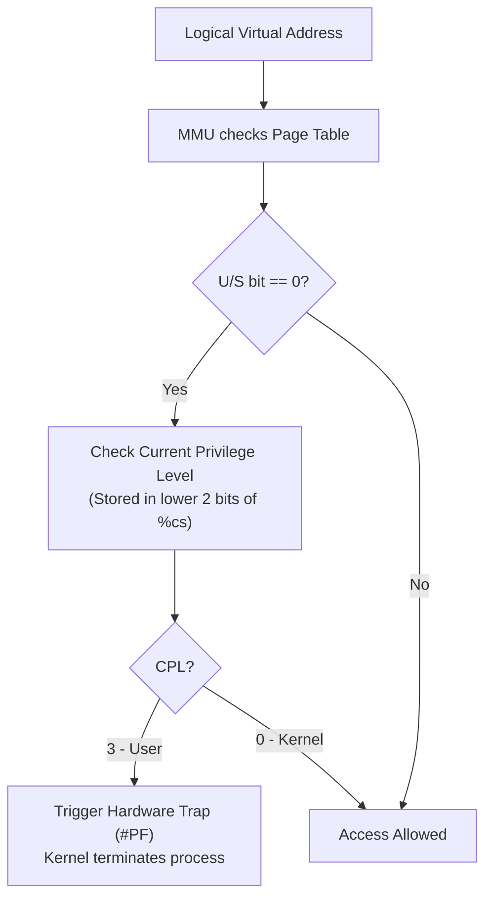
The page table structures (Page Directory Entries, Page Table Entries) are themselves stored in kernel space. A user application cannot change its own page mappings because the register pointing to the base of the page table (the `CR3` register on x86) can only be written to using the `MOV CR3, reg` instruction, which is a privileged instruction that will throw a `#GP` fault if executed in Ring 3.

### Real Life Analogy
Consider a high-security government building. The front lobby is "User Space" where anyone can walk in. The secure archives in the basement are "Kernel Space." An employee badge (CPL) determines access. A visitor has a Level 3 badge. The security turnstile (MMU) reads the badge at the elevator. If the visitor tries to press the button for the secure basement level (Kernel page), the turnstile locks, alarm bells ring (trap), and security guards (OS Kernel) escort the visitor out of the building (SIGSEGV).

### Real World Example
In a C program, if you execute:
```c
int *ptr = (int *)0xffffffff81000000; // Typical kernel code address
printf("%d\n", *ptr);
```
Compiling and running this code will compile successfully because the compiler doesn't check absolute addresses. However, during execution, the CPU's MMU notices that the address points to supervisor memory while the CPL is set to 3. The CPU suspends the instruction pipeline, fires a `#PF` trap, and the Linux kernel delivers a `SIGSEGV` signal, terminating the program.

### Production Perspective
In high-throughput database design, memory allocations are optimized to minimize user-kernel transitions. Large memory blocks are allocated using `mmap()` rather than standard `malloc()` to avoid frequent `brk()` or `sbrk()` system calls. Additionally, the kernel uses **Huge Pages** (e.g., 2MB or 1GB pages instead of the standard 4KB pages) for database memory pools. This reduces page table directory sizes, decreasing the chance of Translation Lookaside Buffer (TLB) misses during transitions between user and kernel operations.

### Advantages
* **Robust Multi-tenancy:** Allows thousands of different, untrusted processes to run concurrently on the same physical server.
* **Deterministic Access Control:** Enables granular security controls (Read/Write/Execute permissions per memory frame).

### Limitations
* **TLB Thrashing:** When switching between User and Kernel space, the virtual memory mappings change, which can force the CPU to flush its Translation Lookaside Buffer (TLB), slowing down subsequent memory access.
* **Double Buffering:** Data must often be copied from user-space memory buffers to kernel-space buffers (e.g., socket write buffers) before hardware output can occur, wasting CPU cache bandwidth.

### Trade-offs
* **Kernel Memory Mapping:** Mapping the kernel into the upper address space of every user process enables super-fast system calls (as page tables do not have to be completely swapped). However, this trade-off exposes processors to side-channel attacks like **Meltdown**, where CPU speculative execution instructions can read cached kernel memory from Ring 3. Fixing Meltdown required implementing **KPTI (Kernel Page Table Isolation)**, which swaps page tables entirely during mode transitions, introducing a 5-30% performance penalty on system-call heavy workloads.

### Best Practices
* Minimize memory copies by utilizing zero-copy techniques like `sendfile()` or `splice()` when transferring data from a file descriptor to a network socket.
* Avoid writing raw memory pointers to files or sending them over networks, as virtual addresses have zero meaning outside the process's custom user-space layout.

### Common Mistakes
* **Thinking Virtual Memory exists on Hardware:** The CPU MMU enforces virtual-to-physical translations, but the virtual address space structure and page tables are entirely software constructs managed by the kernel.

### Common Interview Traps
* **Trap:** The interviewer asks: *"If Kernel Space is mapped to every process's virtual memory, does that mean Process A can access Process B's memory by reading Kernel Space?"*
* **Correction:** No. Processes have identical kernel space mappings, but their *user space* mappings are isolated. The CPU prevents Process A from reading kernel space. Thus, Process A can access neither the kernel's memory nor Process B's user memory.

### Interview Follow-up Questions
* *What is KPTI (Kernel Page Table Isolation) and why was it introduced?*
  - **Answer:** KPTI is a defensive patch against the Meltdown vulnerability. It forces the kernel to maintain two sets of page tables for each process: a user-space page table (containing only the bare minimum kernel mappings needed to enter/exit system calls) and a kernel-space page table (containing all mappings). This prevents the CPU from speculatively caching kernel memory while running in User Mode.

### Cross Questions
* *If the MMU handles address translation, how does it translate addresses before page tables are set up at boot time?*
  - **Answer:** At boot time, the CPU runs in **Real Mode** (a 16-bit mode on x86) where physical addresses are accessed directly without virtual address translating structures. The kernel sets up the initial page tables in physical RAM, writes the root address to the control register (`CR3`), and then toggles a control bit in the register (`CR0.PG`) to enable protected virtual mode and the MMU.

### Memory Trick
* **U**ser Space = **U**nshared & restricted virtual land.
* **K**ernel Space = **K**eyboard/Hardware controllers sharing one global map.

### Revision Note
User vs. Kernel space segregation secures the OS. It is enforced via page table flags (U/S bit) and CPU privilege rings (CPL). Attempting to breach this boundary triggers a hardware interrupt exception handled by the OS.

---

## Question 3

### Difficulty
Hard / FAANG

### Interview Question
What is a Mode Transition (Dual-Mode Operation), how does it occur, and what is the role of system calls and CPU rings?

### Short Interview Answer (30 Seconds)
A mode transition is the hardware-controlled sequence of switching the CPU execution privilege level from Ring 3 (User) to Ring 0 (Kernel). It is triggered when an application executes a system call (via the `SYSCALL` instruction or software interrupt `INT 0x80`), or when a hardware device raises an interrupt. The CPU hardware saves the program counter, switches the stack pointer to a secure kernel stack, changes the privilege level register to Ring 0, and jumps to a hardcoded vector address containing the kernel's handler. Once the kernel task completes, the CPU executes `SYSRET`, reversing this process and returning control to Ring 3.

### Detailed Interview Answer
Dual-mode operation relies on cooperation between hardware (CPU privilege checks) and software (Kernel handler addresses). 
The transition occurs through three main entry points:
1. **System Calls (Software Traps):** Programmed requests made by applications (e.g., opening a file).
2. **Exceptions:** Synchronous CPU events caused by invalid operations (e.g., dividing by zero or page faults).
3. **Hardware Interrupts:** Asynchronous signals from external devices (e.g., keyboard input or network packet arrival).

**Step-by-step execution flow of a Mode Transition during a System Call:**
1. **User Mode Setup:** The program registers the system call parameters in hardware registers (e.g., `rdi`, `rsi`, `rdx` in x86-64 Linux) and writes the system call number to `rax`.
2. **Instruction Invocation:** The program executes the `SYSCALL` instruction.
3. **Hardware State Save:** The CPU hardware performs the following atomically:
   - Copies the current instruction pointer (`RIP`) into register `RCX`.
   - Copies the CPU flags register (`RFLAGS`) into `R11`.
   - Switches the CPL (Current Privilege Level) to Ring 0.
   - Adjusts the stack pointer register `RSP` from the User Stack to the Kernel Stack (defined in the Task State Segment - TSS).
   - Jumps to the kernel's entry point address stored in the `IA32_LSTAR` Model Specific Register (MSR).
4. **Kernel Processing:** The kernel pushes remaining registers onto the kernel stack to preserve the user's register context, looks up the system call table, and executes the requested driver or resource manager code.
5. **Return Transition:** The kernel restores the saved registers from the kernel stack and calls the `SYSRETQ` instruction. The CPU hardware restores `RIP` from `RCX`, `RFLAGS` from `R11`, drops the CPL back to Ring 3, and switches back to the User Stack.

### Internal Working

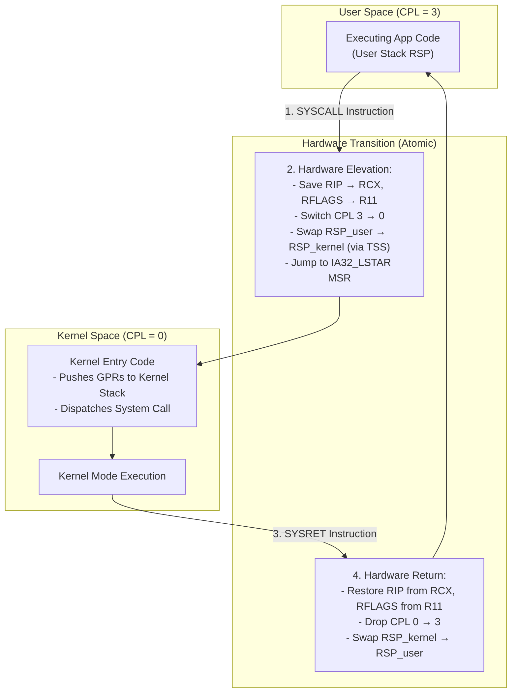


### Real Life Analogy
Consider a citizen (User Space App) visiting a high-security embassy (Kernel Space). The citizen cannot open the security doors. Instead, they walk up to a bulletproof window (System Call boundary). The citizen hands a passport request (syscall number and arguments) to the clerk through a secure slot (Registers). The clerk verifies it, pushes a button (SYSCALL), enters the vault (Ring 0), retrieves the passport, returns to the window, and slides the passport back to the citizen (SYSRET).

### Real World Example
Let's look at the assembly compilation of a simple `printf()` call. The compiler translates it to a `syscall` instruction:
```assembly
mov     eax, 1          ; System call number 1 is sys_write on x86-64 Linux
mov     edi, 1          ; File descriptor 1 is stdout
mov     rsi, message    ; Pointer to the string buffer
mov     edx, 13         ; String length
syscall                 ; Transition to Ring 0 kernel handler
```

### Production Perspective
In high-frequency trading (HFT) applications, mode transitions are the enemy of low latency. A single transition can cost hundreds of nanoseconds. To combat this, engineers use **Kernel Bypass** cards (such as Solarflare OpenOnload). By mapping the network card interface queues directly into the user application's address space, the application can poll the network interface buffer directly without issuing `read()` or `recv()` system calls, bypassing mode transitions entirely.

### Advantages
* **Secures Critical Hardware:** Prevents user code from executing dangerous CPU instructions (like halting the CPU or clearing interrupts).
* **Guarantees Resource Allocation:** The kernel maintains control over the hardware, ensuring scheduler tasks are executed on time.

### Limitations
* **Cache Pollution:** Modifying execution paths changes the active CPU registers and memory pages, dirtying L1/L2 caches and the TLB, which impacts execution speeds.
* **Context Storing Cost:** Pushing and popping CPU registers (general-purpose registers like RAX, RBX, RCX, etc.) takes cycles.

### Trade-offs
* **Frequent Small Operations vs. Batched System Calls:** Writing single bytes to disk requires a system call per byte. Batching writes using output buffers (e.g., C's buffered `fwrite` or Java's `BufferedOutputStream`) minimizes transitions. However, this trade-off delays output delivery, which can be problematic if the application crashes before the buffer is flushed.

### Best Practices
* Always buffer disk and network operations in User Space memory before writing to file descriptors.
* Utilize asynchronous system call frameworks like **`io_uring`** on Linux. `io_uring` allows applications to submit multiple I/O requests to a shared ring buffer in user space and read results back without executing a system call for each individual transaction.

### Common Mistakes
* **Confusing Mode Switch with Process Context Switch:** 
  - A *Mode Switch* transitions execution privileges within the *same* process (User Mode to Kernel Mode). It is lightweight.
  - A *Process Context Switch* changes execution from *Process A* to *Process B*, which requires swapping the virtual memory address spaces (modifying CR3 page directory pointers), flushing the TLB, and saving full thread states. It is far more expensive.

### Common Interview Traps
* **Trap:** The interviewer asks: *"Does executing the `malloc()` function in C always cause a mode transition?"*
* **Correction:** No. `malloc()` is a library wrapper. It attempts to satisfy the memory allocation request from its pre-allocated heap pool in User Space. It only triggers a mode transition (`brk` or `mmap` system calls) when its user-space pool is exhausted and it must request more pages from the OS.

### Interview Follow-up Questions
* *What is the difference between `SYSCALL` and the software interrupt `INT 0x80`?*
  - **Answer:** `INT 0x80` is the legacy x86 method of making system calls. It forces the CPU to query the IDT (Interrupt Descriptor Table) in memory, which is slow. `SYSCALL`/`SYSENTER` are dedicated hardware instructions introduced by CPU vendors that bypass the IDT lookup by hardcoding jump vectors inside CPU Model Specific Registers (MSRs), offering a much faster transition.

### Cross Questions
* *If the system stack changes during a mode transition, what happens if the user-space stack was corrupted before calling `SYSCALL`?*
  - **Answer:** The CPU handles this safely because the kernel stack pointer is not read from user space. It is fetched from a secure CPU structure (the Task State Segment - TSS) that is set up by the kernel during system boot. Even if the user stack pointer (`RSP`) is completely corrupted, the kernel handler executes on a clean, valid kernel stack.

### Memory Trick
* **SYS**CALL goes **IN**, **SYS**RET goes **OUT**. Rings contract from **3** (outer/weakest) to **0** (center/strongest).

### Revision Note
A mode transition switches privilege levels (Ring 3 to Ring 0) via software interrupts or hardware instructions (`SYSCALL`). The CPU switches stack pointers to a secure kernel stack, executes the handler, and drops privileges back to user space via `SYSRET`.

---

## Reinforcement: Topic 1

### Comparison Table: User Space vs. Kernel Space

| Dimension | User Space (Ring 3) | Kernel Space (Ring 0) |
| :--- | :--- | :--- |
| **Privilege Level** | Non-privileged (Restricted) | High-privilege (Unrestricted) |
| **CPU Rings** | Ring 3 (x86) | Ring 0 (x86) |
| **Memory Access** | Limited to its own Virtual Memory Page Table | Complete access to physical RAM and all virtual tables |
| **Hardware Access** | No direct access (forbidden) | Direct access via drivers and port I/O |
| **Crash Impact** | Process terminates (Segmentation Fault) | System crashes (Kernel Panic / Blue Screen of Death) |
| **Privileged Instructions** | Triggers CPU Exception (`#GP`) | Executed directly |
| **Address Range (Linux 64-bit)** | Lower addresses (`0x0000000000000000` to `0x00007fffffffffff`) | Upper addresses (`0xffff800000000000` to `0xffffffffffffffff`) |

### Key Takeaways
1. Dual-mode operation is a hardware-enforced security wall.
2. The kernel maintains system stability by intercepting operations before they access physical components.
3. System calls are safe gatekeepers that transition the CPU from Ring 3 to Ring 0 using fast hardware routines (`SYSCALL` / `SYSRET`).

### Revision Checklist

*   **Differentiate** between User Mode and Kernel Mode.
*   **Trace** a system call from user-space wrapper to kernel execution.
*   **Understand** privilege levels (Ring 0 vs. Ring 3) and page table isolation.


---

## Topic 2: Kernel Architectures and IPC

### Concept Explanation

> **TIP:**
> **Beginner Explanation**
> Imagine an operating system kernel as the organizing structure of a company:
> - **Monolithic Kernel:** A single giant open office floor. The manager, security guards, accountants, and IT team all sit at one massive desk. Communication is instant (they can just talk to each other), making work fast. However, if one person gets sick with a highly contagious virus (crashes), the entire office catches it, and the company completely shuts down.
> - **Microkernel:** A modular setup with individual small offices spread across the city. Only the CEO sits in the main building (the tiny kernel). The accounting, IT, and security teams work in separate buildings (user space processes). If the accounting office burns down, the company keeps running; they just open a new branch. However, communication is slow because they have to send letters (Inter-Process Communication) across the city to talk to each other.
> - **Hybrid Kernel:** A compromise. The CEO, security, and IT teams sit in one building, but accounting is still kept in a separate building to protect the files.

> **IMPORTANT:**
> **Intermediate Explanation**
> Kernel design defines how operating system tasks are structured within memory:
> 1. **Monolithic Kernel:** All core OS services (Process Scheduler, Virtual Memory Manager, File System, Network Stack, and Device Drivers) run as a single execution binary within **Kernel Space**. Communication between services happens via fast, direct function calls.
> 2. **Microkernel:** Moves all non-essential services out of Kernel Space and runs them as server processes in **User Space** (e.g., file server, network driver). The microkernel itself retains only minimal functions: IPC, basic thread scheduling, and physical memory management. 
> 3. **Hybrid Kernel:** A combined architecture. It resembles a monolithic kernel in performance because it keeps key services in kernel space, but uses microkernel modular concepts (like abstracting drivers) to ease driver development.
>
> **Inter-Process Communication (IPC):** Since processes cannot access other memory pools, they use IPC to share information:
> - **Shared Memory:** The kernel maps a single physical page into the virtual address spaces of both processes. They write directly to it at RAM speeds, requiring mutual exclusion locking mechanisms.
> - **Message Passing:** Processes swap data by writing to and reading from kernel-managed message buffers (e.g., pipes, sockets, queues). This involves copy overheads but is easier to isolate.

> **WARNING:**
> **Advanced Explanation & Internal Working**
> In a **Monolithic Kernel** (e.g., Linux), modules can be loaded dynamically (`insmod`), but once loaded, they run in Ring 0, sharing the same address space. A null-pointer dereference in a loaded module triggers a **Kernel Panic** because it corrupts Ring 0 memory.
>
> In a **Microkernel** (e.g., seL4, QNX), when a user application wants to read a file:
> 1. The Application sends an IPC message to the File System Server.
> 2. This requires a mode switch (Ring 3 App $\rightarrow$ Ring 0 Microkernel).
> 3. The Microkernel routes the message to the File System Server in user space. This requires a process context switch (Ring 0 $\rightarrow$ Ring 3 File Server).
> 4. The File Server processes the request, sends the result back via IPC (Ring 3 File Server $\rightarrow$ Ring 0 Microkernel $\rightarrow$ Ring 3 App).
>
> This requires **multiple context switches** and **TLB flushes**, creating significant latency.
>
> To resolve this overhead, modern IPC uses **Single-Copy or Zero-Copy IPC**. In Microkernels like L4, IPC messages are passed by pinning memory pages or transferring them directly via CPU registers if the message size is small (e.g., copying directly into registers `rsi`/`rdi` before switching execution contexts), bypassing RAM copy overheads.

### Visual Architecture

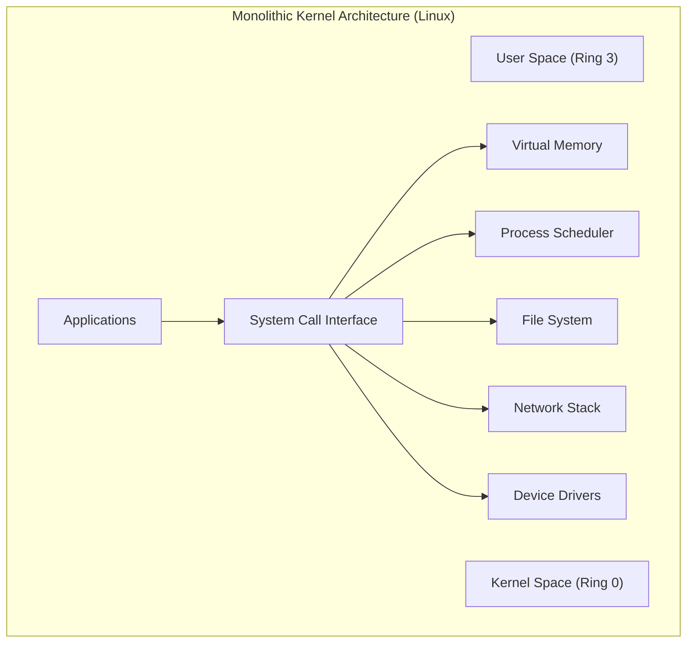

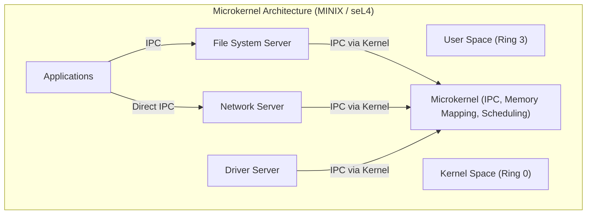

---

### Comprehensive Interview Questions

## Question 4

### Difficulty
Medium

### Interview Question
Compare Monolithic and Microkernel architectures in detail. What are the engineering trade-offs regarding size, reliability, and performance?

### Short Interview Answer (30 Seconds)
Monolithic kernels run all OS services (scheduling, memory, drivers, file systems) in a single kernel address space at Ring 0, yielding maximum performance because services communicate via direct function calls. However, they lack fault isolation: a crash in any service triggers a system-wide crash. Microkernels reduce the kernel to its absolute minimum (scheduling, basic memory, IPC), executing all other services as isolated user-space processes at Ring 3. This guarantees reliability and stability, but introduces significant context-switching and IPC overhead, leading to slower execution speeds.

### Detailed Interview Answer
Monolithic and Microkernel architectures represent two opposite design ideologies:
1. **Monolithic Kernels (e.g., Linux, FreeBSD):**
   - **Internal Structure:** All drivers, file system modules, and network layers are compiled together or loaded into the same memory space.
   - **Performance:** Excellent. Communication between subsystems is as fast as a pointer reference.
   - **Size:** Large. The Linux kernel contains millions of lines of code.
   - **Reliability:** Low boundary isolation. A buggy Wi-Fi driver can dereference a bad pointer, causing a kernel panic.
2. **Microkernels (e.g., seL4, QNX, MINIX 3):**
   - **Internal Structure:** The core kernel contains only the bare necessities. All other modules are isolated in user space.
   - **Performance:** Slower. Service requests involve message queues, IPC mechanisms, mode switches, and CPU address space changes.
   - **Size:** Tiny. Microkernels are typically a few thousand lines of code.
   - **Reliability:** High boundary isolation. If a driver crashes, the system spawns a new instance of the driver process while the OS continues running.

### Internal Working
In a monolithic kernel, calling `write()` jumps execution directly to the filesystem code in Ring 0, which immediately talks to the disk driver. 
In a microkernel:
1. The application sends an IPC write request.
2. The hardware traps to the microkernel.
3. The microkernel schedules the user-space File System Server.
4. The File System Server translates the request, then sends another IPC to the Disk Driver Server (requiring another trip through the microkernel scheduler).
5. The Disk Driver Server writes to the hardware ports.
6. The response flows backward through the IPC chain.
This chain requires multiple context switches and invalidates CPU L1 caches, hurting latency.

### Real Life Analogy
A monolithic kernel is like an F1 racecar. It has no doors or passenger comfort structures; the engine, wheels, and frame are integrated directly for raw speed. If one spark plug fails, the entire vehicle stops instantly. A microkernel is like a modular freight train. Each carriage (service) is separate. If a refrigeration carriage breaks down, you can decouple it and attach a new one without stopping the locomotive engine. However, the train is slower and heavier to maneuver.

### Real World Example
- **Linux** is monolithic. It is used on performance-critical cloud servers and supercomputers because it processes millions of IOPS (I/O Operations Per Second) with minimal latency.
- **QNX** is a real-time microkernel owned by BlackBerry. It is used inside medical devices, airplane autopilots, and automotive control systems, where a crash in a non-essential service (like the media player dashboard) must never crash the steering or braking control systems.

### Production Perspective
In production microkernel designs, the performance bottleneck of IPC is alleviated using **Thread Migration** or **IPC page-mapping redirection**. During IPC, instead of saving the registers, flushing page tables, and running the scheduler, the kernel redirects the active CPU context pointer to execute code inside the target user server directly on the caller's thread time-slice, saving scheduling cycles.

### Advantages
* **Monolithic:** Unmatched execution speed, direct hardware mapping, and mature ecosystem support.
* **Microkernel:** High reliability, easily verifiable codebases (seL4 is mathematically proven to be bug-free), and hot-swappable system services.

### Limitations
* **Monolithic:** Single point of failure; security vulnerabilities in drivers grant full root access.
* **Microkernel:** Difficult to program, high context-switching overhead, and complex service synchronization.

### Trade-offs
* **Performance vs. Reliability:** Monolithic architectures prioritize high performance and are ideal for general-purpose computing. Microkernels prioritize reliability and safety, making them ideal for mission-critical embedded systems.

### Best Practices
* For monolithic systems, write drivers defensively, use static analysis tools, and compile non-essential drivers as dynamically loadable modules (`.ko` files) so they can be unloaded if they misbehave.
* For microkernel systems, design APIs to bundle small messages into larger batches to reduce the frequency of IPC calls.

### Common Mistakes
* **Assuming Monolithic Kernels cannot load modules at runtime:** Linux loads kernel modules dynamically, but those modules still run inside the Ring 0 space. This does not make Linux a microkernel or hybrid kernel.

### Common Interview Traps
* **Trap:** *"Since Linux can load modules dynamically, is it a Hybrid Kernel?"*
* **Correction:** No. Linux is strictly monolithic. Dynamic kernel modules run inside the same address space as the rest of the kernel, with the same Ring 0 permissions.

### Interview Follow-up Questions
* *Why are microkernels not popular on standard desktop systems?*
  - **Answer:** Desktop systems run highly diverse, unpredictable workloads with many I/O requests. The IPC overhead of a microkernel on graphics-heavy, game-heavy, and file-heavy workloads significantly degrades performance compared to monolithic designs.

### Cross Questions
* *How can seL4 claim to be "mathematically verified"?*
  - **Answer:** Due to its small codebase size, computer scientists used mathematical proof assistants (like Isabelle/HOL) to verify that the compiled machine code behaves exactly as defined by its formal specification, mathematically ruling out buffer overflows, null pointer dereferences, and memory leaks.

### Memory Trick
* **Mono**lithic = **Mono** (One big block).
* **Micro**kernel = **Micro** (Tiny core, split rooms).

### Revision Note
Monolithic kernels put all services in Ring 0 for speed. Microkernels move services to Ring 3 as isolated servers, communicating via IPC for reliability, though this introduces a performance cost.

---

## Question 5

### Difficulty
Medium

### Interview Question
What is a Hybrid Kernel, and how do modern operating systems like Windows and macOS balance monolithic performance with microkernel modularity?

### Short Interview Answer (30 Seconds)
A hybrid kernel combines monolithic performance with microkernel modular design. It runs most core services (such as the virtual memory manager, scheduler, and filesystem) inside the Ring 0 kernel address space to avoid IPC context-switching overhead. However, it adopts microkernel concepts by running non-performance-critical services (like user-space driver frameworks, audio services, and window managers) in Ring 3. This architecture balances speed and stability.

### Detailed Interview Answer
Modern operating systems like **Windows NT** and **macOS (XNU)** are classified as Hybrid Kernels. They were designed to combine the strengths of both architectures:
- **Architecture of Windows NT:** The kernel space contains the Executive and the Kernel. Historically, the GUI manager (Window Manager) was in user space (microkernel design), but it was moved to kernel space in Windows NT 4.0 to eliminate the context-switching overhead that caused laggy UI rendering.
- **Architecture of macOS (XNU):** XNU stands for "X is Not Unix." It merges the Mach microkernel (handling scheduling, IPC, and thread management) with BSD components (handling POSIX API layers, filesystems, and network stacks) into a single, cohesive Ring 0 address space. This avoids the message-passing cost of classic microkernels while retaining a modular codebase.

By keeping performance-sensitive services inside Ring 0 while pushing modular extensions (like Apple's DriverKit user-space drivers) to Ring 3, hybrid systems balance stability with monolithic speeds.

### Internal Working
In a Hybrid Kernel like macOS:
- File storage and network operations run within the kernel.
- USB drivers and audio processing run in User Space via helper processes.
- If a USB driver experiences a memory fault, only that driver process crashes. The hybrid kernel catches the exception, restarts the driver, and the user experiences only a brief pause rather than a complete system crash.

### Real Life Analogy
A hybrid kernel is like a department store. The store manager, security staff, and inventory controllers work in the main building (Kernel Space) for fast operations. However, rather than hiring in-house tailors or food preparers, the store leases space to independent boutiques and cafes (User Space services). This arrangement protects the main store from financial losses if a single boutique fails, while still providing customers with a seamless, single-building experience.

### Real World Example
- **Windows 11:** Uses the hybrid Windows NT kernel. The graphics engine runs in kernel space, but printer drivers and user audio mixers run in user space.
- **macOS / iOS:** Built on the Darwin OS with the XNU kernel. Modern versions use **DriverKit**, which runs drivers in user space instead of kernel extensions (`.kext` files) to improve security and prevent system crashes.

### Production Perspective
In production cloud environments, hypervisors like AWS Nitro or specialized microVMs (such as Firecracker) use hybrid concepts. They strip down the guest Linux kernels to contain only minimal device drivers, delegating complex I/O handling to a highly optimized hypervisor process running on host hardware. This approach achieves microkernel-like isolation with near-native performance.

### Advantages
* **High Performance:** Core paths do not require expensive IPC.
* **Improved Stability:** Buggy peripheral drivers can run in user space, reducing the risk of a blue screen or kernel panic.
* **Modularity:** Easier to write and debug user-space drivers using standard tools.

### Limitations
* **Design Complexity:** Merging two distinct architectures requires managing complex interfaces between the microkernel base and monolithic subsystems.
* **Increased Attack Surface:** If the boundary interfaces are not carefully implemented, vulnerabilities can allow user-space drivers to escalate their privileges to Ring 0.

### Trade-offs
* **Safety vs. Speed:** Placing a driver in user space makes the system more stable, but increases latency due to context switching. Hybrid kernels force developers to choose the path of execution based on how performance-sensitive the service is.

### Best Practices
* Avoid installing third-party kernel extensions (like legacy `.kext` files in macOS or unsigned `.sys` drivers in Windows) unless absolutely necessary. Use User-Space Driver Frameworks (UMDF) instead.
* Enforce driver signing policies to ensure only verified, tested drivers run in the Ring 0 space.

### Common Mistakes
* **Labeling macOS as a pure Microkernel:** Although it uses Mach, macOS compiles Mach and BSD components together in the same Ring 0 address space. It is not a pure microkernel.

### Common Interview Traps
* **Trap:** *"Is Windows NT a microkernel because it has services running in user space?"*
* **Correction:** No. Windows NT is a hybrid kernel. Almost all its primary services run in Ring 0. Only minor user services run in Ring 3.

### Interview Follow-up Questions
* *What happens when a graphics card driver crashes on modern Windows?*
  - **Answer:** The hybrid architecture isolates the graphics driver. If it crashes, the OS restarts the driver in the background, causing the screen to flicker for a second, rather than throwing a Blue Screen of Death (BSOD) as it did in older versions of Windows.

### Cross Questions
* *If the filesystem is in kernel space in a hybrid kernel, how does it interface with user-space drivers?*
  - **Answer:** It uses a virtual filesystem (VFS) interface. The kernel filesystem sends requests down, which are converted by a kernel-mode driver wrapper into IPC messages routed to the user-space driver server.

### Memory Trick
* **Hybrid** = **Hyb**ridized (Monolithic engine, Microkernel doors).

### Revision Note
Hybrid kernels (like Windows NT and XNU) run core OS services in Ring 0 to maintain high performance, but execute non-critical drivers and services in Ring 3 to improve system stability.

---

## Question 6

### Difficulty
Hard / FAANG

### Interview Question
How do processes communicate across boundary lines? Explain Inter-Process Communication (IPC) via Shared Memory vs. Message Passing.

### Short Interview Answer (30 Seconds)
Processes communicate across boundaries using **Shared Memory** or **Message Passing**. **Shared Memory** maps a single physical memory block into the page tables of both processes, allowing them to read and write directly to RAM at high speeds. However, this requires user-space synchronization (such as mutexes or semaphores) to prevent race conditions. **Message Passing** routes data through kernel-managed buffers (like pipes, message queues, or sockets). This approach is safer and provides automatic synchronization, but it is slower because every message transfer requires mode switches and memory copies.

### Detailed Interview Answer
To prevent security leaks, the OS isolates process memory. For processes to cooperate, they must use **Inter-Process Communication (IPC)**.

1. **Shared Memory:**
   - **Mechanism:** Process A requests the kernel to allocate a shared memory segment. The kernel maps this segment into the virtual memory page tables of both Process A and Process B. Once mapped, the kernel steps out of the way.
   - **Performance:** Fast. Reads and writes happen at the speed of physical RAM without system call overhead.
   - **Synchronization:** The developer must implement lock mechanisms (like POSIX semaphores or mutexes) to coordinate access.
2. **Message Passing:**
   - **Mechanism:** The kernel creates a mailbox or buffer. Process A issues a system call (e.g., `write()`) to copy data from its memory into the kernel buffer. Process B issues a system call (e.g., `read()`) to copy the data from the kernel buffer into its own memory space.
   - **Performance:** Slower. Every message transfer requires mode switches, context switching, and copying the data twice.
   - **Synchronization:** Automatically managed by the kernel. If the buffer is empty, the kernel blocks Process B until Process A writes data.

### Internal Working

#### Shared Memory Architecture
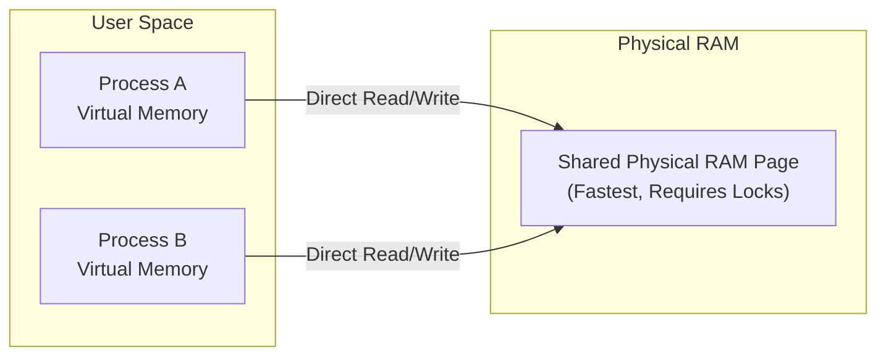

#### Message Passing Architecture
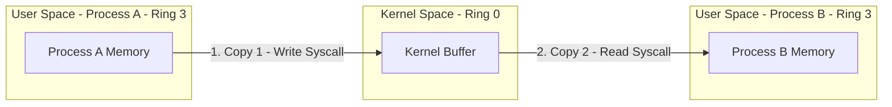


### Real Life Analogy
- **Shared Memory:** Two students working on the same poster. They sit at the same table (Shared Page) and draw directly on it. This is fast, but if they don't coordinate, they might write over each other's work (race condition).
- **Message Passing:** Two students in different cities sending letters. Student A writes a letter (Copy 1), mails it via the post office (Kernel), and Student B receives and reads it (Copy 2). This is safe and organized, but takes much longer.

### Real World Example
- **Shared Memory:** High-frequency trading applications use **POSIX Shared Memory** (`shm_open`, `mmap`) to share market data feeds between the ingestion process and execution engines instantly.
- **Message Passing:** **Unix Pipes** (`cat file.txt | grep "pattern"`). The stdout of `cat` is routed into a kernel pipe buffer, and the stdin of `grep` reads from it.

### Production Perspective
In distributed system designs, IPC is replaced by **gRPC** or **Message Brokers** (like RabbitMQ or Kafka) which use TCP/IP network sockets (message passing). For IPC on the same machine, **Domain Sockets (UDS)** bypass the TCP/IP stack overhead, writing directly to kernel memory buffers, which increases local message-passing throughput.

### Advantages
* **Shared Memory:** Low latency, high bandwidth, and zero kernel intervention after setup.
* **Message Passing:** Safe, isolated, easy to implement across network boundaries, and automatically synchronized.

### Limitations
* **Shared Memory:** Complex programming model, lacks built-in protection against race conditions, and cannot be used across different physical machines.
* **Message Passing:** High memory copy overhead and system-call latency.

### Trade-offs
* **Complexity vs. Speed:** Shared memory is chosen for massive data transfers and low-latency processing, but requires complex synchronization code. Message passing is chosen for small data updates and modular pipelines.

### Best Practices
* When using Shared Memory, always protect write operations with robust synchronization primitives (like semaphores or mutexes) to avoid data corruption.
* Use `mmap` with the `MAP_SHARED` flag for efficient file sharing.

### Common Mistakes
* **Neglecting Cache Coherency in Shared Memory:** On multi-core systems, if Core 1 writes to a shared memory page, Core 2 might read stale data from its L1 cache if synchronization instructions (like memory barriers) are not used.

### Common Interview Traps
* **Trap:** The interviewer asks: *"Does Shared Memory use more RAM than Message Passing?"*
* **Correction:** No. Shared memory maps the same physical RAM frame to multiple processes, saving memory. Message passing requires duplicating data across user and kernel space buffers, using more memory.

### Interview Follow-up Questions
* *What is a double-copy problem in message passing?*
  - **Answer:** It refers to copying data first from the sender's user space memory to the kernel's IPC buffer, and then from the kernel buffer to the receiver's user space memory.

### Cross Questions
* *How can you achieve Zero-Copy message passing in a local OS?*
  - **Answer:** By using page table redirection (page mapping manipulation). Instead of copying the data bytes, the kernel changes the page table descriptors of the receiver to point to the physical memory frame of the sender, flipping the page permissions.

### Memory Trick
* **Shared** Memory = **S**ame space (Fast, unsafe).
* **M**essage Passing = **M**ailbox (Slow, safe).

### Revision Note
Shared Memory maps physical pages to both processes, allowing fast read/writes but requiring locks. Message Passing uses kernel buffers and copies data, which is slower but automatically synchronized.

---

## Reinforcement: Topic 2

### Comparison Table: Monolithic vs. Microkernel

| Dimension | Monolithic Kernel | Microkernel |
| :--- | :--- | :--- |
| **Location of OS Services** | All inside Kernel Space (Ring 0) | Moved to User Space (Ring 3) as servers |
| **Execution Privilege** | Ring 0 | Ring 3 (except core scheduling/IPC) |
| **Performance** | High (Direct function calls) | Lower (High context-switching overhead) |
| **Fault Isolation** | None (One bug crashes the OS) | High (Crashed server restarts) |
| **IPC Frequency** | Very Low | Extremely High |
| **Examples** | Linux, Unix, MS-DOS | seL4, QNX, MINIX 3 |

### Key Takeaways
1. Monolithic kernels prioritize raw speed; microkernels prioritize system safety.
2. Hybrid kernels are the modern standard, keeping speed-critical layers in Ring 0 and modular services in Ring 3.
3. IPC is necessary for isolated processes, using either shared memory (fast, complex) or message passing (slower, safe).

### Revision Checklist

*   **List** the differences between Monolithic, Micro, and Hybrid kernels.
*   **Explain** why microkernels have higher context-switching overhead.
*   **Contrast** Shared Memory and Message Passing IPC.


---

## Topic 3: The OS Boot Process

### Concept Explanation

> **TIP:**
> **Beginner Explanation**
> Booting a computer is like waking up a sleeping giant and getting them ready for work:
> 1. **Power On:** You press the button. Electricity flows through the system, and the CPU wakes up.
> 2. **Load BIOS/UEFI:** The CPU reads its first instructions from a permanent microchip. This is the **BIOS/UEFI** (the basic firmware).
> 3. **Hardware Test (POST):** The firmware runs a checklist to ensure all parts (RAM, keyboard, storage) are working. If a part is broken, the motherboard beeps.
> 4. **Find the Bootloader:** The firmware looks at storage to find the **Boot Loader** program (like GRUB or Windows Boot Manager).
> 5. **Load the OS:** The boot loader loads the heavy Operating System kernel into RAM, and the OS displays the login screen.

> **IMPORTANT:**
> **Intermediate Explanation**
> The boot process (bootstrapping) is the initialization sequence of the computer system:
> 1. **Power-On:** The Power Supply Unit (PSU) stabilizes power and sends a "Power Good" signal to the motherboard. The CPU starts executing code at a fixed memory address (the reset vector `0xFFFF0` in x86).
> 2. **BIOS/UEFI Initialization:** The CPU executes firmware stored on a ROM chip.
>    - **BIOS (Basic Input/Output System):** Legacy firmware that operates in 16-bit real mode. It reads the first sector (512 bytes) of the boot disk, known as the **Master Boot Record (MBR)**.
>    - **UEFI (Unified Extensible Firmware Interface):** Modern firmware operating in 32-bit or 64-bit protected mode. It understands file systems (like FAT32) and reads boot loader files directly from the **EFI System Partition (ESP)**.
> 3. **Power-On Self-Test (POST):** The firmware performs diagnostics on system hardware.
> 4. **Boot Loader Execution:** The firmware hands execution to the boot loader (e.g., GRUB for Linux, Bootmgr for Windows) located on the boot device.
> 5. **Kernel Loading:** The boot loader mounts the storage partition, loads the OS kernel image into memory, and jumps to the kernel's initialization code.

> **WARNING:**
> **Advanced Explanation & Internal Working**
> Modern UEFI systems use the **GUID Partition Table (GPT)** instead of the legacy MBR:
> - **MBR Limitations:** Supports a maximum of 4 primary partitions and 2.2 TB disk sizes.
> - **GPT Advantages:** Supports up to 128 partitions, disk sizes up to 9.4 ZB ($9.4 \times 10^{21}$ bytes), and includes redundant backup headers to prevent corruption.
>
> **The transition from firmware to kernel space:**
> 1. In UEFI, the system firmware reads the boot configuration from NVRAM variables.
> 2. It accesses the ESP partition and loads the boot loader executable (e.g., `/EFI/BOOT/BOOTX64.EFI`).
> 3. The boot loader executes, initializes basic video modes, collects hardware details, and loads the kernel binary (e.g., `vmlinuz` on Linux) into memory along with the initial ramdisk (`initrd` or `initramfs`).
> 4. The boot loader calls the UEFI runtime service `ExitBootServices()`. This halts firmware-level hardware control, transitions the CPU from UEFI execution mode to the kernel's memory mapping mode, and jumps to the kernel entry point (`startup_64`).
> 5. The kernel initializes memory page tables, starts the process scheduler, and spawns the first user-space process (PID 1, e.g., `/sbin/init` or `systemd`).

### Visual Architecture

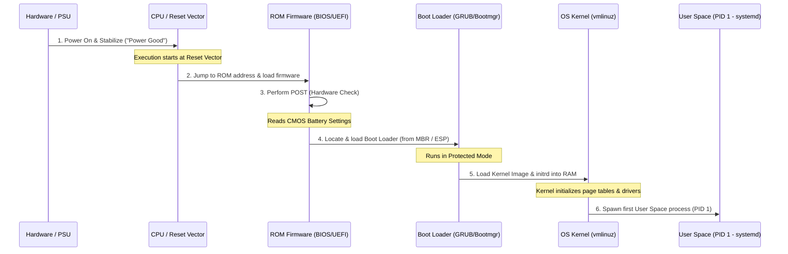

---

### Comprehensive Interview Questions

## Question 7

### Difficulty
Easy

### Interview Question
Explain the step-by-step boot process of a computer from the moment the power button is pressed to when the OS finishes loading.

### Short Interview Answer (30 Seconds)
The boot process consists of 5 stages:
1. **Power-On:** The power supply stabilizes power, triggering the CPU to execute code at its hardware reset vector.
2. **Firmware Load (BIOS/UEFI):** The CPU loads the firmware initialization program from ROM.
3. **POST (Power-On Self-Test):** The firmware runs diagnostics to verify hardware components (RAM, CPU, storage).
4. **Boot Loader Hand-off:** The firmware reads the boot order from CMOS memory, finds the boot device, and loads the Boot Loader (like GRUB or Windows Boot Manager) into RAM.
5. **OS Initialization:** The boot loader loads the kernel, which initializes drivers and launches the first user-space process (PID 1) to show the login screen.

### Detailed Interview Answer
The bootstrap sequence is a chain-of-trust execution flow:
1. **Power Delivery:** Pressing the power button sends power to the motherboard. The Power Supply Unit (PSU) runs internal tests and sends a "Power Good" signal to the CPU.
2. **CPU Reset Vector:** The CPU resets and enters 16-bit Real Mode (in legacy systems) or direct UEFI execution mode. It reads the reset vector address (`0xFFFF0` on x86) which points to the system ROM containing BIOS/UEFI.
3. **Hardware Verification:** BIOS/UEFI initializes system registers and performs the POST. If a critical component (like memory) is missing or faulty, the boot halts.
4. **Boot Device Selection:** The firmware reads configuration settings stored in CMOS memory (maintained by the CMOS battery) to determine the boot order (e.g., SSD, USB, Network).
5. **Boot Loader Phase:** The firmware reads the boot sector (MBR or EFI System Partition) of the primary drive and loads the boot loader into RAM, handing over execution control.
6. **Kernel Execution:** The boot loader initializes memory and loads the compressed OS kernel image. It then decompresses the kernel, sets up initial page tables, and passes control to the kernel. The kernel initializes drivers and spawns PID 1 (`systemd` or `init`), bringing up the user interface.

### Internal Working
During Step 5, the boot loader loads an initial filesystem image called `initramfs` (initial RAM filesystem) on Linux. This contains temporary drivers needed to mount the actual root filesystem (like SATA or NVMe storage drivers). Once the real root directory is mounted, the kernel discards the `initramfs` and executes the real `/sbin/init` process to start user space.

### Real Life Analogy
Waking up in the morning:
1. The alarm rings (Power Good).
2. You open your eyes and load your basic senses (BIOS/UEFI).
3. You check your limbs and ensure you aren't sick (POST).
4. You check your calendar to see what you need to do today (CMOS Settings).
5. You go to your closet and put on your work clothes (Boot Loader).
6. You leave the house and start your workday (OS Kernel / User Space).

### Real World Example
On a Linux server:
1. UEFI runs POST.
2. UEFI reads the ESP partition and loads `/EFI/ubuntu/grubx64.efi`.
3. GRUB reads `/boot/grub/grub.cfg` and displays the menu.
4. GRUB loads the kernel `/boot/vmlinuz-5.15.0` and `/boot/initrd.img-5.15.0`.
5. Control jumps to `startup_64`.
6. PID 1 launches system services.

### Production Perspective
In cloud environments, boot speeds are critical. Standard virtual machine boots can take up to a minute due to slow virtualized hardware checks. Cloud engineers optimize this by using **Direct Kernel Boot**. Hypervisors like QEMU bypass the BIOS/UEFI and boot loader stages entirely by loading the Linux kernel directly into the virtual machine's RAM and jumping straight to the kernel entry point. This reduces boot times from minutes to milliseconds.

### Advantages
* **Decoupled Architecture:** Allows upgrading or changing the operating system without modifying the motherboard's firmware.
* **Granular Failure Detection:** POST ensures the system fails early and safely if hardware is damaged, protecting files from corruption.

### Limitations
* **Single Point of Failure:** If the boot loader files or the boot sector partition tables are corrupted, the system cannot boot, even if the OS kernel is intact.
* **Firmware Initialization Overhead:** Traditional BIOS initialization and POST can take several seconds, delaying boot times.

### Trade-offs
* **Secure Boot vs. Custom Kernels:** UEFI Secure Boot verifies the digital signature of the boot loader against keys stored in the motherboard. This prevents malware from replacing the boot loader. However, it makes it difficult to install custom compiled kernels or alternative operating systems unless users manually disable Secure Boot in the UEFI menu.

### Best Practices
* Maintain an active CMOS battery to ensure the system clock and boot order configurations are preserved.
* Back up partition tables (GPT/MBR) to allow recovery if the primary storage sectors are corrupted.

### Common Mistakes
* **Assuming the CMOS Battery Stores the BIOS Program:** The BIOS/UEFI firmware is stored on non-volatile Flash ROM (retains data without power). The CMOS battery only powers the tiny volatile RAM that holds configuration edits (like boot order) and the real-time clock.

### Common Interview Traps
* **Trap:** The interviewer asks: *"Does the CPU run in virtual memory mode immediately upon power-on?"*
* **Correction:** No. On power-on, the CPU starts in a legacy raw-addressing mode (Real Mode in x86). It does not use virtual memory page tables until the boot loader or kernel configures virtual paging registers and enables page-translation flags.

### Interview Follow-up Questions
* *What is the difference between `initramfs` and `initrd`?*
  - **Answer:** `initrd` (init ramdisk) is a legacy block device image that requires filesystem driver overhead inside the kernel to mount. `initramfs` (init ramfs) is a compressed cpio archive that the kernel unpacks directly into a temporary ram-based filesystem (`tmpfs`), which is faster and has less overhead.

### Cross Questions
* *If the CPU starts executing at address `0xFFFF0`, how does it fit the BIOS program there when it only has 16 bytes of address space left before the 1MB Real Mode limit?*
  - **Answer:** The instruction at `0xFFFF0` is a hardware-jump instruction (a "far jump") that redirects execution to the actual lower start address of the BIOS program in ROM, bypassing the space limitation.

### Memory Trick
* **P**lease **F**ind **P**erfect **B**oot **K**ernels: **P**ower-on $\rightarrow$ **F**irmware $\rightarrow$ **P**OST $\rightarrow$ **B**ootloader $\rightarrow$ **K**ernel.

### Revision Note
The boot process transitions from hardware power stabilization to CPU reset vector execution, BIOS/UEFI loading, POST hardware checks, boot loader execution from MBR/ESP, and finally kernel decompression and loading.

---

## Question 8

### Difficulty
Medium

### Interview Question
Compare BIOS vs. UEFI, and explain the roles of the CMOS battery, POST, and boot partitioning schemes (MBR vs. GPT/EFI).

### Short Interview Answer (30 Seconds)
BIOS is a legacy 16-bit firmware that handles boot configurations via the CMOS battery and launches bootloaders from the Master Boot Record (MBR), which is limited to 4 partitions and 2.2 TB drive sizes. UEFI is a modern 32-bit or 64-bit firmware that supports GUI interfaces, Secure Boot, faster initialization, and loads boot loaders directly from the EFI System Partition (ESP) using the GUID Partition Table (GPT), which supports up to 128 partitions and zettabyte drive scales.

### Detailed Interview Answer
BIOS and UEFI represent two generations of system firmware:

1. **BIOS (Basic Input/Output System):**
   - **Execution Mode:** Runs in 16-bit Real Mode, limiting access to 1MB of memory.
   - **Drive Partitioning:** Relies on **MBR (Master Boot Record)**. MBR uses a 32-bit logical block addressing (LBA) scheme, limiting maximum drive size support to 2.2 TB.
   - **Boot Process:** Reads the first sector of the drive and executes whatever code it finds there, making it vulnerable to boot-sector viruses.
2. **UEFI (Unified Extensible Firmware Interface):**
   - **Execution Mode:** Runs in 32-bit or 64-bit mode, accessing all system memory.
   - **Drive Partitioning:** Relies on **GPT (GUID Partition Table)**. Uses 64-bit addressing to support drives up to 9.4 ZB.
   - **Boot Process:** Operates like a mini-OS. It reads filesystems (typically FAT32) directly, loading signed executable files (`.efi`) from the EFI System Partition (ESP). This enables **Secure Boot**, verifying signatures to prevent rootkit infection.

**Supporting Components:**
- **CMOS Battery:** Provides continuous power to the volatile CMOS RAM containing system time and user settings (like RAM speeds and boot order).
- **POST (Power-On Self-Test):** A diagnostic check run by the firmware to verify CPU, RAM, and hardware health before booting.

### Internal Working

#### Legacy BIOS Boot Flow


#### Modern UEFI Boot Flow


### Real Life Analogy
- **BIOS and MBR:** An old office filing cabinet (MBR) limited to 4 folders (partitions). The office manager (BIOS) only reads typed paper slips, cannot handle large files, and has no lock on the drawers.
- **UEFI and GPT:** A digital database (GPT) that supports unlimited folders. The database manager (UEFI) uses a login system (Secure Boot), has search tools, and can store massive datasets.

### Real World Example
- An old computer from 2005 uses a legacy BIOS screen (usually blue and grey text-only, operated using only the keyboard).
- A modern computer uses UEFI with a GUI layout that supports mouse input, network updates, and advanced hardware overclocking tools.

### Production Perspective
In cloud infrastructure virtualization, UEFI is preferred because it supports virtual network boot (PXE boot over IPv6) and faster VM spin-up times. In large partition environments (such as storage servers containing 100TB drives), GPT is mandatory since MBR cannot address space beyond 2.2 TB.

### Advantages
* **UEFI / GPT:** Fast boot times, Secure Boot support, native handling of large drives, and backup partition tables.
* **BIOS / MBR:** Simple, universal backward compatibility with old hardware and operating systems.

### Limitations
* **BIOS / MBR:** Restricted memory space, limited to 4 primary partitions, and vulnerable to boot sector corruption.
* **UEFI / GPT:** Requires complex partition setups (ESP partition) and does not support legacy 16-bit operating systems.

### Trade-offs
* **UEFI Compatibility Support Module (CSM):** Modern UEFI systems often include CSM to emulate BIOS booting for legacy operating systems. However, enabling CSM disables UEFI features like Secure Boot and fast initialization, trading modern security for backward compatibility.

### Best Practices
* Use GPT for all drives larger than 2TB and format the system disk with an EFI System Partition of at least 100MB to 500MB to avoid running out of bootloader space.
* Keep Secure Boot enabled on production machines to block unauthorized boot loaders and rootkits.

### Common Mistakes
* **Thinking GPT is only for SSDs:** GPT is a partition table style. It can be used on traditional hard drives, SSDs, or NVMe storage.

### Common Interview Traps
* **Trap:** The interviewer asks: *"If the CMOS battery dies, does the computer lose the BIOS firmware program?"*
* **Correction:** No. The BIOS program is stored in a non-volatile flash ROM chip. A dead CMOS battery only resets user configurations (like custom boot order, RAM profiles) back to factory defaults and resets the system clock.

### Interview Follow-up Questions
* *What happens if the primary GPT header is corrupted?*
  - **Answer:** Unlike MBR (which has no backup), GPT maintains a secondary backup table at the very end of the disk. If the primary header is corrupted, the OS or partition manager can automatically restore it from the backup header.

### Cross Questions
* *Why does UEFI use a FAT32 filesystem for the EFI System Partition instead of NTFS or ext4?*
  - **Answer:** FAT32 is a simple filesystem format that is open, widely implemented, and easy to parse. By using FAT32 as a standard, UEFI can access the boot partition across different operating systems (Windows, Linux, macOS) without needing complex filesystem drivers.

### Memory Trick
* **M**BR = **M**ax 4 partitions / 2.2TB.
* **G**PT = **G**igantic (Zettabytes) / GUIDs.

### Revision Note
BIOS is 16-bit, legacy, uses MBR (2.2TB limit, 4 partitions), and boots raw sectors. UEFI is 32/64-bit, uses GPT (Zettabyte scale, 128 partitions), and loads files directly from the FAT32 ESP partition.

---

## Question 9

### Difficulty
Medium

### Interview Question
What is a Boot Loader (e.g., GRUB vs. Windows Boot Manager), where does it reside, and how does it load the OS kernel?

### Short Interview Answer (30 Seconds)
A boot loader is a program that acts as a bridge between system firmware and the operating system. It resides on the boot drive (in the MBR sector or on the EFI System Partition). When executed, the boot loader initializes minimum system memory, parses configuration files, loads the operating system kernel and its initial filesystem dependencies (like `initramfs`) into RAM, and jumps to the kernel's entry point to start the operating system.

### Detailed Interview Answer
The boot loader is the first software program run by the hardware firmware during boot:

**Where it resides:**
- On **MBR systems**, the primary boot loader stage fits in the first 512 bytes of the disk. Because this is too small, it loads secondary stages from unallocated disk sectors.
- On **UEFI systems**, the boot loader resides as a file (e.g., `grubx64.efi` or `bootmgfw.efi`) inside the `/EFI/` folder on the FAT32 EFI System Partition.

**How it loads the OS:**
1. **Hardware Hand-off:** The firmware reads the boot device list, locates the partition, loads the boot loader file into RAM, and jumps to its start address.
2. **Configuration Parsing:** The boot loader initializes basic video output and reads its configuration file (e.g., `grub.cfg` for GRUB) to display a boot menu or handle timeout options.
3. **Kernel Loading:** The boot loader reads the storage drive using basic hardware access calls, locates the compressed kernel image (such as `vmlinuz`), and writes it to a specific physical address in RAM.
4. **Environment Setup:** It loads the initial RAM disk (`initramfs` / `initrd`) into another RAM address. This disk contains drivers for mounting the real root filesystem.
5. **Execution Transfer:** The boot loader prepares the boot arguments (kernel flags like `quiet` or `init=/bin/bash`), disables firmware interface calls, and jumps to the kernel's startup address, handing over control.

### Internal Working
Let's look at **GRUB (GRand Unified Bootloader)** stages in legacy MBR systems:
- **Stage 1:** Stored in the 512-byte MBR. Its sole task is to load Stage 1.5.
- **Stage 1.5:** Stored in the sectors immediately following the MBR. It contains drivers to read filesystems (like ext4 or NTFS).
- **Stage 2:** Loaded from the actual filesystem directory `/boot/grub/`. It displays the GUI menu and loads the kernel.
Modern UEFI systems bypass this multi-stage complexity because the UEFI firmware natively reads the FAT32 ESP partition, running GRUB Stage 2 directly.

### Real Life Analogy
The boot loader is like a launchpad coordinator for a rocket (the OS). The launch platform (firmware) powers on the systems and performs safety checks. Once clear, it hands control to the launch coordinator (boot loader). The coordinator checks the payload directions, loads the rocket engines (kernel modules) into the assembly bay (RAM), activates the main computer, and launches the rocket into orbit.

### Real World Example
- **GRUB:** The standard boot loader for Linux. It displays a menu allowing you to select different kernel versions, run memory diagnostic tests, or boot into recovery mode.
- **Windows Boot Manager (`bootmgr`):** The default boot loader for Microsoft Windows. It reads configuration data from the BCD (Boot Configuration Data) store.

### Production Perspective
In high-security enterprise environments, boot loaders are configured with passwords to prevent physical access attacks. Without a boot loader password, an attacker with physical access could edit the GRUB menu, append `init=/bin/sh` to the kernel arguments, and bypass the user login screen to gain root access to the system console.

### Advantages
* **Multi-boot Support:** Allows selecting between multiple operating systems installed on different partitions of the same drive.
* **Kernel Customization:** Enables passing dynamic runtime configuration parameters to the kernel at boot time.

### Limitations
* **Fragility:** A typo in the boot loader configuration file or a bad block in the boot partition can render the entire server unbootable.
* **Slow Updates:** Reconfiguring boot settings often requires rebuilding boot configuration files using tools like `update-grub`.

### Trade-offs
* **Feature-rich Boot Loaders (GRUB) vs. Simple EFI Stubs:** Linux kernels can be compiled with an `EFI stub` option, allowing the UEFI firmware to load the kernel directly as an EFI application, bypassing GRUB. This trade-off speeds up booting, but removes recovery menus and multi-OS boot selections.

### Best Practices
* Secure your boot loader with a password on production servers to prevent local execution exploit attempts.
* Keep backup copies of older, working kernel versions in your boot configuration so you can roll back if a kernel upgrade fails.

### Common Mistakes
* **Confusing the Boot Loader with the Kernel:** The boot loader is an independent helper application. Once it jumps to the kernel entry point, it is removed from RAM and does not run while the OS is operating.

### Common Interview Traps
* **Trap:** The interviewer asks: *"Can you boot a Linux system if the `/boot` partition is formatted with an encrypted filesystem?"*
* **Correction:** Only if the boot loader supports decryption. Legacy boot loaders cannot read encrypted filesystems. Modern GRUB versions support decrypting LUKS partitions at boot, prompt the user for the password, and load the kernel.

### Interview Follow-up Questions
* *What is the purpose of the kernel parameters `ro` and `rw` passed by the boot loader?*
  - **Answer:** `ro` tells the kernel to mount the root filesystem as read-only initially to allow filesystem integrity checks (`fsck`). Once checks are complete, the system remounts the root filesystem as read-write (`rw`).

### Cross Questions
* *If the boot loader is responsible for loading the kernel, how does it know where to write the kernel in physical RAM?*
  - **Answer:** The kernel binary follows standard executable formats (like ELF). The ELF header defines the target memory layout and entry point address. The boot loader reads this metadata and loads the binary segments to the specified addresses.

### Memory Trick
* **GRUB** = **G**rab **R**AM, **U**npack, **B**oot.

### Revision Note
A boot loader (GRUB, Bootmgr) is a program that reads partition filesystems, copies the kernel and initial RAM filesystem (initramfs) into memory, and jumps to the kernel entry point to launch the OS.

---

## Reinforcement: Topic 3

### Comparison Table: MBR vs. GPT Partitioning

| Dimension | MBR (Master Boot Record) | GPT (GUID Partition Table) |
| :--- | :--- | :--- |
| **Max Disk Capacity** | 2.2 TB | 9.4 ZB ($9.4 \times 10^{21}$ bytes) |
| **Max Primary Partitions** | 4 primary partitions | 128 partitions (default configuration) |
| **Backup Redundancy** | None (Single point of failure) | Dual copies (Primary and Backup tables) |
| **Addressing Method** | 32-bit Logical Block Addressing (LBA) | 64-bit Logical Block Addressing (LBA) |
| **Boot Loader Integration** | Stored in Sector 0 (512 bytes) | Stored as files in the EFI System Partition (ESP) |
| **Corruption Recovery** | Requires external recovery utilities | Automatically self-heals from backup header |

### Key Takeaways
1. Booting is a sequence of hand-offs: Power Good $\rightarrow$ BIOS/UEFI $\rightarrow$ POST $\rightarrow$ Bootloader $\rightarrow$ Kernel $\rightarrow$ PID 1.
2. UEFI is a modern firmware standard that works with GPT partition systems and FAT32 system partitions to enable Secure Boot.
3. The CMOS battery keeps volatile settings and system time active when the machine is powered down.

### Revision Checklist

*   **List** the steps of the computer boot sequence.
*   **Contrast** BIOS and UEFI architectures.
*   **Understand** the differences between MBR and GPT partition tables.

---

## Topic 4: I/O Management and Core Process Control

### Concept Explanation

> **TIP:**
> **Beginner Explanation**
> - **Spooling:** Think of a doctor's office waiting room. Patients arrive at random speeds, but the doctor can only see one patient at a time. The receptionist has patients sit in the waiting room (Spooling queue) until the doctor is ready to see them. This handles different tasks from different people concurrently.
> - **Buffering:** Think of a water pitcher. You cannot drink directly from the kitchen tap because the water flow is too fast for your mouth. Instead, you fill a pitcher (Buffer) and pour it into your glass at a comfortable speed. This handles one task at a time.
> - **Caching:** Keeping your favorite snacks on a coffee table next to you instead of walking to the kitchen cupboard every time you want a bite.
>
> **Core Process Control:**
> - `fork()`: Splitting like an amoeba. One parent process clones itself, creating an identical child process.
> - `kill()`: Sending a stop sign to a process to terminate it.
> - `ps -a`: A checklist of all programs currently running on the computer.

> **IMPORTANT:**
> **Intermediate Explanation**
> **I/O Management:**
> 1. **Spooling (Simultaneous Peripheral Operations On-Line):** A technique that uses the disk as a buffer to queue I/O jobs for slow, non-shareable devices (like printers). It intercepts output from multiple processes, writes it to disk files, and feeds it to the device sequentially.
> 2. **Buffering:** A memory area used to temporarily store data while it is being transferred between two devices of different speeds, or between a device and an application. It handles speed mismatches and prevents data loss.
> 3. **Caching:** Storing copies of active data in high-speed cache memory (like CPU L1 cache or RAM buffer pools) to speed up read access.
>
> **Process Control Interface:**
> - **`ps -a`:** A command-line utility that lists active processes running on the system, showing their PIDs, terminal association, and execution states.
> - **`fork()`:** A system call that creates a new child process by duplicating the calling process's memory layout. It returns `0` to the child, and the child's PID to the parent.
> - **`kill()`:** A system call used to send signals (e.g., `SIGKILL` or `SIGTERM`) to processes using their PIDs.

> **WARNING:**
> **Advanced Explanation & Internal Working**
> **How `fork()` works internally (Copy-on-Write - COW):**
> Creating a complete copy of a process's memory space during `fork()` is slow. To optimize this, modern operating systems use **Copy-on-Write (COW)**:
> 1. During `fork()`, the kernel copies the parent's page directory structures, but doesn't duplicate the actual physical memory pages.
> 2. The page table entries for both the parent and child are marked as **Read-Only**.
> 3. Both processes point to the same physical memory frames.
> 4. If either process attempts to write to a page, a write-protection page fault exception occurs.
> 5. The kernel intercepts the exception, allocates a new physical memory page, copies the page content to the new page, updates the page table entry of the writing process to point to the new page, marks it as Read-Write, and resumes instruction execution.
> This optimization ensures that if a child process immediately calls `execve()` to load a new program, no memory pages are needlessly duplicated.

### Visual Architecture

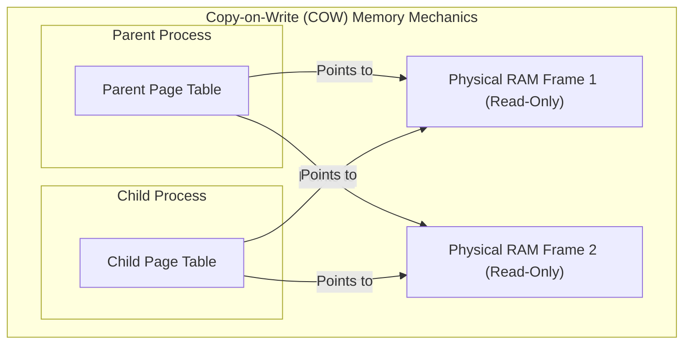

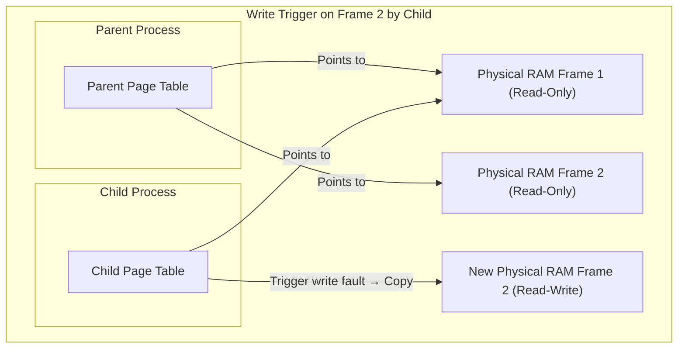

---

### Comprehensive Interview Questions

## Question 10

### Difficulty
Medium

### Interview Question
Differentiate between Spooling, Buffering, and Caching. Explain their respective use cases, benefits, and working mechanisms.

### Short Interview Answer (30 Seconds)
**Spooling** queues data on disk to handle multiple jobs sent to non-shareable, slow peripheral devices like printers. **Buffering** uses physical memory to temporarily store data, resolving speed and transfer-size mismatches between two devices during a single stream (like video buffering). **Caching** stores copies of frequently accessed data in fast memory to speed up read access, operating independently of device speed mismatches.

### Detailed Interview Answer
These three memory management techniques optimize data flow:

1. **Spooling (Simultaneous Peripheral Operations On-Line):**
   - **Working:** Intercepts output from multiple processes, writes the data to spool files on disk, and queues them. A spooler daemon reads these files sequentially and sends them to the device.
   - **Key Feature:** Overlaps the I/O of one job with the computation of other jobs. It makes slow devices appear shareable.
   - **Use Case:** Print queues, mail servers.
2. **Buffering:**
   - **Working:** Reserve a memory region (the buffer) to hold data during transfer. When writing, the sender fills the buffer. Once full, the receiver reads it.
   - **Key Feature:** Smooths out speed differences. For example, if a program writes data faster than the disk can write, the data sits in the buffer.
   - **Use Case:** Video streaming, double-buffering in graphics rendering, network socket reads.
3. **Caching:**
   - **Working:** Keeps a copy of data that exists on slower storage in a faster cache memory. When a read is requested, the system checks the cache first.
   - **Key Feature:** Improves read latency by exploiting temporal and spatial locality.
   - **Use Case:** CPU caches (L1, L2, L3), database query caches, CDN web caching.

### Internal Working
In video streaming (Buffering), the player reserves a buffer in RAM. The network thread writes packets to this buffer. The rendering engine reads frames from the buffer. If network speed drops, the rendering engine pauses until the buffer is refilled.

In printing (Spooling), when three applications print concurrently, the OS doesn't interleave their pages. Instead, the OS creates three separate spool files on disk. The print spooler daemon prints the first file completely before starting the second.

### Real Life Analogy
- **Spooling:** A mailroom. Residents drop off outgoing letters in a bin (spool queue). The mail carrier collects them all at once and delivers them.
- **Buffering:** An hourglass. You pour sand in quickly at the top, and it trickles out at a steady pace at the bottom.
- **Caching:** Keeping a copy of your house keys in your pocket instead of walking to the safe in your bedroom to get them every time you want to open the door.

### Real World Example
- **Spooling:** Print Spooler on Windows or CUPS (Common Unix Printing System) on Linux.
- **Buffering:** Standard C streams use buffer arrays. `printf("hello")` doesn't write to the screen immediately; it buffers the text until it encounters a newline `\n` or the buffer is flushed.
- **Caching:** Web browsers cache image files locally on your SSD so they load instantly when you visit the page again.

### Production Perspective
In production database design, tuning buffer pools (like InnoDB Buffer Pool in MySQL) is critical. The buffer pool acts as both a cache (holding hot data pages) and a buffer (accumulating writes before flushing them to disk). Misconfiguring this can lead to write-amplification or I/O bottlenecks.

### Advantages
* **Spooling:** Makes non-shareable devices shareable and prevents applications from blocking while waiting for slow devices.
* **Buffering:** Smooths data flow rates, matching speed mismatches between devices.
* **Caching:** Significantly reduces read access latencies.

### Limitations
* **Spooling:** Requires disk space to hold queued files.
* **Buffering:** Can introduce latency (waiting for the buffer to fill).
* **Caching:** Requires complex cache invalidation logic to prevent stale data reads.

### Trade-offs
* **Latency vs. Memory:** Larger buffers reduce dropouts but increase start latency and use more RAM.

### Best Practices
* Set buffer sizes to match the underlying disk block size (usually 4KB) to optimize write alignment.
* Implement appropriate cache eviction policies (like Least Recently Used - LRU) to keep hot data in memory.

### Common Mistakes
* **Confusing Buffering and Caching:** Buffering stores the *only* copy of transient data during transfer. Caching stores a *duplicate* copy of persistent data to speed up access.

### Common Interview Traps
* **Trap:** The interviewer asks: *"Does caching improve write speeds?"*
* **Correction:** Only if you use a "write-back" cache policy (where data is written to the cache first and flushed to disk later). Under a "write-through" policy, write speed is limited by the slower disk speed because data must be written to both the cache and disk simultaneously.

### Interview Follow-up Questions
* *What is a buffer overflow?*
  - **Answer:** A vulnerability where an application writes more data to a buffer than it was allocated to hold. The excess data overflows into adjacent memory, overwriting pointers or return addresses.

### Cross Questions
* *How does the OS print spooler handle printer out-of-paper errors without blocking applications?*
  - **Answer:** The applications finish writing to their disk spool files immediately. The spooler daemon catches the printer error, pauses the print queue, and alerts the user, while the applications continue running normally.

### Memory Trick
* **S**pool = **S**hareable slow queues.
* **B**uffer = **B**ridge speed gaps.
* **C**ache = **C**opy for quick access.

### Revision Note
Spooling queues jobs on disk for slow devices. Buffering smooths data flow during transfers. Caching duplicates active data in fast memory to speed up read access.

---

## Question 11

### Difficulty
Hard / FAANG

### Interview Question
Explain the `fork()` system call. How does it create a child process, what does it return, and how does the Copy-on-Write (COW) optimization work?

### Short Interview Answer (30 Seconds)
`fork()` is a system call that creates a new child process by cloning the parent process. It returns twice: it returns `0` to the child process, and the child's Process ID (PID) to the parent process. To avoid the overhead of copying memory during the clone, the OS uses **Copy-on-Write (COW)**. It maps the virtual page tables of both processes to the same physical memory pages, marking them as read-only. The pages are only copied if one of the processes attempts to write to them.

### Detailed Interview Answer
When a process calls `fork()`:
1. The kernel allocates a new process descriptor (`task_struct` in Linux) and a new unique Process ID (PID) for the child.
2. It copies the parent's descriptor values, file descriptor tables, and virtual memory mappings (page table pages).
3. **Copy-on-Write (COW):** Instead of duplicating the physical memory pages, the kernel points both the parent and child page tables to the same physical pages and marks them as **Read-Only** (even if they were read-write in the parent).
4. **Execution Resume:** Both processes resume execution from the instruction immediately following the `fork()` call.

**The Return Value:**
- In the **Parent Process**, `fork()` returns the PID of the new child. This allows the parent to manage, track, or wait for the child.
- In the **Child Process**, `fork()` returns `0`. This allows the child code to branch into its own execution path.
- If it fails, it returns `-1` in the parent.

**The COW Write Flow:**
If the child attempts to write to a variable:
1. The CPU tries to execute the write instruction, but the MMU sees the page table entry is marked read-only, triggering a Page Fault Exception.
2. The CPU traps to the kernel page fault handler in Ring 0.
3. The kernel sees the fault occurred on a valid writeable page that was shared during a `fork()`.
4. It allocates a new physical memory frame, copies the content of the shared page into it, updates the faulting process's page table to point to this new frame, marks the page as read-write, and drops the sharing flag.
5. The CPU resumes execution, performing the write on the new private page.

### Internal Working
```c
#include <stdio.h>
#include <unistd.h>
#include <sys/types.h>

int main() {
    pid_t pid = fork();
    if (pid < 0) {
        // Fork failed
        return 1;
    } else if (pid == 0) {
        // Child process path
        printf("I am the child. My PID is %d\n", getpid());
    } else {
        // Parent process path
        printf("I am the parent of child PID %d\n", pid);
    }
    return 0;
}
```

### Real Life Analogy
Consider a document you are editing (Parent Process). You want to try some risky edits, so you copy the document's link (fork) and share it with a colleague (Child). Instead of duplicating the file, the system points both of you to the same document. As long as you both only read it, no extra space is used. However, the moment your colleague types a new sentence (writes to memory), the system automatically clones that page to create a private copy for them.

### Real World Example
- **Web Servers (Apache):** Pre-forks worker processes to handle incoming HTTP requests in parallel.
- **Redis Database:** Uses `fork()` to create a background child process that writes a snapshot of the in-memory database to disk (`rdbSave`). Because of COW, the parent Redis process can continue serving client write requests on its own copies of pages, while the child process writes a stable, frozen snapshot of the memory from the moment `fork()` was called.

### Production Perspective
In high-throughput databases with massive memory footprints (e.g., a Redis instance using 64GB of RAM), calling `fork()` can trigger performance issues. Although COW avoids copying the memory pages themselves, the kernel must still copy the virtual page tables. For a 64GB database, the page tables can occupy hundreds of megabytes. Copying them can freeze the database process for several milliseconds (known as "fork latency"). Under heavy write workloads immediately after a fork, COW can trigger page faults, increasing memory consumption and potentially triggering the Linux **Out Of Memory (OOM) Killer**.

### Advantages
* **Extremely Fast Creation:** Creating a child process takes microseconds because COW avoids memory copies.
* **Simple Programming Model:** The child inherits open files, network sockets, and execution states, making multitasking easy to implement.

### Limitations
* **Page Table Copy Overhead:** For processes with large memory footprints, copying page tables can cause performance hiccups.
* **Risk of Memory Overcommit:** If both parent and child write to many pages, memory usage can double, leading to crashes.

### Trade-offs
* **Fork-and-Exec vs. Spawning Threads:** Creating processes via `fork` provides complete memory isolation, but uses more resources than creating threads, which share the same address space.

### Best Practices
* When calling `fork()`, if the child is going to call `execve()` immediately, use `vfork()` (which blocks the parent and shares the stack without copying page tables) or `posix_spawn()`.
* Ensure that the host has sufficient swap space if you run large applications (like Redis) that fork frequently.

### Common Mistakes
* **Assuming parent and child share variables after fork:** Once a write occurs, the memory page is copied. Changes made by the child do not affect the parent's variables, and vice versa.

### Common Interview Traps
* **Trap:** The interviewer asks: *"If a parent process has 10 open file descriptors, how many does the child have after `fork()`?"*
* **Correction:** The child has 10 file descriptors that point to the exact same file descriptors in the kernel's file table. If the child reads a line from File Descriptor 3, it updates the shared file offset, meaning the parent will read from the next line.

### Interview Follow-up Questions
* *What is a zombie process?*
  - **Answer:** A child process that has terminated but still has its process descriptor in the kernel's process table because the parent has not yet read its exit status using the `wait()` system call.

### Cross Questions
* *What is an orphan process and how is it handled?*
  - **Answer:** An orphan process is a child process whose parent terminated before it did. The kernel reparents the orphan process to the init process (PID 1), which automatically calls `wait()` to clean up its process descriptor when it terminates.

### Memory Trick
* **F**ork = **F**ork in the road. Parent gets **P**ID, Child gets **0** (Zero/Zip).

### Revision Note
`fork()` clones a process, returning `0` to the child and the child's PID to the parent. COW optimizes this by sharing physical memory pages as read-only, duplicating them only on write operations.

---

## Question 12

### Difficulty
Medium

### Interview Question
Explain the `kill()` system call and the utility of the `ps -a` command. How does the OS deliver process termination signals?

### Short Interview Answer (30 Seconds)
The `kill()` system call sends a signal (such as `SIGKILL` or `SIGTERM`) to a process using its Process ID (PID). It is not exclusively for termination, but rather a general signal delivery mechanism. The `ps -a` command is a user-space tool that queries the kernel's process descriptors to list running processes along with their PIDs, terminal associations, and execution states. When `kill()` is called, the kernel checks permissions, updates the target process's signal queue, and triggers the signal handler during the target's next transition to user mode.

### Detailed Interview Answer
**`ps -a` Command:**
`ps` stands for "Process Status". The `-a` flag instructs it to query the kernel and list all processes associated with a terminal, except session leaders. This is used to locate target PIDs.

**The `kill()` System Call:**
Its signature is `int kill(pid_t pid, int sig);`. 
1. **Validation:** The kernel verifies that the sending process has permission to signal the target process.
2. **Signal Selection:** Common signals include:
   - `SIGTERM` (15): Requests termination. The target process can catch this signal to perform cleanup (e.g., closing databases) before exiting.
   - `SIGKILL` (9): Forcefully terminates the process. This signal cannot be caught, blocked, or ignored.
   - `SIGSTOP` (19): Pauses process execution.
3. **Signal Delivery:** The kernel marks the signal in the target process's descriptor flag field. The signal is not delivered instantly; it is processed when the target process transitions from Kernel Mode back to User Mode, or when it wakes up from a blocked state.

### Internal Working

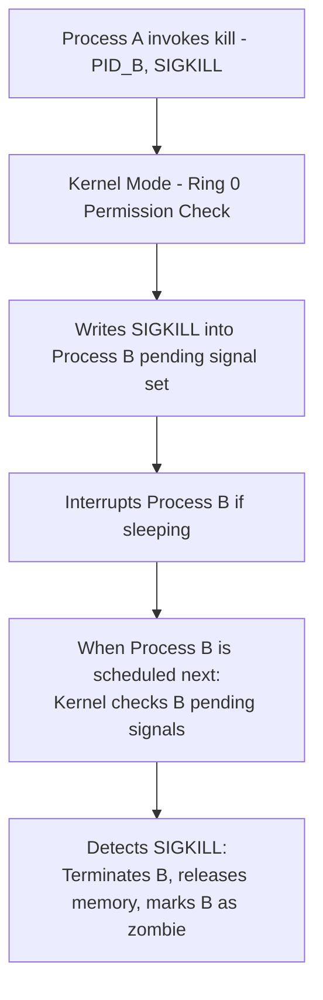

### Real Life Analogy
- **`ps -a`:** A classroom attendance list showing every student's name and seat ID (PID).
- **`kill()`:** A teacher passing a note (signal) to a student. If the note says "Please clean your desk and step out" (SIGTERM), the student can finish writing their sentence before leaving. If the note is a principal's expulsion notice (SIGKILL), the student is escorted out of the room immediately.

### Real World Example
To stop a runaway background process:
1. Run `ps -a` to find the process:
   ```
   PID   TTY          TIME CMD
   4521  pts/0    00:02:15 bad_agent
   ```
2. Send a graceful termination signal:
   ```bash
   kill -15 4521
   ```
3. If it does not respond, send a forceful termination signal:
   ```bash
   kill -9 4521
   ```

### Production Perspective
In container environments (like Docker or Kubernetes), container shutdown follows this exact flow. When a container is stopped, the container engine sends a `SIGTERM` to the container's PID 1. The engine waits a grace period (typically 30 seconds) to allow the application to finish handling requests and close resources. If the container is still running after the grace period, the engine sends a `SIGKILL` to forcefully terminate it.

### Advantages
* **Asynchronous Control:** Allows managing processes without needing to poll or block.
* **Graceful Degradation:** Signals allow processes to catch errors, save states, and close files before terminating.

### Limitations
* **SIGKILL Hazard:** Forcefully killing a database process using `SIGKILL` can cause data corruption since the database cannot flush its memory buffers to disk.
* **Permissions:** Processes can only signal other processes running under the same user ID (except root, which can signal any process).

### Trade-offs
* **Graceful Exit (`SIGTERM`) vs. Instant Exit (`SIGKILL`):** `SIGTERM` is safer but can be ignored by buggy processes. `SIGKILL` is guaranteed to succeed but risk corrupting files.

### Best Practices
* Always send `SIGTERM` (15) first to allow processes to clean up resources, and only resort to `SIGKILL` (9) if the process is unresponsive.
* Check the return value of the `kill()` call. If it returns `-1` with `errno == ESRCH`, the process does not exist.

### Common Mistakes
* **Believing `kill` only terminates processes:** The `kill` command is a generic signal delivery system. It can also be used to pause execution (`SIGSTOP`), resume execution (`SIGCONT`), or trigger configuration reloads (`SIGHUP`).

### Common Interview Traps
* **Trap:** The interviewer asks: *"Can a process catch a `SIGKILL` signal to save its state before terminating?"*
* **Correction:** No. `SIGKILL` (9) and `SIGSTOP` (19) are processed directly by the kernel scheduler. The kernel terminates or stops the process immediately and never returns control to the process's user-space code.

### Interview Follow-up Questions
* *What happens if you send signal 0 to a process using `kill(pid, 0)`?*
  - **Answer:** Signal 0 is a null signal. The kernel does not send a signal, but still performs error checking. This is used to check if a process ID is valid and active.

### Cross Questions
* *If a process is blocked in an uninterruptible sleep state (indicated by state `D` in `ps`), what happens when you send it a `SIGKILL`?*
  - **Answer:** The process will not terminate immediately. A process in state `D` is waiting for hardware I/O operations (like disk writes) to complete. The kernel will only process the `SIGKILL` and terminate the process after the hardware driver returns.

### Memory Trick
* **`ps`** = **P**rocess **S**tatus.
* **`kill`** = **K**ernel **I**ntercepts **L**ocal **L**inux IDs.

### Revision Note
`kill()` is a system call that sends signals to target PIDs. `ps -a` displays active processes. Signals are processed during mode transitions, with `SIGKILL` bypass-handling to force process termination.

## Question 13

### Difficulty
Medium / FAANG

### Interview Question
Explain the differences between Programmed I/O (Polling), Interrupt-Driven I/O, and Direct Memory Access (DMA). Compare their CPU utilization efficiency and data transfer mechanics.

### Short Interview Answer (30 Seconds)

*   **Programmed I/O (Polling)**: The CPU controls the data transfer and constantly checks the device's status register in a loop until the I/O completes. This wastes 100% of CPU cycles during the wait.

*   **Interrupt-Driven I/O**: The CPU initiates the operation and then context switches to other tasks. The device raises a hardware interrupt when it is ready. The CPU suspends its work, runs the Interrupt Service Routine (ISR) to copy the data, and resumes. This saves wait time but still uses CPU cycles for data copying.

*   **Direct Memory Access (DMA)**: A dedicated hardware controller manages data transfer directly between the peripheral device and physical RAM. The CPU only initiates the transfer (source, destination, size) and is interrupted only once when the entire block transfer is complete. This maximizes CPU efficiency.


### Detailed Interview Answer

To handle communications with peripheral devices (keyboards, disks, network interfaces), operating systems use three primary hardware data transfer models:

1.  **Programmed I/O (PIO / Polling):**
    *   **Mechanism:** When the CPU wants to send or receive data, it writes command bytes to the device's control registers. It then enters a busy-waiting loop (polling) checking the status register (e.g., waiting for a "Data Ready" or "Device Busy" bit to flip).
    
    *   **CPU Utilization:** Extremely poor. The CPU is locked in a tight loop doing no useful work.
    
    *   **Use Case:** Simple embedded systems without interrupt controllers, or when latency is ultra-critical (e.g., polling a high-speed network device for immediate packets where the context switch cost of an interrupt is higher than the poll time).

2.  **Interrupt-Driven I/O:**
    *   **Mechanism:** The CPU programs the device controller and immediately switches back to execute user-space threads. When the device is ready to send/receive a byte/word, it raises a signal on a hardware line (Interrupt Request - IRQ). The CPU interrupts its current instruction sequence, saves registers, jumps to the **Interrupt Vector Table (IVT)**, executes the **Interrupt Service Routine (ISR)** to copy the data byte from the controller to memory, and context-switches back.
    
    *   **CPU Utilization:** Good, because the CPU does not wait. However, for high-speed devices (like gigabit network cards or NVMe SSDs), generating an interrupt for every few bytes will overwhelm the CPU with register-saving overhead (referred to as **Interrupt Storms**).

3.  **Direct Memory Access (DMA):**
    *   **Mechanism:** The CPU delegates data block transfers to a dedicated **DMA Controller (DMAC)**. The CPU writes the source memory address, the device port, the transfer size, and the read/write mode to the DMAC registers. Once programmed, the DMAC takes control of the system bus, copying blocks of data directly between the hardware device and system RAM. The CPU is free to run other tasks.
    
    *   **CPU Intervention:** The CPU is only interrupted once: when the entire block transfer has finished.
    
    *   **Cycle Stealing:** During DMA transfer, the DMAC and CPU share the system memory bus. The DMAC periodically "steals" memory cycles from the CPU to perform transfer pulses, slightly slowing down CPU memory access, but this is negligible compared to manual copying.


### Internal Working

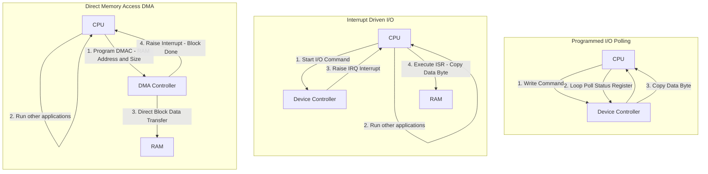


### Real Life Analogy

*   **Programmed I/O:** Standing next to the microwave, staring at the timer, waiting for your food. You can do absolutely nothing else.

*   **Interrupt-Driven I/O:** Putting food in the microwave, going to clean the living room, and running back to the kitchen to plate the food the second the microwave beeps.

*   **Direct Memory Access (DMA):** Ordering delivery. You pay, go read a book (run other processes), and the delivery driver places the food directly in your kitchen. You only get interrupted when the doorbell rings once at the end.


### Real World Example

*   **Programmed I/O:** High-frequency trading (HFT) loop polling a network socket register continuously, or older 80s PC IDE hard drives using PIO Mode.

*   **Interrupt-Driven I/O:** A USB keyboard or mouse. The CPU does not poll them; it only processes inputs when a key press raises an interrupt.

*   **DMA:** A modern SSD loading a 4GB game file. The OS kernel schedules a DMA transaction, and the game data is copied directly from disk to RAM without CPU core copy operations.


### Production Perspective

In high-throughput server systems, handling interrupts efficiently is critical to prevent CPU starvation. If a network card receives 100,000 packets per second, generating 100,000 interrupts will lock the CPU core in ISR code forever. To prevent this, Linux uses **NAPI (New API)**: the kernel starts with interrupt-driven I/O, but if the packet rate crosses a threshold, it temporarily disables hardware interrupts and switches to high-speed Programmed Polling in user space to consume packets in batches.


### Advantages

*   **Programmed I/O:** Zero interrupt hardware complexity; fast response time for dedicated single-task computers.

*   **Interrupt-Driven:** Frees CPU from blocking on slow hardware.

*   **DMA:** Completely unburdens the CPU from copying data blocks, essential for high-bandwidth devices.


### Limitations

*   **Programmed I/O:** Wastes CPU cycles; terrible multitasking performance.

*   **Interrupt-Driven:** High interrupt handling overhead on high-speed hardware.

*   **DMA:** Requires specialized DMAC hardware chips, bus arbitration logic, and can cause bus contention (cycle stealing).


### Trade-offs

*   **Polling latency vs. Interrupt latency:** Polling has zero latency once the device is ready because the CPU is already waiting there. Interrupts have transition latency (registers save, vector jump). However, interrupts save massive amounts of CPU cycles at the expense of this slight dispatch latency.


### Best Practices

*   Use DMA for any transfer size larger than a few disk sectors or network packets.

*   Ensure that memory buffers passed to DMA controllers are **pinned (locked in RAM)** so the OS pager does not swap them to disk during the active hardware transfer.


### Common Mistakes

*   **Believing DMA doesn't impact CPU speed:** The DMA controller steals bus cycles from the CPU. While the CPU isn't doing the copying, its memory access speed might decrease slightly during active DMA transfers.

*   **Assuming interrupts are purely software constructs:** Interrupts are triggered by physical electrical signals raised on hardware IRQ pins connected to the CPU interrupt controller (like the APIC).


### Common Interview Traps

*   **Trap:** *"Why doesn't the CPU page-out memory buffers during a DMA transfer?"*

*   **Correction:** The virtual memory system must explicitly mark the target page table entries as "pinned" or "locked" in physical RAM before triggering the DMA operation. If the page was paged out to disk, the DMAC would copy data to the wrong physical frame, corrupting the memory of other processes.


### Interview Follow-up Questions

*   *What is cycle stealing in the context of DMA?*
    - **Answer:** It is a bus control allocation method where the DMA controller takes control of the system bus for a single bus cycle, suspending the CPU's bus usage for that cycle. This allows the DMAC to transfer one word of data without holding the bus continuously.


### Cross Questions

*   *What is the role of an I/O channel or IOP (I/O Processor)?*
    - **Answer:** An I/O Channel is an advanced evolution of DMA. It is a separate, dedicated processor that executes its own channel programs stored in system memory to control multiple I/O devices, completely isolating the main CPU from all peripheral interfaces and management.


### Memory Trick

*   **P**olling = **P**ersistent check (CPU blocked).

*   **I**nterrupt = **I**ntermittent checks (CPU runs other tasks, copies on trigger).

*   **D**MA = **D**elegate copies (DMAC handles all data copying).


### Revision Note

Operating systems transfer I/O data using Polling (CPU loops), Interrupts (CPU notified when a byte is ready, copies it), or DMA (external controller copies data blocks directly to RAM and interrupts at the end).

---

## Topic 4: Numerical & Analytical Problems

### Section A: Process Tree and `fork()` Calculations

In interviews, you are often asked to calculate the number of processes created by a sequence of `fork()` statements or dry-run process output trees.

#### Mathematical Rule:
* A single `fork()` call duplicates the number of active processes.
* If a program executes $n$ consecutive, unconditional `fork()` calls, the total number of processes created (including the parent) is:
  $$\text{Total Processes} = 2^n$$
* The number of child processes created is:
  $$\text{Child Processes} = 2^n - 1$$

---

#### Problem 1: Basic Unconditional Forking
**Question:** How many times will the string `"OS"` be printed by the following program?
```c
#include <stdio.h>
#include <unistd.h>

int main() {
    fork();
    fork();
    fork();
    printf("OS\n");
    return 0;
}
```

##### Step-by-Step Solution:
1. The program executes 3 unconditional `fork()` calls ($n = 3$).
2. Apply the formula:
   $$\text{Total Processes} = 2^3 = 8$$
3. Each process continues executing from the point of its creation. All 8 processes will reach the `printf("OS\n")` statement.
4. **Answer:** The string `"OS"` will be printed **8 times**.

##### Execution Tree:

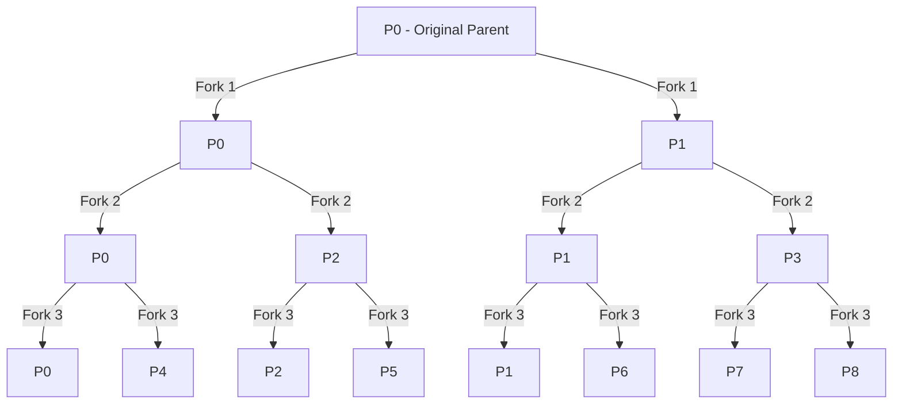

---

#### Problem 2: Forking inside a Loop
**Question:** How many processes are created in total by this loop?
```c
for (int i = 0; i < 4; i++) {
    fork();
}
```

##### Step-by-Step Solution:
1. The loop runs for $i = 0, 1, 2, 3$, executing a `fork()` call in each iteration.
2. This is equivalent to writing 4 consecutive `fork()` statements.
3. Apply the formula ($n = 4$):
   $$\text{Total Processes} = 2^4 = 16$$
4. **Answer:** **16 processes** are created in total (1 parent and 15 children).

---

#### Problem 3: Logical Operators in Fork Chains (FAANG Level)
**Question:** How many processes are created by the execution of this line?
```c
fork() && fork();
```

##### Step-by-Step Solution:
To solve this, you must apply the **C Short-Circuit Evaluation Rules**:
- The logical AND operator `&&` evaluates left-to-right.
- If the left operand is `0` (false), the evaluation stops, and the right operand is **not** evaluated.
- Remember the return values of `fork()`:
  - Parent process receives child PID (evaluated as non-zero / true).
  - Child process receives `0` (evaluated as false).

Let's trace:
1. **Initial State:** 1 process exists (let's call it $P_{root}$).
2. **First `fork()` Execution (Left Side):**
   - $P_{root}$ forks, creating a child $P_{child1}$.
   - **In Parent ($P_{root}$):** The first `fork()` returns a non-zero PID (true). Because the left side is true, the `&&` operator forces evaluation of the right side. $P_{root}$ executes the second `fork()`, creating child $P_{child2}$.
   - **In Child ($P_{child1}$):** The first `fork()` returns `0` (false). Because the left side is false, the `&&` operator short-circuits. $P_{child1}$ does **not** execute the second `fork()`.
3. **Execution count:**
   - $P_{root}$ (original parent)
   - $P_{child1}$ (created in first fork)
   - $P_{child2}$ (created by parent in second fork)
4. **Answer:** **3 processes** are created in total.

##### Execution Tree Trace:

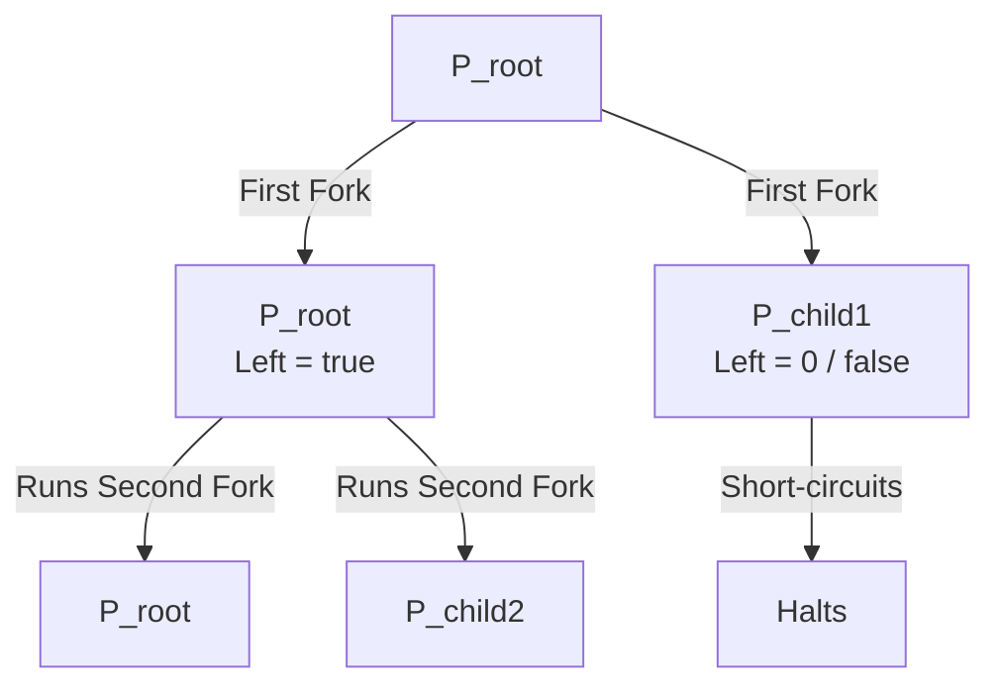

---

#### Problem 4: Complex Logical Or Chains
**Question:** How many processes are created by this statement?
```c
fork() || fork();
```

##### Step-by-Step Solution:
Apply the **C Logical OR (`||`) Short-Circuit Rules**:
- If the left operand is non-zero (true), the evaluation stops, and the right operand is **not** evaluated.
- If the left operand is `0` (false), the evaluation continues, and the right operand is evaluated.

Let's trace:
1. **Initial State:** 1 process exists ($P_{root}$).
2. **First `fork()` Execution (Left Side):**
   - $P_{root}$ forks, creating a child $P_{child1}$.
   - **In Parent ($P_{root}$):** The first `fork()` returns a non-zero PID (true). Because the left side is true, the `||` operator short-circuits. $P_{root}$ does **not** execute the second `fork()`.
   - **In Child ($P_{child1}$):** The first `fork()` returns `0` (false). Because the left side is false, the `||` operator evaluates the right side. $P_{child1}$ executes the second `fork()`, creating child $P_{child2}$.
3. **Execution count:**
   - $P_{root}$ (original parent)
   - $P_{child1}$ (created in first fork)
   - $P_{child2}$ (created by child in second fork)
4. **Answer:** **3 processes** are created in total.

---

### Section B: Practice Problems

1. **Practice 1:** How many times will `"Hello"` be printed by the following program?
   ```c
   int main() {
       for(int i=0; i<3; i++) {
           fork();
       }
       printf("Hello\n");
   }
   ```
   * *Answer:* 8 times (since $2^3 = 8$).

2. **Practice 2:** Determine the total number of processes created by this line:
   ```c
   fork() || fork() && fork();
   ```
   * *Detailed Hint:* Operator precedence rules dictate that `&&` has higher priority than `||`. The statement is evaluated as `fork() || (fork() && fork())`.
   * *Trace:*
     - First `fork()` (left of `||`) creates a child.
     - In Parent: returns true. The `||` short-circuits. No further forks.
     - In Child: returns false. The right side of `||` is evaluated: `fork() && fork()`.
     - The child forks. In this parent, it returns true, so it forks again. In this child, it returns false and short-circuits.
   * *Total Processes:* **5 processes** in total.

---

## Reinforcement: Topic 4

### Comparison Table: Spooling vs. Buffering vs. Caching

| Feature | Spooling | Buffering | Caching |
| :--- | :--- | :--- | :--- |
| **Storage Medium** | Disk Storage | Physical Memory (RAM) | High-speed cache memory (SRAM/RAM) |
| **Purpose** | Queues jobs for slow, non-shareable devices. | Handles speed and data-size mismatches. | Speeds up access to frequently used data. |
| **Queue Type** | Multi-job queue (FIFO list) | Single stream queue | Associative table (key-value structure) |
| **Direct Hardware** | Prone to disk speed limits | Fast RAM access speeds | CPU cache or fast RAM speeds |
| **Shared Resource** | Yes (e.g., share a printer) | No (restricted to a single I/O stream) | Yes (mapped to active processes) |

### Key Takeaways
1. Buffering smooths out speed differences during transfers, while spooling lists jobs for slow, non-shareable hardware.
2. `fork()` creates processes quickly using **Copy-on-Write (COW)** to defer duplicating physical memory pages until writes occur.
3. System signals (`kill()`) are handled when processes transition from Kernel Mode back to User Mode.

---

## End of File: Day 2 Mastery

### Revision Checklist

*   **Understand** the mechanics of mode transitions from Ring 3 to Ring 0.
*   **Diagram** Monolithic, Microkernel, and Hybrid architectures.
*   **List** the steps of the computer boot sequence.
*   **Differentiate** between Spooling, Buffering, and Caching.
*   **Solve** process tree creation counts for conditional `fork()` sequences.

---

## Section A: Kernel Architecture Master Comparison Table {#kernel-table}

> **IMPORTANT:**
> This is one of the most frequently asked comparison topics in OS interviews at FAANG and top product companies.

### Kernel Architecture Designs

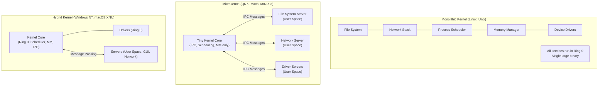

### Master Comparison Table

| Feature | **Monolithic** | **Microkernel** | **Hybrid** | **Exokernel** | **Unikernel** |
| :--- | :--- | :--- | :--- | :--- | :--- |
| **Core Idea** | All OS services in kernel space | Minimal kernel; most services in user space | Mix of both | Expose raw hardware; libraries do OS functions | Single-purpose kernel fused with one app |
| **Kernel Size** | Very large | Very small | Medium | Tiny | Tiny |
| **Performance** | Highest (direct calls) | Lower (IPC overhead) | Good | Highest possible | Very high |
| **Stability** | Driver bug = kernel panic | Driver crash = isolated to user server | Mixed | N/A | High (limited attack surface) |
| **Security** | Lower (large Ring 0 surface) | Higher (minimal Ring 0) | Medium | Application controls everything | Very high (no extra services) |
| **Portability** | Harder (hardware-specific code in kernel) | Easier (kernel is minimal) | Medium | Hard | Hard |
| **IPC Overhead** | None (direct function calls) | High (message passing cross-boundary) | Medium | Minimal | None |
| **Examples** | **Linux**, Unix, FreeBSD | **QNX**, Mach, MINIX 3, seL4 | **Windows NT**, **macOS (XNU)** | MIT Exokernel | MirageOS, Unikraft |
| **Used In** | Servers, cloud, embedded | Automotive (QNX), safety-critical | Desktop OS, gaming consoles | Research | Cloud functions, IoT |

### Why Linux is Called Monolithic (But with Modules)

Linux is a monolithic kernel, but it supports **Loadable Kernel Modules (LKMs)** — device drivers and filesystem modules that can be dynamically inserted (`insmod`/`modprobe`) and removed (`rmmod`) at runtime without rebooting. LKMs run at **Ring 0 with full privileges**, so a buggy LKM can still cause a kernel panic. This is a pragmatic compromise: the clean module interface gives the appearance of modularity, but the security boundary of a true microkernel is absent.

### Windows NT Hybrid Design

Windows NT (the kernel behind all modern Windows) places the HAL (Hardware Abstraction Layer), Executive (Memory Manager, I/O Manager, Process Manager), and device drivers in Ring 0. Win32 subsystem servers (csrss.exe) run in Ring 3 as user-mode processes, communicating via the NT Local Procedure Call (ALPC) IPC mechanism — giving it microkernel characteristics for subsystem isolation.

### macOS XNU Hybrid Design

macOS XNU ("X is Not Unix") is a hybrid kernel combining:
- **Mach** microkernel core (IPC, virtual memory, scheduling).
- **BSD** subsystem (POSIX APIs, networking, file systems) — runs inside the kernel for performance, not in user space as true microkernel design would dictate.
- **I/O Kit** (C++ driver framework in Ring 0).

---

## Section B: Linux Syscall Category Reference {#syscall-ref}

### What is a System Call?

A system call is the **programmatic interface** through which user-space applications request services from the kernel. The Linux kernel has ~350+ distinct system calls. They are organized into functional categories.

### Syscall Number Convention (x86-64)

When a program calls a function like `open()` from glibc:
1. glibc writes the syscall number into register `rax` (e.g., `open` = syscall #2).
2. Arguments go into `rdi`, `rsi`, `rdx`, `r10`, `r8`, `r9`.
3. The `SYSCALL` instruction triggers the mode transition.
4. The kernel dispatches via `sys_call_table[rax]`.
5. Return value is placed in `rax` upon `SYSRET`.

### System Call Categories

| Category | System Calls | Description |
| :--- | :--- | :--- |
| **Process Control** | `fork`, `exec`, `exit`, `wait`, `getpid`, `getppid`, `clone`, `kill` | Create, terminate, wait for processes. `clone()` is the low-level call behind threads. |
| **File Management** | `open`, `close`, `read`, `write`, `seek`, `stat`, `lstat`, `fstat`, `truncate`, `rename`, `unlink` | Open/read/write/close files. |
| **Directory** | `mkdir`, `rmdir`, `opendir`, `readdir`, `chdir`, `getcwd` | Navigate and manage directory entries. |
| **Memory** | `brk`, `sbrk`, `mmap`, `munmap`, `mprotect`, `mlock`, `msync` | Manage process virtual memory. `malloc()` internally uses `brk()`/`mmap()`. |
| **IPC** | `pipe`, `msgget`, `msgsnd`, `msgrcv`, `shmget`, `shmat`, `semget`, `semop`, `socket` | Inter-process communication primitives. |
| **Network / Socket** | `socket`, `bind`, `listen`, `accept`, `connect`, `send`, `recv`, `sendto`, `recvfrom`, `sendfile` | Network communication. |
| **Signal** | `signal`, `sigaction`, `sigprocmask`, `sigsuspend`, `kill`, `raise`, `alarm` | Signal delivery and handling. |
| **Device / I/O** | `ioctl`, `fcntl`, `read`, `write`, `select`, `poll`, `epoll_create`, `epoll_ctl`, `epoll_wait` | I/O control and multiplexing. |
| **Time** | `time`, `gettimeofday`, `clock_gettime`, `nanosleep`, `setitimer` | Get/set system time and timers. |
| **User / Group** | `getuid`, `setuid`, `getgid`, `setgid`, `getgroups`, `setgroups` | User identity management. |
| **File Permissions** | `chmod`, `chown`, `umask`, `access` | Change or check file permissions. |
| **System Info** | `uname`, `sysinfo`, `getrlimit`, `setrlimit`, `times` | Query system information and resource limits. |

### Important Syscalls Deep Dive

#### `mmap` — Memory-Mapped Files

`mmap()` maps a file (or anonymous memory) directly into a process's virtual address space. Instead of using `read()`/`write()` (which require copying data through a kernel buffer), the process accesses file data via direct pointer dereference.

```c
void *addr = mmap(NULL, file_size, PROT_READ, MAP_SHARED, fd, 0);
// Now access file like an array:
char first_byte = ((char*)addr)[0];  // No syscall needed — page fault loads from disk
```

**Why databases use mmap:** SQLite uses mmap for database file access. However, large databases avoid mmap because the OS's page eviction is not database-aware — the kernel may evict hot database pages from cache unpredictably.

#### `epoll` — Scalable I/O Multiplexing

```c
int epfd = epoll_create1(0);               // Create epoll instance
epoll_ctl(epfd, EPOLL_CTL_ADD, sockfd, &ev); // Register socket
int n = epoll_wait(epfd, events, MAX, -1); // Block until any socket is ready
```

**Why epoll > select/poll:** `select()` and `poll()` pass the entire FD list to the kernel on every call (O(N) per call). `epoll` maintains a persistent kernel data structure and returns **only ready FDs** — O(1) regardless of total registered FDs. This is why Nginx can handle 100K+ concurrent connections in a single thread.

### vDSO — Bypassing the Kernel for Common Syscalls

The **vDSO (Virtual Dynamic Shared Object)** is a small kernel-provided shared library automatically mapped into every process's address space. It allows certain frequently called syscalls to execute **entirely in user space**, avoiding the overhead of the full Ring 3 → Ring 0 → Ring 3 transition.

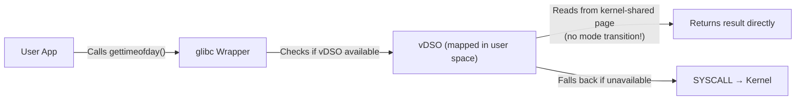

**Syscalls offloaded to vDSO:** `gettimeofday()`, `clock_gettime()`, `time()`, `getcpu()`.

**Why possible:** The kernel maintains a shared read-only memory page (vsyscall page) containing live time data updated by the kernel. The vDSO code reads this page directly without switching rings.

**Performance impact:** `gettimeofday()` via vDSO takes ~4ns vs ~100ns via full syscall — a **25× speedup** for high-frequency time queries (critical for trading systems, metrics collectors, and network timestamping).

---

## Section C: DMA — Direct Memory Access {#dma}

### The Problem DMA Solves

Without DMA, every byte transferred from a storage device or network card requires the **CPU to orchestrate each transfer**:
1. CPU tells device controller to read next byte.
2. CPU reads byte from data register.
3. CPU writes byte to target memory address.
4. Repeat for every byte.

For a 1MB disk read: this consumes 1,048,576 CPU read+write cycles — completely blocking the CPU for the entire duration.

### DMA Lifecycle

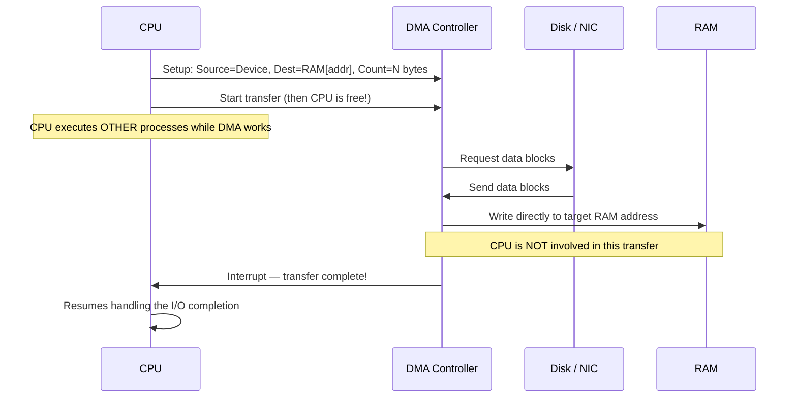

### DMA Types

| Type | Description | Usage |
| :--- | :--- | :--- |
| **Standard DMA** | Uses system bus; CPU bus is temporarily locked during transfers (cycle stealing) | Legacy ISA devices |
| **Bus Mastering DMA** | DMA controller takes full ownership of bus; true parallel operation | PCIe devices (NVMe, SATA AHCI) |
| **Scatter-Gather DMA** | Single DMA operation transfers to/from non-contiguous memory regions | Modern network cards (zero-copy networking) |

### Cache Coherency Problem with DMA

DMA writes directly to physical RAM, **bypassing CPU caches**. If the CPU has cached a memory region that DMA is writing to, the CPU cache holds **stale data** — a cache coherency violation.

**Solution:** The kernel marks DMA buffers as **non-cacheable** (using cache-coherent DMA mappings) or explicitly issues **cache flush/invalidation** instructions before and after DMA operations.

---

## Section D: Memory-Mapped I/O vs Port-Mapped I/O {#mmio}

Device registers (the hardware interface points for controlling peripherals) can be accessed by the CPU in two architecturally distinct ways:

| Feature | **Port-Mapped I/O (PMIO)** | **Memory-Mapped I/O (MMIO)** |
| :--- | :--- | :--- |
| **Address Space** | Separate I/O address space (distinct from RAM) | Part of the main memory address space |
| **CPU Instructions** | Special `IN`/`OUT` instructions (x86-specific) | Standard `MOV` / `LDR` / `STR` memory instructions |
| **Architecture Support** | x86 only | All modern architectures (ARM, RISC-V, x86) |
| **Security** | OS controls I/O port access via IOPL in EFLAGS | OS controls via page table protection bits |
| **Performance** | Slower (special instructions, no caching) | Faster (standard memory pipeline, write combining) |
| **Addressable Devices** | Limited (16-bit I/O port space = 65536 ports) | Large (maps into 64-bit virtual address space) |
| **Used For** | Legacy x86 devices (PIC 8259, PIT 8253, old PCI) | All modern peripherals (PCIe GPUs, NVMe, APIC) |
| **Example** | `outb(0x3F8, 'A')` — write to serial port | `*((volatile uint32_t*)0xFED00000) = val` — write to APIC |

**Modern Reality:** All modern systems use MMIO. Port-Mapped I/O persists only for backward-compatible legacy devices (like the x86 PIC interrupt controller at ports 0x20/0xA0).

---

## Section E: I/O Scheduling Algorithms {#io-sched}

I/O schedulers determine the order in which kernel I/O requests to a storage device are dispatched. For HDDs, reordering requests to minimize seek distance dramatically improves throughput. For SSDs (which have no mechanical seek), ordering for latency fairness is more important.

### I/O Scheduler Comparison

| Scheduler | Full Name | Key Policy | Best For | Weakness |
| :--- | :--- | :--- | :--- | :--- |
| **NOOP** | No Operation | FIFO order, minimal processing | **SSDs / NVMe** (no seek cost) | Poor for HDDs (no seek optimization) |
| **Deadline** | Deadline | Batches reads (500ms timeout) and writes (5s timeout); prevents starvation via expiry queues | **Databases on HDDs** (predictable latency) | Less throughput than CFQ for mixed workloads |
| **CFQ** | Completely Fair Queuing | Time-sliced I/O bandwidth per process | **Desktop workloads** (fair interactive feel) | Deprecated in Linux 5.0+ |
| **BFQ** | Budget Fair Queuing | Budget-based per-process I/O allocation; guarantees latency for interactive processes | **Desktop, laptops, multimedia** | Higher CPU overhead |
| **mq-deadline** | Multi-Queue Deadline | Multi-queue version of Deadline for NVMe | **NVMe SSDs in data centers** | Default in many Linux distros |
| **kyber** | Kyber | Targets latency rather than throughput; feedback-based | **Ultra-fast NVMe / NAND flash** | Less configurable |

### Check Current I/O Scheduler

```bash
# View scheduler for a device
cat /sys/block/sda/queue/scheduler
# [mq-deadline] kyber bfq none

# Change scheduler at runtime
echo mq-deadline > /sys/block/sda/queue/scheduler

# Permanently change via udev rule
echo 'ACTION=="add|change", KERNEL=="sd[a-z]", ATTR{queue/scheduler}="deadline"' \
    > /etc/udev/rules.d/60-scheduler.rules
```

### HDD vs SSD Scheduling Strategy

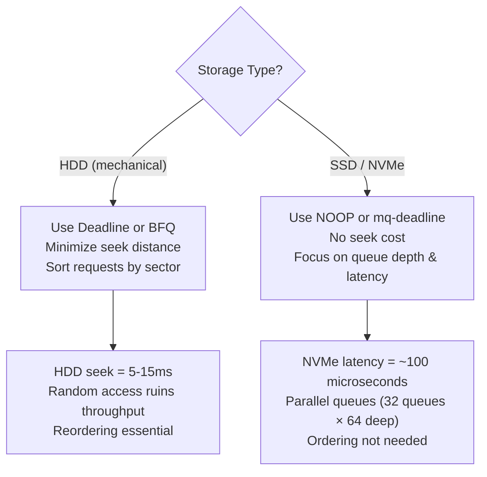

---

## Section F: FAANG-Level Interview Q&A {#faang-qa}

#### Q1. What is Meltdown? How was it fixed? What was the performance cost?

**Answer:**

**Meltdown** (CVE-2017-5754) is a hardware vulnerability in Intel CPUs discovered in 2017. It exploits CPU speculative execution to allow a Ring 3 user process to read kernel memory that should be inaccessible.

**How it works:**
1.  The CPU speculatively executes a load instruction for a kernel address (even though it will eventually cause a Page Fault).
2.  During speculative execution, the kernel memory is loaded into CPU cache.
3.  Before the Page Fault fires and the CPU rolls back the speculation, the attacker uses a **cache timing side channel** (Flush+Reload) to determine which cache line was populated — revealing the kernel memory byte value.

**Fix — KPTI (Kernel Page Table Isolation):**
The kernel now maintains **two separate page table sets** per process:
- A **user-space page table** (minimal kernel mappings — only enough to handle mode transitions).
- A **kernel-space page table** (full mappings used while in Ring 0).

When switching from user to kernel mode, the page table is swapped, preventing speculative loads from reaching kernel mappings.

**Performance cost:** KPTI causes a **5–30% performance regression** on syscall-heavy workloads (databases, web servers). The cost is lower on CPUs with PCID (Process Context Identifier) support, which avoids full TLB flushes during page table switches.

---

#### Q2. What is the OOM Killer? How does it select its victim?

**Answer:**
The **OOM (Out-Of-Memory) Killer** is a Linux kernel mechanism activated when the system has exhausted all available physical RAM and swap space. Rather than causing a kernel panic, the kernel selects a process to kill to reclaim memory.

**Selection Algorithm:**
The kernel computes an `oom_score` for every process based on:
- Physical memory consumed (larger = higher score).
- Child processes' memory (parent responsible for children).
- Length of time running (newer processes prioritized).
- Process priority (nice value).

The process with the **highest `oom_score`** is selected as the victim and sent `SIGKILL`.

```bash
# View OOM scores
cat /proc/1234/oom_score

# Protect critical processes from OOM Killer
echo -1000 > /proc/$(pgrep sshd)/oom_score_adj

# Monitor OOM events
dmesg | grep -i "killed process"
journalctl -k | grep oom
```

**Production implication:** Database processes (PostgreSQL, MySQL) should have `oom_score_adj = -900` to ensure the OOM Killer targets application worker processes before the database itself.

---

#### Q3. How does O_DIRECT work, and why do databases use it instead of standard file I/O?

**Answer:**

**Standard I/O path:**
```
App write() → Kernel page cache (RAM buffer) → Kernel flusher thread → Disk
App read()  ← Kernel page cache (cache hit)  ← (no disk read if cached)
```

**O_DIRECT path:**
```
App write() → Direct DMA transfer → Disk (bypasses page cache entirely)
App read()  → Direct DMA transfer ← Disk (no kernel buffering)
```

**Why databases (PostgreSQL, MySQL InnoDB) use O_DIRECT:**
1. **Avoid double buffering:** Databases maintain their own buffer pool in user space (shared memory). Without O_DIRECT, data is cached twice: once in the database's buffer pool AND once in the kernel page cache — wasting RAM.
2. **Predictable write latency:** Standard writes are asynchronous (kernel decides when to flush). O_DIRECT writes are synchronous — the application knows data is on disk when `write()` returns.
3. **Control over I/O scheduling:** The database can issue its own optimized I/O patterns (sequential pre-fetching, prioritizing certain table access) without the kernel's generic heuristics overriding them.

**Constraint:** O_DIRECT requires **aligned memory buffers** (4KB alignment on modern systems) and **sector-aligned I/O sizes**. Violating alignment causes `EINVAL`.

---

#### Q4. Explain Huge Pages and why databases configure them.

**Answer:**

**Standard paging** uses 4KB pages. For a 512GB database buffer pool:
- Number of page table entries needed = 512GB / 4KB = **134,217,728 entries**.
- These entries must be translated on every memory access → enormous TLB pressure.
- With a 1536-entry TLB, the effective TLB hit rate approaches 0% for a 512GB working set.

**Huge Pages** use 2MB or 1GB page sizes:
- 512GB / 2MB = **262,144 entries** (512× fewer TLB entries).
- TLB coverage massively improved → more cache hits → faster memory access.

```bash
# View huge page availability
cat /proc/meminfo | grep -i huge

# Allocate huge pages
echo 1024 > /proc/sys/vm/nr_hugepages  # Allocate 1024 × 2MB = 2GB

# PostgreSQL huge_pages configuration
echo "huge_pages = on" >> /etc/postgresql/14/main/postgresql.conf
```

**Transparent Huge Pages (THP):** Linux can automatically merge 4KB pages into 2MB pages without explicit configuration. However, THP can cause periodic latency spikes during compaction (when the kernel tries to assemble contiguous physical pages), so many databases disable THP:
```bash
echo never > /sys/kernel/mm/transparent_hugepage/enabled
```

---

#### Q5. A service starts on boot but crashes after 5 seconds and loops. How do you diagnose it?

**Answer:**

```bash
# Step 1: Check systemd unit status and recent logs
systemctl status myservice.service

# Step 2: Follow live journal for this service
journalctl -fu myservice.service

# Step 3: Check kernel messages for OOM kills or crashes
dmesg -T | grep -i "myservice\|killed\|segfault"

# Step 4: Check the binary dependencies
ldd /usr/bin/myservice | grep "not found"

# Step 5: Trace system calls to find the exact failure
strace -f /usr/bin/myservice 2>&1 | tail -30
# Look for the last syscall before exit_group()

# Step 6: Check file/port conflicts
ss -tulpn | grep 8080   # Is the port already in use?
lsof /var/lock/myservice.pid  # Is a lock file held?

# Step 7: Check resource limits
cat /proc/$(pgrep myservice)/limits
ulimit -a

# Step 8: Review systemd restart policy
cat /etc/systemd/system/myservice.service | grep Restart
# Restart=on-failure with StartLimitBurst=5 might be causing the loop
```

---

#### Q6. Explain the difference between a hard link and a bind mount.

**Answer:**

| Property | Hard Link | Bind Mount |
| :--- | :--- | :--- |
| **Scope** | Single filesystem only (same device) | Can cross filesystems |
| **Works on directories** | No | Yes |
| **Kernel mechanism** | Directory entry → same inode | Mounts a directory subtree at a new path in the VFS namespace |
| **Namespace isolation** | No | Yes (per-namespace visibility) |
| **Docker/Container use** | No | Yes — overlayfs and bind mounts enable container filesystems |
| **Command** | `ln file link` | `mount --bind /src /dst` |

Bind mounts are a critical mechanism for containers: Docker uses bind mounts to expose host directories inside containers and OverlayFS to layer container filesystem changes on top of the base image.

---

## Section G: Reinforcement — Rapid Fire & Checklist {#reinforcement}

### 25-Question Rapid Fire Q&A

1.  **Q:** What CPU register controls the active page table? **A:** `%cr3` on x86-64.
2.  **Q:** What is the U/S bit in a page table entry? **A:** User/Supervisor bit — controls if Ring 3 can access the page.
3.  **Q:** What does KPTI stand for and why was it needed? **A:** Kernel Page Table Isolation — defense against Meltdown CPU vulnerability.
4.  **Q:** What is a vDSO? **A:** Virtual Dynamic Shared Object — maps kernel code into user space to avoid mode transitions for frequent syscalls.
5.  **Q:** Which syscalls are accelerated by vDSO? **A:** `gettimeofday()`, `clock_gettime()`, `time()`, `getcpu()`.
6.  **Q:** What is the first software to run when a PC powers on? **A:** UEFI/BIOS firmware (runs from flash ROM).
7.  **Q:** What is the role of GRUB? **A:** Bootloader — loads the Linux kernel image (`vmlinuz`) and initial RAM disk (`initramfs`) into memory.
8.  **Q:** What is initramfs? **A:** Temporary root filesystem in RAM containing drivers and tools needed to mount the real root filesystem.
9.  **Q:** What is PID 1 in Linux? **A:** The first user-space process — `systemd` (or `init` on older systems). All processes are descendants of PID 1.
10. **Q:** What happens when a process calls `exit()`? **A:** Kernel releases resources, process enters Zombie state, sends SIGCHLD to parent. Removed when parent calls `wait()`.
11. **Q:** What is the difference between `fork()` and `clone()`? **A:** `fork()` creates a new process with a separate address space. `clone()` is the low-level primitive that can share resources (used to create threads).
12. **Q:** What is Copy-on-Write in `fork()`? **A:** After `fork()`, parent and child share physical pages marked read-only. When either writes, the kernel creates a private copy of that page.
13. **Q:** What is a Monolithic kernel? **A:** All OS services (scheduler, FS, drivers, network) run in Ring 0 as one binary. Example: Linux.
14. **Q:** What is a Microkernel? **A:** Minimal Ring 0 kernel (IPC, scheduling, MM only); all other services run in user space. Example: QNX.
15. **Q:** Why does Linux not use intermediate privilege rings (1 and 2)? **A:** To maintain portability with ARM/RISC-V (which have only 2 rings) and avoid inter-ring transition overhead.
16. **Q:** What is DMA? **A:** Direct Memory Access — hardware mechanism allowing I/O devices to transfer data directly to/from RAM without CPU involvement.
17. **Q:** What is the DMA cache coherency problem? **A:** DMA writes bypass CPU caches; cached CPU data may be stale. Fixed via non-cacheable DMA mappings or explicit cache flush.
18. **Q:** What I/O scheduler should you use for NVMe SSDs? **A:** NOOP or mq-deadline (no seek optimization needed).
19. **Q:** What I/O scheduler should you use for databases on HDDs? **A:** Deadline scheduler (minimizes seek + prevents read starvation).
20. **Q:** What is O_DIRECT? **A:** Open flag that bypasses kernel page cache — I/O goes directly between user buffer and device via DMA.
21. **Q:** What is Memory-Mapped I/O? **A:** Device registers mapped into the main memory address space, accessed via standard load/store instructions.
22. **Q:** What is Port-Mapped I/O? **A:** Device registers in a separate I/O address space, accessed via special `IN`/`OUT` CPU instructions (x86 only).
23. **Q:** What syscall does `malloc()` use internally? **A:** `brk()`/`sbrk()` for small allocations; `mmap(MAP_ANONYMOUS)` for large allocations.
24. **Q:** Why does `epoll` scale better than `select`? **A:** `select` passes entire FD list on every call (O(N)); `epoll` maintains a persistent kernel set and returns only ready FDs (O(1)).
25. **Q:** What is the OOM Killer? **A:** Linux kernel mechanism that kills the highest `oom_score` process when the system exhausts all RAM and swap.

### Top 10 Interview Mistakes — Day 2

1.  Saying the Shell is part of the kernel — the shell is a **user-space application**.
2.  Not knowing that Ring 1 and Ring 2 are **unused by modern OSes** (Linux, Windows, macOS).
3.  Saying Linux is a Microkernel — Linux is **Monolithic** (with loadable modules).
4.  Not explaining the **vDSO** optimization when asked about `gettimeofday()` performance.
5.  Forgetting that **Copy-on-Write** means `fork()` does NOT immediately copy all memory.
6.  Not knowing that **DMA bypasses CPU caches**, creating potential cache coherency issues.
7.  Confusing `mmap` (memory-mapped files in user space) with MMIO (device register access).
8.  Not knowing that **O_DIRECT** requires aligned buffers (common interview trap).
9.  Forgetting **KPTI** and its performance implications when discussing Meltdown.
10. Not being able to explain why `epoll` is O(1) while `select` is O(N).

### Day 2 Revision Checklist

- [ ] I can draw the Ring 0 / Ring 3 boundary and explain the U/S page table bit.
- [ ] I can trace a `write()` syscall from user space through the kernel to hardware.
- [ ] I can name and distinguish Monolithic, Microkernel, Hybrid, and Exokernel with examples.
- [ ] I can explain KPTI, why it was introduced, and its performance cost.
- [ ] I can list the UEFI → GRUB → vmlinuz → initramfs → PID 1 boot chain.
- [ ] I can explain DMA, its lifecycle, and the cache coherency problem it introduces.
- [ ] I can compare MMIO vs Port-Mapped I/O and name which architectures support each.
- [ ] I can explain what vDSO is and name the syscalls it optimizes.
- [ ] I can recommend the right I/O scheduler for HDD vs SSD workloads.
- [ ] I can explain OOM Killer, victim selection, and how to protect critical processes.

### One-Page Day 2 Cheat Sheet

| Topic | Key Fact |
| :--- | :--- |
| Ring 0 = | Kernel (full hardware access) |
| Ring 3 = | User space (restricted, no hardware access) |
| Mode transition trigger | `SYSCALL` instruction / hardware interrupt |
| Syscall interface | Args in `rdi,rsi,rdx`; number in `rax`; `SYSCALL` → kernel handler |
| vDSO | Maps kernel code into user space; `gettimeofday()` = ~4ns (no syscall) |
| Monolithic kernel | All OS in Ring 0; fast; example = Linux |
| Microkernel | Minimal Ring 0; services in user space; example = QNX |
| Hybrid kernel | Both in Ring 0 + user space servers; example = Windows NT, macOS XNU |
| KPTI | Separate page tables per process; fixes Meltdown; 5–30% perf cost |
| Boot chain | UEFI → GRUB → vmlinuz → initramfs → PID 1 (systemd) → user space |
| initramfs | Temporary RAM-based root FS to mount real root |
| DMA | Device → RAM without CPU; bypasses caches |
| MMIO | Device registers in main memory address space |
| PMIO | Device registers in I/O address space; `IN`/`OUT` instructions; x86 only |
| O_DIRECT | Bypasses page cache; databases use it to avoid double buffering |
| Huge Pages | 2MB/1GB pages → fewer TLB entries → less TLB pressure |
| epoll vs select | epoll = O(1); select = O(N) — epoll for high-concurrency servers |
| OOM Killer | Kills highest `oom_score` process when RAM exhausted |
| I/O scheduler (HDD) | Deadline or BFQ |
| I/O scheduler (SSD/NVMe) | NOOP or mq-deadline |
