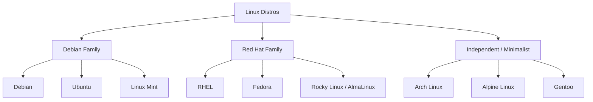
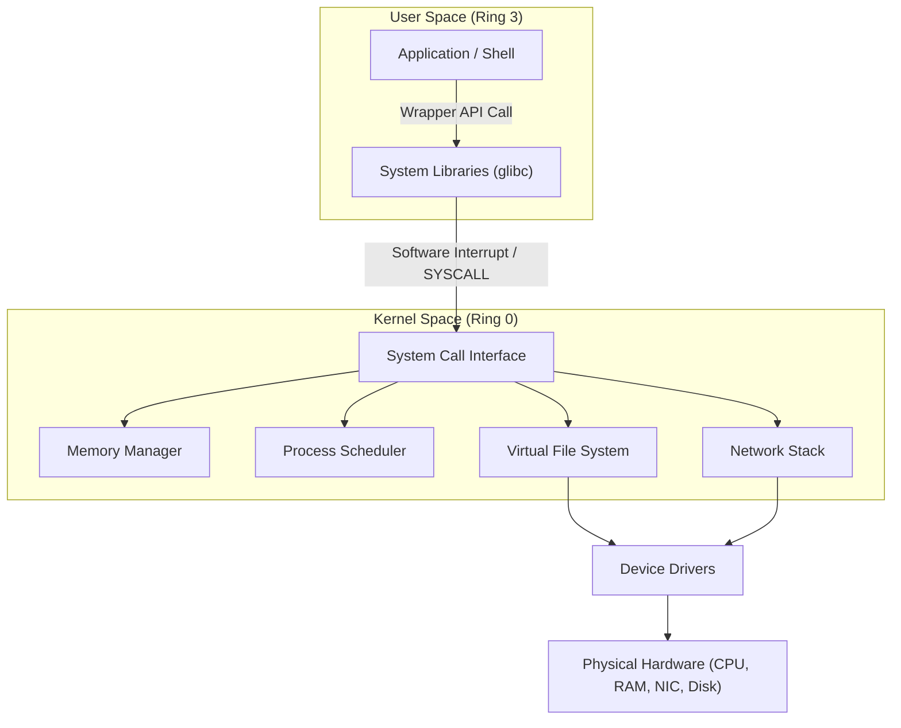
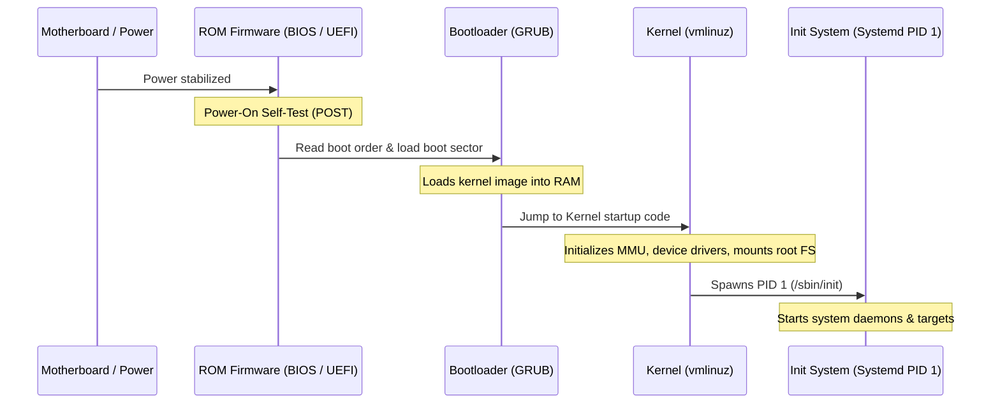
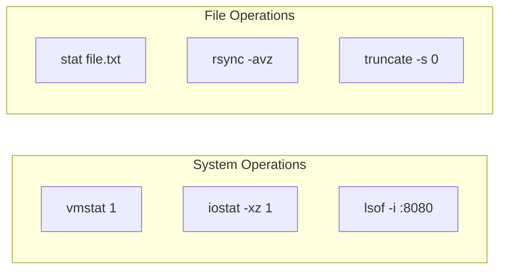

# Day 3: Mastering Linux Commands, Internals, and Shell Scripting - Ultimate Interview Guide

> **NOTE:**  
> Welcome to Day 3 of the ultimate Operating Systems interview preparation guide. This document focuses on the Linux Operating System, covering its design roadmap, command encyclopedia, internal mechanics, shell scripting, comparison tables, and system-level troubleshooting. Use this guide to prepare for technical interviews at top-tier product-based companies and build a production-grade understanding of Linux systems engineering.

---

## Section 1: Learning Roadmap & Distributions

### What is Linux?
Linux is an open-source, Unix-like operating system kernel created by Linus Torvalds in 1991. Today, "Linux" is commonly used to describe the entire operating system, which packages the Linux kernel alongside system utilities, libraries, and applications (many of which are sourced from the GNU Project, leading to the designation **GNU/Linux**).

### History of Linux
*   **Unix Ancestry:** In the late 1960s, AT&T Bell Labs developed Unix, a powerful multi-user, multitasking OS. However, Unix was proprietary and licensing was expensive.
*   **GNU Project:** In 1983, Richard Stallman launched the GNU Project to create a free, Unix-compatible OS. By 1990, GNU had developed almost all core components (compiler, libraries, shell) except the kernel (Hurd).
*   **The Kernel Arrival:** In 1991, Linus Torvalds, a student at the University of Helsinki, developed a monolithic kernel to run on Intel 80386 processors. He released the source code under the GNU General Public License (GPL). Combining the Linux kernel with GNU utilities created the first fully functional, open-source operating system.

### Why Linux Dominates Servers & Cloud
1.  **Open Source & Cost:** No licensing fees mean organizations can scale virtual machine clusters without proportional cost increases.
2.  **Stability & Reliability:** Designed for continuous operation. Kernel panics are rare, and configuration changes (even kernel updates via technologies like `kpatch`) can be performed without rebooting.
3.  **Security & Modularity:** Discretionary Access Control (DAC), Mandatory Access Control (MAC via SELinux/AppArmor), namespaces, and cgroups isolate applications.
4.  **Resource Efficiency:** Runs headlessly (without a GUI), dedicating almost all memory and CPU cycles directly to applications.
5.  **Native Containerization:** Modern container systems (Docker, Kubernetes) run natively on Linux, using kernel features (namespaces and cgroups) to virtualize workloads without hypervisor overhead.

### Role-Specific Importance

#### For Backend Engineers
Understanding the file system, network sockets, memory allocation, and processes allows backend developers to design high-performance, non-blocking applications. Knowledge of system limits (e.g., file descriptors, epoll queues, TCP buffers) is essential for scaling microservices.

#### For DevOps Engineers
DevOps engineers rely on Linux to construct build agents, manage CI/CD runners, deploy containers, configure web servers, and automate infrastructure deployments.

#### For SREs & Cloud Engineers
Site Reliability Engineers (SREs) and Cloud Engineers operate at the interface of software and systems. They debug resource constraints (CPU throttle, out-of-memory kills, I/O wait), configure cloud instances, audit system security, and analyze live system calls.

---

### Distribution Breakdown



1.  **Debian Family (Debian, Ubuntu):** Emphasizes stability and open-source principles. Ubuntu, built on Debian, offers a user-friendly experience and is the standard choice for cloud virtual machines and container base images. Uses `.deb` packages and `apt` package manager.
2.  **Red Hat Family (RHEL, Fedora, Rocky/AlmaLinux):** Tailored for enterprise environments with commercial support options. Uses `.rpm` packages and `dnf`/`yum` package managers.
3.  **Alpine Linux:** A security-oriented, ultra-lightweight distribution (around 5MB in size) built around musl libc and BusyBox. It is widely used as the default base image for production Docker containers to minimize download sizes and reduce security attack surfaces.
4.  **Arch Linux:** Follows a rolling-release model and is aimed at advanced users. It follows a "Keep It Simple" philosophy, forcing users to configure system components manually.

---

## Section 2: Best Platforms to Practice Linux

| Platform | Overview | Advantages | Disadvantages | Difficulty | Industry Usage | Best For | Recommendation |
| :--- | :--- | :--- | :--- | :--- | :--- | :--- | :--- |
| **Ubuntu VM** | Full Ubuntu OS running on local virtualization hypervisor. | Absolute control, snapshot capabilities, matches staging servers. | High memory and disk usage. | Medium | Very High | Local testing, application setups | Recommended for SREs and SDEs. |
| **WSL 2** | Native Linux kernel integration within Windows. | Runs alongside Windows tools; shares local drive paths. | Slight overhead; systemd requires manual activation on older versions. | Easy | High | Developer workstation daily driving | Recommended for Windows developers. |
| **Dual Boot** | Linux installed directly on physical disk partitions. | Full bare-metal performance, GPU access. | Repartitioning risk; requires system reboot to switch OS. | Hard | Medium | Power users, hardware development | Best for dedicated Linux workstations. |
| **Docker** | Isolated container running Linux binaries. | Starts instantly; extremely lightweight; disposable. | Lacks systemd init processes by default; restricted namespace. | Easy | Critical | Testing CLI commands, clean sandboxes | Recommended for command sandboxing. |
| **Cloud VM** | Remote VM (EC2, GCP Compute Engine). | Accessible over SSH, real public IP, mimics production. | Can incur costs if left running; requires network connection. | Medium | Standard | Production, cloud engineering | Recommended for Cloud/DevOps practice. |
| **Codespaces** | Remote containerized workspace in GitHub. | Integrated with IDE; ready-to-go environment. | Dependent on cloud connectivity; limited CPU/RAM on free tier. | Easy | High | Quick fixes, coding tests | Best for remote coding. |
| **Killercoda** | Free interactive terminal browser labs. | Pre-configured scenarios; zero installation. | Session timeouts; requires constant internet access. | Easy | Low | Guided scenario practicing | Best for structured SRE/DevOps labs. |
| **Bandit** | Wargame learning platform by OverTheWire. | Gamified approach; focuses on security and pipes. | Text-only; can be frustrating for absolute beginners. | Medium | Low | Command-line fluency and scripting | Recommended for security fundamentals. |
| **Codecrafters** | Implement system tools from scratch. | Teaches deep system programming. | Paid tier; requires advanced coding knowledge. | Hard | Medium | Internal engineering comprehension | Best for senior developers. |

### Practice Recommendations
*   **Absolute Beginners:** Start with **WSL 2** (if on Windows) or a local **VirtualBox VM** running Ubuntu LTS to build comfort with the filesystem.
*   **Interview Prep:** Play **OverTheWire Bandit** to master CLI navigation, file searching, pipelines, and basic permissions.
*   **Daily Developer Work:** Adopt **WSL 2** or native **Dual Boot** to run development environments locally.
*   **DevOps & SRE Candidates:** Practice deploying **Cloud VMs (AWS EC2)** using SSH keys, setting up Docker containers, and managing firewall rules.

---

## Section 3: Linux Internals & Architecture

To prepare for system-level interviews, candidates must understand what happens beneath the shell command layer.



### 1. User Space vs. Kernel Space
*   **Kernel Space (Ring 0):** The protected memory area where the core kernel executes. It has direct access to CPU execution paths, memory mappings, and raw peripheral buses.
*   **User Space (Ring 3):** The restricted memory area where applications (web servers, databases, compilers) and shells run. If a user-space application crashes, it only terminates its own execution block; the kernel remains unaffected.

### 2. System Calls (Syscalls)
An application in user space cannot read a file from disk or send a packet over the network directly. Instead, it must invoke a **System Call**. This transitions the processor from Ring 3 to Ring 0.
1.  The application calls a standard C library wrapper (e.g., `read()` in glibc).
2.  The wrapper puts the arguments into registers and writes the unique System Call Number to the accumulator register (`rax` in x86-64).
3.  The wrapper executes the hardware instruction `SYSCALL` (or software interrupt `INT 0x80`).
4.  The CPU stops user execution, raises privileges to Ring 0, and jumps to the address mapped in the Model Specific Register (`IA32_LSTAR`) which points to the Kernel's System Call Handler (`entry_SYSCALL_64`).
5.  The handler maps the system call number to the function pointer in the `sys_call_table` and runs the kernel code (e.g., `sys_read`).
6.  The CPU drops back to Ring 3 via `SYSRET` and resumes the application.

### 3. The Boot Process



### 4. File System Hierarchy Standard (FHS)
Linux organizes data in a unified directory tree starting at the root `/`.
*   `/bin` & `/sbin`: Core binary commands needed for system administration and boot recovery (e.g., `ls`, `mount`).
*   `/boot`: Files required to boot the machine, including the Linux kernel image (`vmlinuz`) and the initial RAM disk (`initramfs`).
*   `/dev`: Device files representing hardware components as files (e.g., `/dev/sda` for a disk, `/dev/urandom` for random bytes).
*   `/etc`: Volatile, system-wide configuration files (e.g., `/etc/passwd`, `/etc/hosts`).
*   `/proc`: A pseudo-filesystem tracking active kernel states and process directories (e.g., `/proc/cpuinfo`, `/proc/<PID>`).
*   `/sys`: A pseudo-filesystem exporting kernel device attributes to user space.
*   `/var`: Variable data directories, such as log stores (`/var/log`) and database caches.
*   `/usr`: User utilities and applications, containing its own `/usr/bin` and `/usr/lib` hierarchies.

---

## Section 4: Complete Linux Command Encyclopedia

This section serves as a comprehensive reference for core and advanced Linux commands.

### File and Directory Management

#### 1. `ls` (List)
*   **Purpose:** List directory contents.
*   **Lesser-Known Flags:**
    *   `-h`: Render file sizes in human-readable formats (e.g., 2K, 4M, 1G).
    *   `-t`: Sort files by modification time, newest first.
    *   `-S`: Sort files by file size, largest first.
    *   `-i`: Output the inode number of each file.
    *   `-R`: List directories recursively.
*   **Production Example:** Sort files in a directory by size and show hidden files:
    ```bash
    ls -lahS
    ```

#### 2. `stat` (Status)
*   **Purpose:** Display detailed file or file system status.
*   **Why it exists:** Provides metadata details (inode number, access/modification/change timestamps, blocks allocated, block size, exact permissions in octal) that `ls` does not show.
*   **Production Example:** Output the octal permission code and file size of a script:
    ```bash
    stat -c "Perms: %a, Size: %s bytes" deploy.sh
    ```

#### 3. `truncate`
*   **Purpose:** Shrink or extend the size of a file to a specified value.
*   **When to use:** Truncate large application log files to 0 bytes instantly without deleting the file handle (avoiding service restarts).
*   **When NOT to use:** Do not use on binary database files, as it can cause data corruption.
*   **Production Example:** Empty a runaway 50GB log file:
    ```bash
    truncate -s 0 /var/log/nginx/access.log
    ```

#### 4. `sync` & `syncfs`
*   **Purpose:** Flush file system buffers from memory cache to physical disk.
*   **Internal Working:** Linux uses memory caching (page cache) for disk I/O. When data is written, it is stored in dirty pages in RAM. `sync` triggers the kernel to flush all dirty pages to the disk queue.
*   **Production Example:** Force write dirty pages to disk before running a hardware maintenance power-down:
    ```bash
    sync
    ```

---

### Text Processing & Filtering

#### 5. `grep` (Global Regular Expression Print)
*   **Purpose:** Pattern matching within text files or standard streams.
*   **Flags to Know:**
    *   `-i`: Case-insensitive search.
    *   `-v`: Invert match (output lines that do *not* contain the pattern).
    *   `-r` / `-R`: Search directories recursively.
    *   `-o`: Output only the matching string, not the entire line.
    *   `-c`: Print the count of matching lines.
    *   `-E`: Interpret the search pattern as an Extended Regular Expression (ERE).
    *   `-P`: Interpret the pattern as a Perl Compatible Regular Expression (PCRE).
    *   `-A <N>` / `-B <N>` / `-C <N>`: Print N lines After, Before, or Context around matching lines.
*   **Production Example:** Extract valid email addresses from a CSV log:
    ```bash
    grep -oP '[a-zA-Z0-9._%+-]+@[a-zA-Z0-9.-]+\.[a-zA-Z]{2,}' users.csv
    ```

#### 6. `sed` (Stream Editor)
*   **Purpose:** Perform basic text transformations on an input stream.
*   **Why it exists:** Allows automated, non-interactive find-and-replace transformations on text streams.
*   **Production Example:** Change a config parameter inline in a configuration file:
    ```bash
    sed -i 's/PORT=3000/PORT=8080/g' config.env
    ```

#### 7. `awk`
*   **Purpose:** A pattern scanning and processing language.
*   **Why it exists:** Processes structured columnar data (logs, CSVs, system tables).
*   **Production Example:** Calculate the total memory used by all processes running under the user `nginx`:
    ```bash
    ps -u nginx -o rss | awk '{sum+=$1} END {print "Total Memory: " sum/1024 " MB"}'
    ```

---

### Process, Performance & Profiling Utilities

To debug issues like memory leaks, CPU throttling, high I/O wait times, and hanging network sockets, engineers use advanced profiling tools.

#### 8. `strace` (System Trace)
*   **Purpose:** Trace system calls and signals received by a process.
*   **Why it exists:** Crucial when an application fails silently, hangs on startup, or returns access denied errors despite correct permissions.
*   **Lesser-Known Flags:**
    *   `-c`: Generate a summary report table of all syscalls executed.
    *   `-e trace=<syscall>`: Trace only specified system calls (e.g., `openat`, `connect`).
    *   `-p <PID>`: Attach to a running process.
    *   `-f`: Trace child processes spawned by fork calls.
    *   `-T`: Print the time spent in each system call.
*   **Production Example:** Track why a configuration service hangs on startup:
    ```bash
    strace -e trace=openat,read,connect -f -p 4912
    ```

#### 9. `lsof` (List Open Files)
*   **Purpose:** List open files, directories, sockets, and character streams.
*   **Why it exists:** In Linux, everything is a file. If a file is locked or a port is in use, `lsof` identifies the process responsible.
*   **Flags:**
    *   `-i :<PORT>`: Find the process using a specific network port.
    *   `-u <USER>`: List files opened by a specific user.
    *   `+D <DIR>`: Search recursively for open files within a directory.
    *   `-p <PID>`: List all open files for a specific process ID.
*   **Production Example:** Identify which process is holding port 8080 open:
    ```bash
    lsof -i :8080
    ```

#### 10. `perf`
*   **Purpose:** Performance analysis tool for Linux kernels and user-space binaries.
*   **When to use:** When an application is consuming 100% CPU and you need to find the specific function call bottleneck.
*   **Production Example:** Sample CPU usage across all cores for 10 seconds:
    ```bash
    perf record -F 99 -a -g -- sleep 10
    perf report
    ```

#### 11. `sysstat` Suite (`vmstat`, `iostat`, `mpstat`, `sar`)
*   **`vmstat` (Virtual Memory Statistics):** Reports CPU, process states, virtual memory, paging, and block I/O statistics.
    *   *Usage:* `vmstat 1 5` (Sample every 1 second, 5 times). Look at the `si`/`so` columns (swap-in/swap-out). Non-zero values indicate physical memory exhaustion.
*   **`iostat` (I/O Statistics):** Reports CPU and input/output statistics for devices and partitions.
    *   *Usage:* `iostat -xz 1` (Extended statistics, ignoring idle drives). Look at `%util`. If it approaches 100%, the storage device is saturated.
*   **`mpstat` (Multiprocessor Statistics):** Reports CPU utilization per core.
    *   *Usage:* `mpstat -P ALL 1`. Look for single-threaded bottlenecks where one CPU core is pegged at 100% while others are idle.
*   **`sar` (System Activity Reporter):** Collects, reports, and saves historical system activity data.

---

### Networking & Security Utilities

#### 12. `tcpdump` & `tshark`
*   **Purpose:** Network packet analyzers.
*   **Why they exist:** Capture and inspect raw network packets on specific network interface cards (NICs) to diagnose API timeouts, handshake failures, and packet drops.
*   **Production Example:** Capture the first 100 HTTP packets on interface `eth0` and write them to a `.pcap` file for Wireshark analysis:
    ```bash
    tcpdump -i eth0 -n -c 100 'port 80' -w traffic.pcap
    ```

#### 13. `ss` (Socket Statistics)
*   **Purpose:** Investigate network sockets.
*   **Better Alternative:** Replaces the legacy `netstat` command, running much faster by querying socket information directly from kernel memory.
*   **Flags:**
    *   `-t`: Show TCP sockets.
    *   `-u`: Show UDP sockets.
    *   `-l`: Show listening sockets.
    *   `-p`: Show the process using the socket.
    *   `-n`: Do not resolve service names (show raw ports).
*   **Production Example:** Find all listening TCP ports and the processes owning them:
    ```bash
    ss -tulpn
    ```

#### 14. `nc` (Netcat) & `socat`
*   **Purpose:** Network read/write utilities.
*   **When to use:** Port scanning, testing firewall configurations, spinning up ad-hoc listener sockets, or transferring files over network pipes.
*   **Production Example:** Test if a remote Postgres instance is accepting connections:
    ```bash
    nc -zv 192.168.1.50 5432
    ```

---

### Shell Control & Terminal Multiplexers

#### 15. `rsync` (Remote Sync)
*   **Purpose:** Fast, versatile, remote and local file-copying tool.
*   **Why it is preferred over `cp`:** Uses the rsync delta-transfer algorithm, copying only the differences between source and destination files. If a transfer is interrupted, it can resume from the point of failure.
*   **Production Example:** Backup a directory to a remote server over SSH, compression enabled, preserving file attributes:
    ```bash
    rsync -avzP -e ssh /var/www/html/ remote_user@backup.server:/backups/web/
    ```

#### 16. `tmux` (Terminal Multiplexer)
*   **Purpose:** Manage multiple terminal windows within a single shell session.
*   **Why it is critical for production:** If you ssh into a remote production server and start a long-running migration script, a network dropout will kill your SSH session, interrupting the migration. Running the command inside a `tmux` session keeps the process alive even if the SSH connection drops.
*   **Commands:**
    *   `tmux new -s <session_name>`: Start a session.
    *   `Ctrl+b` then `d`: Detach from session.
    *   `tmux attach -t <session_name>`: Reconnect to session.

---

## Section 5: Bash Scripting & Automation

Bash scripting allows engineers to chain commands together to automate tasks.

### Core Scripting Syntax

#### 1. Header (Shebang)
Always start your scripts with:
```bash
#!/usr/bin/env bash
```
This syntax dynamically searches the user's environment `$PATH` for the bash executable, which is more portable than hardcoding `#!/bin/bash`.

#### 2. Defensive Scripting Flags
At the top of production scripts, set configuration options to exit on errors:
```bash
set -e          # Exit immediately if any command exits with a non-zero status.
set -u          # Exit if the script attempts to use uninitialized variables.
set -o pipefail # If any command in a pipeline fails, the exit status of the pipeline is that of the failed command.
```

#### 3. Flow Control: Conditionals
```bash
if [ "$ENV" == "production" ]; then
    echo "Starting production database sync..."
else
    echo "Running sandbox environment test..."
fi
```

#### 4. Loops
```bash
for host in $(cat database_hosts.txt); do
    if ping -c 1 "$host" &> /dev/null; then
        echo "$host is online."
    else
        echo "$host is offline."
    fi
done
```

---

### Production Backup & Monitor Script

This script backs up an application directory, checks disk space thresholds, logs progress, and handles errors cleanly.

```bash
#!/usr/bin/env bash

# Defensive bash scripting settings
set -euo pipefail

# Configurations
BACKUP_SRC="/var/www/app"
BACKUP_DEST="/mnt/backups"
THRESHOLD=80
LOG_FILE="/var/log/app_backup.log"

# Setup logging function
log_msg() {
    local level="$1"
    local message="$2"
    echo "$(date '+%Y-%m-%d %H:%M:%S') [$level] - $message" | tee -a "$LOG_FILE"
}

# Error handler trap
error_trap() {
    log_msg "ERROR" "Backup script failed on line $1. Terminating execution."
}
trap 'error_trap $LINENO' ERR

log_msg "INFO" "Starting backup checks..."

# Check storage space on destination
DISK_USAGE=$(df -h "$BACKUP_DEST" | awk 'NR==2 {print $5}' | sed 's/%//')
if [ "$DISK_USAGE" -gt "$THRESHOLD" ]; then
    log_msg "WARNING" "Storage utilization is high at $DISK_USAGE%. Cleaning oldest backup."
    find "$BACKUP_DEST" -name "backup_*.tar.gz" -type f -mtime +7 -delete
fi

# Run backup operation
BACKUP_FILE="$BACKUP_DEST/backup_$(date '+%Y%m%d_%H%M%S').tar.gz"
log_msg "INFO" "Archiving source files to $BACKUP_FILE..."
tar -czf "$BACKUP_FILE" "$BACKUP_SRC"

log_msg "INFO" "Backup completed successfully."
```

---

## Section 6: Professional Comparison Tables

### 1. Text Search & Processing
| Command | Primary Use Case | Execution Mode | Performance | Complexity |
| :--- | :--- | :--- | :--- | :--- |
| **`grep`** | Search text patterns. | Line-by-line regex filter. | Fast | Low |
| **`sed`** | Inline stream substitution and editing. | Pattern space buffer replacement. | Fast | Medium |
| **`awk`** | Column extraction, data formatting, math reports. | Context-oriented language parser. | Medium | High |

### 2. Networking Diagnostics
| Feature | `netstat` (Legacy) | `ss` (Modern) |
| :--- | :--- | :--- |
| **Data Source** | Reads `/proc/net/tcp` (high overhead under heavy loads). | Directly queries kernel Netlink socket tables. |
| **Performance** | Slower; scans filesystem hooks. | Fast; optimized for thousands of open connections. |
| **Port Mapping** | Supported. | Supported; shows process namespace mappings cleanly. |

### 3. File Transfers
| Feature | `cp` | `rsync` |
| :--- | :--- | :--- |
| **Transfer Method** | Copies full files byte-by-byte. | Copies delta differences between files. |
| **Network Path** | Local file system paths only. | Works over local systems and network protocols (SSH). |
| **Resumable** | No. | Yes, using partial transfer states (`-P` flag). |

### 4. Process Tracking
| Command | Focus | Display Mode | Overhead |
| :--- | :--- | :--- | :--- |
| **`ps`** | Static process snapshots. | Text output list. | Low |
| **`top`** | Live execution loop. | Interactive list sorted by CPU/Memory. | Medium |
| **`htop`** | Advanced live execution. | Colorized graphs, tree views, mouse support. | Medium |

### 5. Links
| Property | Hard Link | Soft Link (Symbolic) |
| :--- | :--- | :--- |
| **Inode Association** | Shares the exact same inode of the target file. | Creates a new inode containing the path string to the target. |
| **Cross-Filesystem** | Cannot span across different mount points or file systems. | Can point to files on different disks or network drives. |
| **Target Deletion** | File remains accessible as long as one link exists. | Link breaks, creating a dangling pointer file. |

---

## Section 7: Placements & FAANG Interview Q&A

This section covers common questions asked in systems engineering and backend interviews.

### Q1. What happens behind the scenes when you execute a command in a bash shell?
**Answer:**
1.  **Read:** The shell reads user input via standard input.
2.  **Parse:** The shell parses input characters, splitting command names, arguments, variables, and redirects.
3.  **Expansion:** Shell environment variables (e.g., `$USER`) and wildcard glob expansions are resolved.
4.  **Lookup:**
    *   The shell checks if the command is a **shell builtin** (e.g., `cd`, `echo`).
    *   If not, it searches the environment path `$PATH` (a colon-separated string of directories) for an executable binary of the same name.
5.  **Fork:** If an executable binary is located, the shell calls the `fork()` system call to duplicate its execution thread, creating a child process.
6.  **Execve:** The child process calls the `execve()` system call, replacing the child's memory image with the executable binary, loading the code and symbols.
7.  **Wait:** The parent shell process calls `waitpid()` to suspend execution until the child command terminates. If the command was run in the background (with `&`), the shell returns control immediately.

---

### Q2. A system is showing 100% disk usage, but running `du -sh *` inside the root directory shows only 10GB of files. Where is the missing space, and how do you resolve it?
**Answer:**
*   **The Cause:** This is caused by **deleted files that are still held open by running processes**. In Linux, when a file is deleted (using `rm`), its directory entry is removed. However, if a process (such as a database server or log aggregator) still holds an open file descriptor pointing to that file's inode, the storage space remains allocated until the file descriptor is closed or the process terminates.
*   **Diagnostics:** Identify the open file descriptors pointing to deleted files:
    ```bash
    lsof +L1
    # Or filter for files marked as deleted
    lsof | grep deleted
    ```
*   **Resolution:**
    1.  Restart the process holding the file open to release the inode.
    2.  If the process cannot be restarted (e.g., a critical database), truncate the file space directly via the process descriptor file system:
        ```bash
        echo > /proc/<PID>/fd/<FD_NUMBER>
        ```

---

### Q3. Explain the difference between Load Average and CPU Utilization. How can a system have a high Load Average but low CPU utilization?
**Answer:**
*   **CPU Utilization:** Measures the percentage of time the CPU was busy executing user-space and kernel-space application threads. It does not measure pending work queue backlogs.
*   **Load Average:** Measures the average number of processes in the system's execution queue over a period of time (typically 1, 5, and 15 minutes). In Linux, the load queue track includes processes in two states:
    1.  **Runnable (CPU Bound):** Processes actively running or waiting for a CPU core.
    2.  **Uninterruptible Sleep (I/O Bound):** Processes blocked waiting for disk access, network responses, or hardware I/O.
*   **Discrepancy Scenario:** If a database experiences slow write rates due to storage controller failure, processes waiting to write to disk will block, entering uninterruptible sleep. These processes populate the execution queue, driving up the Load Average. However, because these threads are waiting for I/O and not executing instructions on the processor, CPU utilization remains low.

---

### Q4. What is a Zombie Process, how is it created, what are its implications, and how do you resolve it?
**Answer:**
*   **Creation:** When a child process terminates, it exits by releasing its memory and files, sending a `SIGCHLD` signal to its parent. The kernel retains its process descriptor entry in the process table (containing its exit code status) so the parent can read it using the `wait()` or `waitpid()` system calls. A **Zombie Process** is a terminated child process whose parent has not yet read its exit status.
*   **Implications:** Zombie processes do not consume CPU cycles or memory pages. However, because they remain in the kernel's process table, they consume a Process ID (PID). If the process table fills with zombies, the OS will be unable to spawn new processes.
*   **Resolution:**
    1.  A zombie process cannot be terminated using `kill -9` because it is already dead.
    2.  Send a `SIGCHLD` signal to the parent process to trigger its wait call handler:
        ```bash
        kill -s SIGCHLD <PARENT_PID>
        ```
    3.  If the parent process does not respond, terminate the parent process. The zombie child will be adopted by the init system (`systemd` at PID 1), which periodically reaps zombie child entries.

---

### Q5. What is the difference between a Hard Limit and a Soft Limit when setting system resources (e.g., using `ulimit` or `limits.conf`)?
**Answer:**
*   **Soft Limit:** The current effective limit applied by the OS to a user or process. An application can increase its soft limit at runtime using system calls (e.g., `setrlimit`), up to the maximum set by the hard limit.
*   **Hard Limit:** The absolute ceiling limit, managed by system administrators. A non-root process cannot increase its hard limit, nor can it increase its soft limit beyond the hard limit threshold.
*   **Production Context:** SREs configure hard/soft limits for file descriptors (`nofile`) to prevent single application instances from consuming all file descriptor handles on a server.

---

## Section 8: Reinforcement & Cheat Sheets

### Command Quick-Reference



### 10-Second Revision Checklist
*   [ ] Do you use `ss` instead of the legacy `netstat` command?
*   [ ] Do you use `<br>` tags in your Mermaid flowcharts to avoid syntax errors?
*   [ ] Can you explain the difference between a hard link and a soft link?
*   [ ] Do you know how to release storage held by a deleted file without restarting the system?
*   [ ] Can you write a basic Bash shell script that exits immediately if a command fails?
