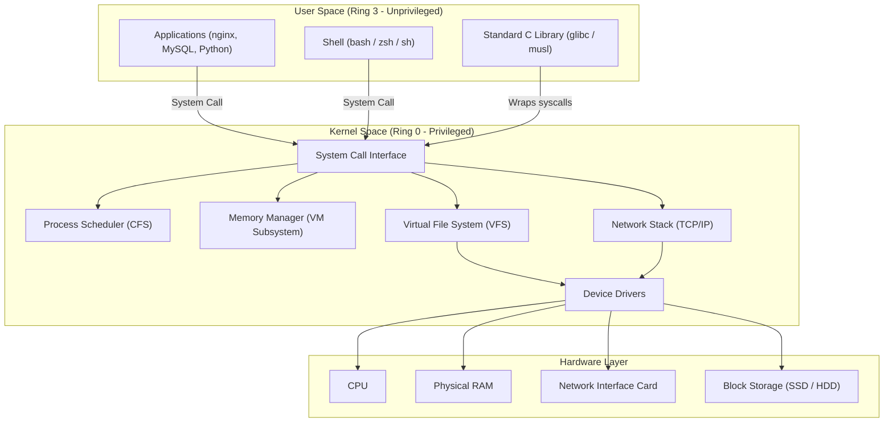
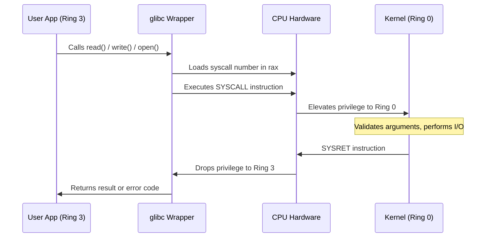
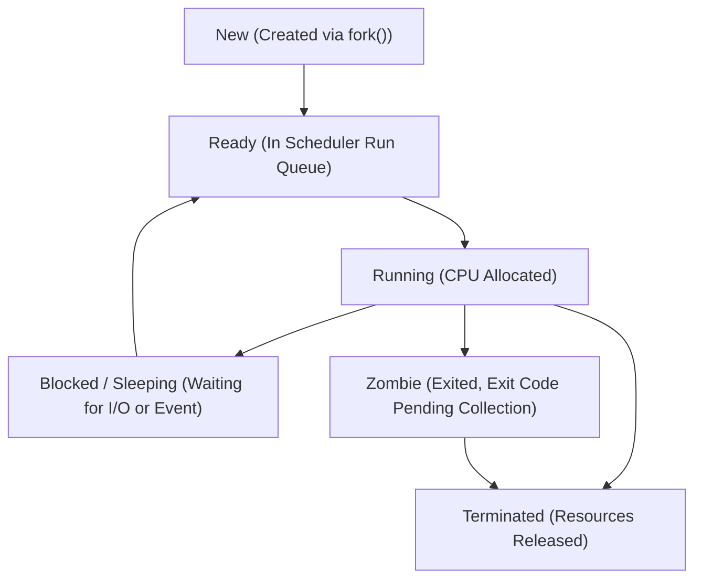
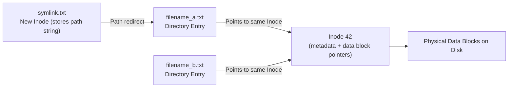
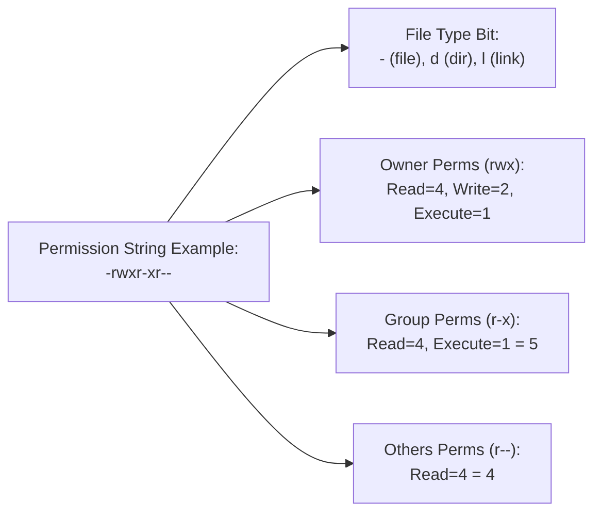
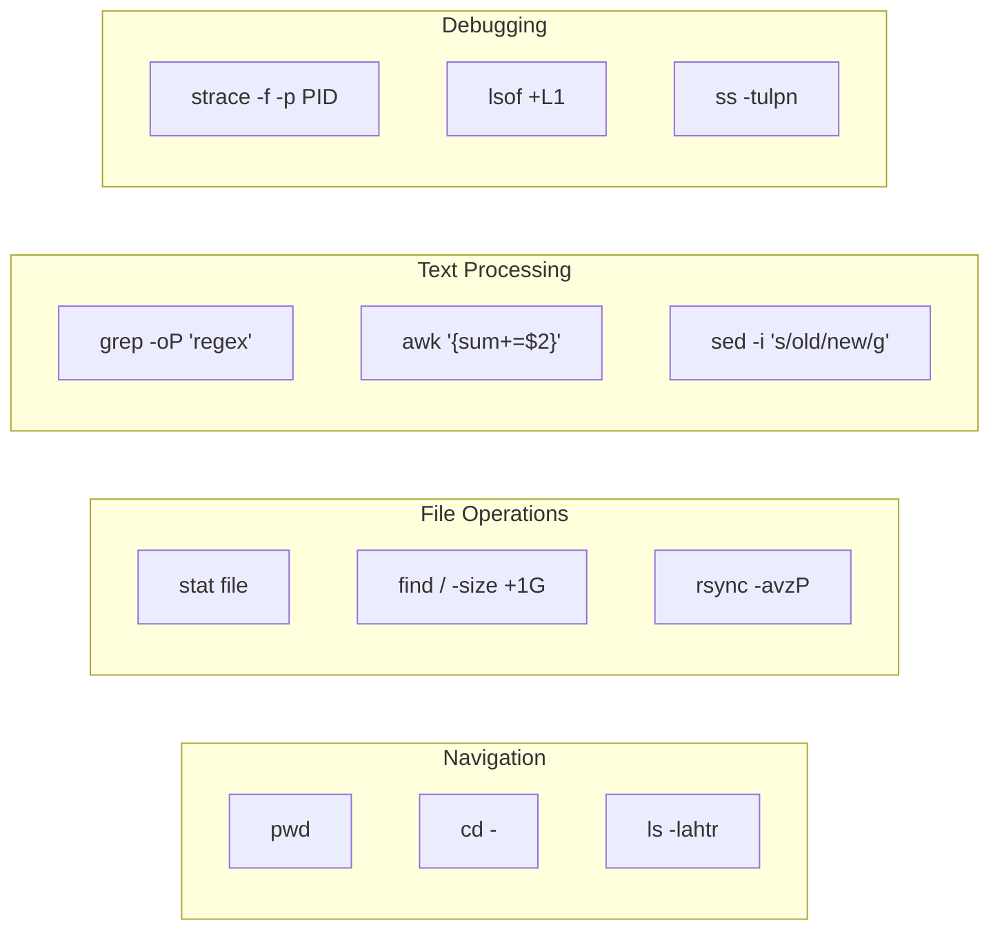

# Day 3: Linux Commands — The Ultimate Interview Encyclopedia

> **NOTE:**
> Welcome to Day 3 of the ultimate Computer Science Interview Encyclopedia. This document is the definitive reference for Linux Commands, covering everything from Linux history and architecture to production-grade debugging, kernel internals, shell scripting, and scenario-based interview questions. This guide is designed to prepare you for interviews at Google, Amazon, Meta, Microsoft, Uber, Netflix, Goldman Sachs, Flipkart, PhonePe, Razorpay, Swiggy, Atlassian, and every top product-based company in the industry.

---

## Table of Contents

1. [Learning Roadmap: Why Linux?](#learning-roadmap)
2. [Best Platforms to Practice Linux](#best-platforms)
3. [Linux Architecture & Internals](#linux-internals)
4. [File System Hierarchy Standard](#fhs)
5. [Linux Command Encyclopedia](#command-encyclopedia)
   - [Navigation Commands](#navigation)
   - [File Management](#file-management)
   - [File Viewing & Editing](#file-viewing)
   - [Text Processing](#text-processing)
   - [Searching & Finding](#searching)
   - [Permissions & Ownership](#permissions)
   - [User & Group Management](#user-management)
   - [Process Management](#process-management)
   - [Networking Commands](#networking)
   - [SSH & Remote Access](#ssh)
   - [Compression & Archiving](#compression)
   - [Storage & Disk Management](#storage)
   - [System Monitoring](#system-monitoring)
   - [Services & Systemd](#services)
   - [Logging & Journal](#logging)
   - [Scheduling & Cron](#scheduling)
   - [Package Management](#packages)
   - [Security & Auditing](#security)
   - [Advanced Debugging & Profiling](#debugging)
   - [Shell Multiplexers](#multiplexers)
6. [Bash Scripting — Beginner to Production](#bash-scripting)
7. [Professional Comparison Tables](#comparison-tables)
8. [Complete Interview Q&A Encyclopedia](#interview-qa)
9. [Reinforcement & Cheat Sheets](#reinforcement)

---

## Section 1: Learning Roadmap — Why Linux? {#learning-roadmap}

### What is Linux?

Linux is an **open-source, monolithic, Unix-like operating system kernel** created by **Linus Torvalds** in 1991 as a personal project while studying at the University of Helsinki. Today, the word "Linux" refers to a complete operating system formed by combining the **Linux kernel** with the **GNU userland utilities** (compilers, shells, libraries), giving rise to the accurate term **GNU/Linux**.

Linux is not a single product but a **family of operating systems** (called distributions or distros) that share the same kernel but differ in package managers, default desktop environments, release cycles, and target audiences.

### History of Linux — The Full Timeline

| Year | Event |
| :--- | :--- |
| **1969** | Bell Labs (AT&T) develops **Unix** — the origin of modern OS design. |
| **1983** | Richard Stallman founds the **GNU Project** to build a free, Unix-compatible OS. |
| **1989** | Stallman releases the **GNU GPL license**, enabling collaborative, free software development. |
| **1991** | Linus Torvalds releases **Linux kernel v0.01** for i386 Intel processors, initially as a personal hobby project. |
| **1992** | Linux is re-licensed under **GPL**, enabling its combination with GNU tools. |
| **1993** | **Slackware and Debian** — the first major Linux distributions — are released. |
| **1994** | **Red Hat** is founded; Linux kernel v1.0 is released. |
| **2003** | The **Linux kernel 2.6** series introduces major improvements in SMP and hardware support. |
| **2004** | **Ubuntu** is released — making Linux significantly more accessible to general users. |
| **2007** | Linux is used to power **Android**, making it the most widely deployed OS in history. |
| **2011** | **Amazon EC2** standardizes Linux as the foundation of cloud computing infrastructure. |
| **2016** | **WSL** (Windows Subsystem for Linux) brings Linux tools natively to Windows. |
| **2022** | Linux powers over **96.3% of all web servers** and **100% of top 500 supercomputers**. |

---

### Why Linux Dominates Servers & Cloud Infrastructure

> **IMPORTANT:**
> In every production engineering interview, you must be able to explain WHY organizations use Linux at scale, not just THAT they use it.

1. **Zero Licensing Cost:** Companies running thousands of cloud instances eliminate per-seat licensing fees entirely. At hyperscaler scale, this translates to hundreds of millions of dollars saved annually.
2. **Kernel Source Transparency:** Large organizations (Google, Meta) maintain their own kernel forks, backporting security patches and performance tuning configurations directly from the kernel source tree.
3. **Containerization Architecture:** Docker, containerd, and Kubernetes rely on Linux kernel features — specifically **namespaces** (for isolation) and **cgroups** (for resource limits) — as their foundational primitives.
4. **Live Kernel Patching:** Using technologies like `kpatch` (Red Hat) and `livepatch` (Canonical), Linux allows critical security vulnerabilities to be patched without any service downtime or reboots.
5. **Granular Security Model:** SELinux (Security-Enhanced Linux) and AppArmor allow Mandatory Access Control policies that restrict what each process can access, reducing blast radius from security compromises.

---

### Role-Specific Importance

#### For Backend Engineers
*   Understanding **file descriptors**, **epoll**, and **blocking vs. non-blocking I/O** is essential for building high-performance API servers and database connectors.
*   Knowing `ulimit`, `/proc/sys/fs/file-max`, and `/proc/sys/net/core/somaxconn` allows engineers to tune server connection limits correctly.
*   Knowledge of `strace` allows debugging library failures and permission denials without reading source code.

#### For DevOps Engineers
*   Configuring **systemd unit files** controls how services start, restart, and log.
*   Writing **Bash automation scripts** with proper error handling (`set -euo pipefail`) prevents silent deployment failures.
*   Using `rsync` over `scp` preserves timestamps, permissions, and avoids full file retransfers on partial upload interruptions.

#### For SREs (Site Reliability Engineers)
*   **Incident diagnosis** using `dmesg`, `journalctl`, `vmstat`, `iostat`, and `perf` allows identifying the root cause of production outages under time pressure.
*   Understanding kernel memory management (OOM Killer, page cache, swap) prevents unexplained process terminations.

#### For Cloud Engineers
*   Cloud instances are exclusively Linux. Managing security groups, instance profiles, SSH key pairs, and ephemeral storage is a daily operational task.
*   Knowledge of `cloud-init` and its scripting interface enables automated post-boot configuration of cloud instances.

#### For Security Engineers
*   File system auditing using `auditd`, ACL inspection with `getfacl`, and immutable file flags with `chattr +i` are standard hardening techniques.
*   Network traffic inspection using `tcpdump` and `tshark` enables incident forensics.

---

### Linux in System Design

In system design interviews, knowledge of Linux is demonstrated through:

*   Explaining how a web server (nginx, Apache) binds to TCP ports and manages worker processes.
*   Describing how the OS scheduler decides which process gets CPU time (CFS — Completely Fair Scheduler).
*   Understanding how the page cache allows database reads to bypass disk I/O on cache hits.
*   Knowing how `epoll` enables Node.js and Nginx to handle hundreds of thousands of simultaneous connections with a single thread.

---

## Section 2: Best Platforms to Practice Linux {#best-platforms}

> **TIP:**
> The best platform depends on your goal. Use the table below to select the right environment for your learning stage.

### Comprehensive Platform Comparison

| Platform | Overview | Advantages | Disadvantages | Difficulty | Industry Use | Best For |
| :--- | :--- | :--- | :--- | :--- | :--- | :--- |
| **Native Ubuntu Install** | Full Ubuntu OS installed on bare metal hardware. | Maximum performance, bare-metal access. | Requires partition management; risk of data loss if incorrectly configured. | Hard | Very High | Power users, hardware engineers. |
| **WSL 2** | Linux kernel running natively inside Windows via Hyper-V. | Seamless Windows + Linux file sharing, fast startup. | systemd support requires manual configuration on older builds. | Easy | High | Windows developers, daily workflows. |
| **Dual Boot** | Linux installed alongside Windows/macOS on separate partitions. | Full hardware access without virtualization overhead. | Requires a complete reboot to switch OS; repartitioning risk. | Hard | Medium | Dedicated Linux workstations. |
| **VirtualBox** | Open-source VM hypervisor running a full Linux guest OS. | Snapshot support; isolated from host; free. | Performance overhead from hardware emulation. | Medium | Medium | Learning, testing, classroom. |
| **VMware Workstation** | Commercial Type-2 hypervisor with excellent hardware emulation. | Better GPU passthrough; excellent clipboard sharing. | Paid license (Workstation Pro). | Medium | Enterprise | Enterprise lab environments. |
| **Docker Container** | Lightweight Linux userspace container. | Instant startup; disposable; near-zero overhead. | No systemd by default; limited process isolation for learning purposes. | Easy | Critical | CLI command sandboxing and testing. |
| **GitHub Codespaces** | Cloud-hosted VS Code environment backed by a Linux container. | Instant; integrates with IDE; no local setup needed. | Dependent on cloud connectivity; resource-limited free tier. | Easy | High | Remote-first development teams. |
| **Killercoda** | Browser-based interactive Linux labs (free). | Scenario-driven; zero installation. | Session timeouts; internet required. | Easy | Low | Structured DevOps and Kubernetes labs. |
| **Linux Journey** | Web-based guided Linux learning portal. | Structured curriculum for absolute beginners. | No actual Linux terminal; only explanatory content. | Easy | Low | Absolute beginners learning concepts. |
| **OverTheWire Bandit** | SSH-based security wargame teaching CLI mastery. | Gamified; forces real-world problem solving. | Text-only; can frustrate beginners. | Medium | Low | Building real command-line fluency. |
| **LabEx** | Browser-based Linux labs with guided challenges. | Provides a real Linux environment inside the browser. | Limited compute power; paid tiers for advanced labs. | Easy-Medium | Low | Structured, hands-on learning tracks. |
| **Codecrafters** | Implement real tools (Redis, Git, DNS) from scratch. | Teaches systems programming deeply. | Advanced; requires prior programming experience. | Hard | Medium | Senior developers studying internals. |
| **Cloud VMs (AWS/GCP/Azure)** | Real remote virtual machines running in cloud data centers. | Matches real production environments exactly; public IP access. | Costs money if left running; requires cloud account setup. | Medium | Standard | Cloud engineers, DevOps, SRE practice. |
| **Raspberry Pi** | ARM-based single-board computer running Linux. | Physical hardware; useful for embedded Linux knowledge. | Slower CPU; requires hardware purchase. | Medium | Medium | IoT engineers, embedded developers. |
| **AWS EC2 Instance** | On-demand cloud servers (t2.micro is free-tier eligible). | 100% production-identical environment; SSH-accessible. | Billing risk if you forget to stop instances. | Medium | Critical | Interview simulation, SRE practice. |

### Final Recommendations

| Goal | Best Platform |
| :--- | :--- |
| **Absolute Beginners** | WSL 2 (Windows) or Ubuntu in VirtualBox. |
| **Interview Preparation** | OverTheWire Bandit + Killercoda labs. |
| **Daily Development Practice** | WSL 2 or Native Ubuntu installation. |
| **DevOps & SRE Practice** | AWS EC2 Free Tier + Killercoda Kubernetes labs. |
| **Backend Developers** | Docker containers (for disposable, clean environments). |

---

## Section 3: Linux Architecture & Internals {#linux-internals}

### Linux Architecture Overview



### The Linux Kernel

The **Linux kernel** is a **monolithic kernel**, meaning that all core OS services (memory management, process scheduling, device drivers, file systems, and network stacks) execute in a single protected kernel address space.

*   **Monolithic vs. Microkernel:** Unlike microkernels (such as QNX or Mach), the Linux kernel combines all essential OS components into one binary, enabling fast inter-component communication via direct function calls. The trade-off is that a kernel module bug can crash the entire system.
*   **Loadable Kernel Modules (LKMs):** Linux supports dynamic loading of kernel modules (using `insmod`/`modprobe`). These modules run at Ring 0 with full privileges. This allows adding device driver support without rebooting the system.
*   **Kernel Versions:** Use `uname -r` to display the running kernel version.

### Shells & Terminals Explained

| Concept | Definition |
| :--- | :--- |
| **Hardware Terminal** | Physical input/output device with a keyboard and display screen, historically connected to a mainframe. |
| **TTY** | Teletype — a kernel abstraction representing a terminal device. Each login session gets a TTY. |
| **PTY (Pseudo-Terminal)** | A software-emulated terminal created by programs like SSH, `tmux`, and `screen`. The master/slave PTY pair allows programs to act as terminal emulators. |
| **Terminal Emulator** | A user-space application simulating a terminal (e.g., GNOME Terminal, iTerm2, Windows Terminal). |
| **Shell** | A command interpreter that runs inside a terminal. Accepts user commands, spawns child processes, and manages input/output. Examples: `bash`, `zsh`, `sh`, `dash`, `fish`. |

### The System Call Lifecycle



### Process Lifecycle



### Process States in Linux

| State | Code | Description |
| :--- | :--- | :--- |
| **Running** | R | Currently executing on a CPU core or in the run queue. |
| **Interruptible Sleep** | S | Sleeping, waiting for an event; can be woken by a signal. |
| **Uninterruptible Sleep** | D | Sleeping in a kernel routine, cannot be interrupted (e.g., waiting for disk I/O). High D-state counts indicate I/O saturation. |
| **Stopped** | T | Paused by `SIGSTOP` or debugger breakpoint. |
| **Zombie** | Z | Process has exited but its parent has not yet called `wait()` to read the exit code. |

### Linux Signals

Signals are software interrupts sent to processes to notify them of events.

| Signal | Number | Default Action | Description |
| :--- | :--- | :--- | :--- |
| `SIGTERM` | 15 | Terminate | Graceful termination request; can be caught by the process. |
| `SIGKILL` | 9 | Terminate | Forceful termination; **cannot be caught or ignored**. |
| `SIGINT` | 2 | Terminate | Keyboard interrupt (Ctrl+C). |
| `SIGSTOP` | 19 | Stop | Pause process execution; **cannot be caught or ignored**. |
| `SIGCONT` | 18 | Continue | Resume a stopped process. |
| `SIGCHLD` | 17 | Ignore | Sent to parent when a child process exits. |
| `SIGHUP` | 1 | Terminate | Terminal hangup; commonly used to reload configuration files in daemons. |
| `SIGSEGV` | 11 | Core Dump | Segmentation fault (invalid memory access). |

### Inodes, Hard Links & Soft Links



*   **Inode:** A kernel data structure storing file metadata (ownership, permissions, timestamps, data block locations). The inode does **not** store the filename.
*   **Hard Link:** A directory entry pointing to an existing inode. Multiple hard links to the same inode means the same file data is accessible via multiple names. Deleting one link does not delete the data; data is freed only when the link count reaches zero.
*   **Symbolic Link (Soft Link):** A new file with its own inode, storing the path string to the target. If the target is deleted, the symlink becomes broken ("dangling").

### Environment Variables & PATH

```bash
# Display all environment variables
printenv

# Display a specific variable
echo $HOME
echo $PATH

# Set a temporary environment variable (current shell only)
export MY_API_KEY="abc123"

# Permanently add a directory to PATH (add to ~/.bashrc or ~/.zshrc)
export PATH="$HOME/.local/bin:$PATH"

# Unset an environment variable
unset MY_API_KEY
```

The `$PATH` variable is a **colon-separated ordered list of directories** the shell searches when executing commands. The shell checks each directory in order and executes the first match found.

---

## Section 4: File System Hierarchy Standard (FHS) {#fhs}

```mermaid
flowchart TD
    Root["/"] --> Boot["/boot<br>Kernel image, GRUB"]
    Root --> Bin["/bin<br>Essential binaries (ls, cp, mv)"]
    Root --> Sbin["/sbin<br>Admin binaries (mount, fsck)"]
    Root --> Etc["/etc<br>Configuration files"]
    Root --> Dev["/dev<br>Device files (block, char)"]
    Root --> Proc["/proc<br>Kernel process virtual FS"]
    Root --> Sys["/sys<br>Hardware attribute virtual FS"]
    Root --> Var["/var<br>Variable data (logs, cache, spool)"]
    Root --> Usr["/usr<br>Read-only user data"]
    Root --> Tmp["/tmp<br>Temporary files (cleared on reboot)"]
    Root --> Home["/home<br>User home directories"]
    Root --> Lib["/lib<br>Shared libraries"]
    Root --> Mnt["/mnt<br>Temporary mount points"]
    Root --> Opt["/opt<br>Optional third-party software"]
    Root --> Srv["/srv<br>Service data (web, FTP)"]
```



| Directory | Purpose |
| :--- | :--- |
| `/proc` | Pseudo-filesystem. Every running process has a directory `/proc/<PID>`. Reading `/proc/cpuinfo`, `/proc/meminfo`, `/proc/net/tcp` reads live kernel state directly from memory. |
| `/sys` | Exports kernel device tree data to user space. Used to tune kernel parameters (e.g., CPU frequency scaling) and inspect hardware attributes. |
| `/dev` | Block devices (`/dev/sda`) and character devices (`/dev/urandom`, `/dev/null`, `/dev/zero`) are represented as files. |
| `/run` | Runtime data directory populated at boot by systemd. Contains PID files, socket files, and mount namespace data. |
| `/etc/passwd` | User account database. Each line contains: `username:x:UID:GID:description:home:shell`. The `x` in the password field means the password hash is in `/etc/shadow`. |

---

## Section 5: Linux Command Encyclopedia {#command-encyclopedia}

---

### Part A: Navigation Commands {#navigation}

#### `pwd` — Print Working Directory

*   **Purpose:** Display the absolute path of the current working directory.
*   **Syntax:** `pwd [-L] [-P]`
*   **Flags:**
    *   `-L` (default): Print logical path, following symbolic link names.
    *   `-P`: Print physical path, resolving all symbolic links to actual directories.
*   **Production Example:** Verify the actual path of a symlinked config directory:
    ```bash
    pwd -P
    ```
*   **Interview Question:** *When would `-L` and `-P` give different results?*

#### `cd` — Change Directory

*   **Purpose:** Change the shell's working directory.
*   **Syntax:** `cd [DIRECTORY]`
*   **Advanced Tricks:**
    *   `cd -`: Return to the **previous** working directory. Useful when toggling between two directories.
    *   `cd ~`: Navigate to the current user's home directory.
    *   `cd ~username`: Navigate to a specific user's home directory.
    *   `pushd <dir>` / `popd`: Push/pop directories onto a navigation stack.
*   **Interview Question:** *What does `cd -` do internally? What variable tracks this?*
    *   **Answer:** `cd -` is equivalent to `cd $OLDPWD`. The shell maintains the `$OLDPWD` variable automatically.

#### `ls` — List Directory Contents

*   **Purpose:** Display directory contents with metadata.
*   **Syntax:** `ls [OPTIONS] [FILE...]`
*   **Complete Flag Reference:**

| Flag | Meaning |
| :--- | :--- |
| `-l` | Long format: permissions, links, owner, group, size, timestamp. |
| `-a` | Include hidden files (files beginning with `.`). |
| `-h` | Human-readable sizes (1K, 2.4M, 1G). |
*   **Always use with `-l`.**
| `-t` | Sort by modification time, newest first. |
| `-S` | Sort by file size, largest first. |
| `-r` | Reverse sort order. |
| `-R` | Recursive — list subdirectories. |
| `-i` | Print the inode number of each file. |
| `-1` (one) | Force one file per output line (useful for scripting). |
| `--color=auto` | Colorize output by file type. |

*   **Production Command:** See all files sorted by most recently modified:
    ```bash
    ls -lahtr
    ```
*   **Better Alternative:** Use `exa` (modern replacement for `ls` with tree views, Git integration, and color-coded output):
    ```bash
    exa -la --tree --git
    ```
*   **Memory Trick:** `ls -lahSr` — "**L**arge **A**ll **H**uman **S**ize **R**everse"

---

### Part B: File Management {#file-management}

#### `cp` — Copy Files

*   **Purpose:** Duplicate files or directories.
*   **Syntax:** `cp [OPTIONS] SOURCE DEST`
*   **Key Flags:**
    *   `-r` or `-R`: Recursively copy directories.
    *   `-p`: Preserve file metadata (timestamps, ownership, permissions).
    *   `-a` (archive): Equivalent to `-dR --preserve=all`. Best flag for complete backups.
    *   `-u`: Copy only when the source is newer than the destination.
    *   `-v`: Verbose output.
    *   `-i`: Prompt before overwriting.
    *   `--reflink=auto`: Use copy-on-write if supported by the filesystem (extremely fast on btrfs, ZFS).
*   **Production Alternative:** Always prefer `rsync` over `cp` for large directory trees:
    ```bash
    rsync -avhP /source/dir/ /destination/dir/
    ```

#### `mv` — Move / Rename Files

*   **Purpose:** Move or rename files and directories.
*   **Syntax:** `mv [OPTIONS] SOURCE DEST`
*   **Internal Working:** If source and destination are on the same filesystem, `mv` only updates the directory entry (extremely fast — zero data copying). If source and destination are on different filesystems, `mv` internally performs a copy followed by a delete.
*   **Key Flag:** `-n`: Never overwrite an existing destination file.

#### `rm` — Remove Files

*   **Purpose:** Delete files and directories.
*   **Syntax:** `rm [OPTIONS] FILE...`
*   **Key Flags:**
    *   `-r` or `-R`: Delete directories recursively.
    *   `-f`: Force deletion without prompting, ignoring errors on non-existent files.
    *   `-i`: Prompt before each deletion.
    *   `-v`: Verbose output.
*   **Common Mistakes:**
    *   `rm -rf /` will destroy the entire filesystem (modern systems add a `--no-preserve-root` guard).
    *   `rm -rf ./*` inside the wrong directory can be catastrophic.
*   **Best Practice:** Before running destructive `rm` commands, preview with `ls` first. Consider using `trash-cli` instead of raw `rm` in interactive sessions.

#### `mkdir` — Create Directories

*   **Purpose:** Create one or more directories.
*   **Key Flag:** `-p` (parents): Create parent directories as needed without error if they already exist.
    ```bash
    mkdir -p /opt/app/config/ssl
    ```

#### `stat` — File Status

*   **Purpose:** Display detailed inode metadata for a file or directory.
*   **Syntax:** `stat [OPTIONS] FILE`
*   **Why it exists:** `ls -l` shows human-readable timestamps and permissions, but `stat` shows the raw inode data including:
    *   Inode number
    *   Number of hard links
    *   All three timestamps: Access, Modify, Change (note: not "creation" time)
    *   Exact permission octal
    *   Block allocation count
*   **Production Example:** Extract just the octal permissions:
    ```bash
    stat -c "%a %n" /etc/passwd
    ```
*   **Real Terminal Output:**
    ```
      File: /etc/passwd
      Size: 2847          Blocks: 8          IO Block: 4096   regular file
    Device: fd01h/64769d	Inode: 1179651     Links: 1
    Access: (0644/-rw-r--r--)  Uid: (    0/    root)   Gid: (    0/    root)
    Access: 2024-07-01 12:00:15.000000000 +0000
    Modify: 2024-06-20 08:30:44.000000000 +0000
    Change: 2024-06-20 08:30:44.000000000 +0000
    ```
*   **Interview Trap:** *What is the difference between Modify time and Change time?*
    *   **Modify (mtime):** The timestamp of the last time the file **content** was changed.
    *   **Change (ctime):** The timestamp of the last time the file **inode metadata** was changed (e.g., permissions change, rename, link count change).

#### `file` — Determine File Type

*   **Purpose:** Determine a file's type by inspecting its contents, not its extension.
*   **Internal Working:** `file` reads the file's initial bytes (magic bytes) and compares them against a database of known file signatures. A `.sh` file renamed to `.png` will correctly identify as "ASCII text".
*   **Production Example:**
    ```bash
    file suspicious_binary
    # Output: suspicious_binary: ELF 64-bit LSB executable, x86-64
    ```

#### `truncate` — Resize Files

*   **Purpose:** Shrink or extend a file to a specified exact size.
*   **Syntax:** `truncate -s SIZE FILE`
*   **When to use:** Instantly emptying a runaway log file without closing the file descriptor (preventing service restart):
    ```bash
    truncate -s 0 /var/log/application/error.log
    ```
*   **When NOT to use:** Never use on binary database files — truncation corrupts data structures.

#### `touch` — Create Files / Update Timestamps

*   **Purpose:** Create a new empty file or update the access/modification timestamp of an existing file.
*   **Lesser-Known Flag:** `-t TIMESTAMP`: Set a specific timestamp in the format `[[CC]YY]MMDDhhmm[.ss]`:
    ```bash
    touch -t 202001010000 deployment_marker.txt
    ```

#### `sync` & `syncfs` — Flush Page Cache to Disk

*   **Purpose:** Force the kernel to write all dirty (modified but not yet written to disk) memory pages to persistent storage.
*   **Internal Working:** Linux uses a **page cache** to buffer disk writes in RAM. Data written to files goes into dirty pages in memory and is asynchronously flushed to disk by background kernel threads (`pdflush`/`kworker`). If the system loses power before flush, unflushed data is lost.
*   **Production Use:**
    ```bash
    sync       # Flush all filesystems
    syncfs     # Flush only the filesystem containing the specified file
    ```

---

### Part C: File Viewing & Editing {#file-viewing}

#### `cat` — Concatenate & Print Files

*   **Purpose:** Read file contents and write to standard output.
*   **Syntax:** `cat [OPTIONS] [FILE...]`
*   **Flags:**
    *   `-n`: Number all output lines.
    *   `-b`: Number only non-blank lines.
    *   `-A`: Show all hidden characters (tabs as `^I`, newlines as `$`).
    *   `-s`: Suppress consecutive blank lines.
*   **Production Trick:** When debugging configuration files with invisible characters or Windows-style CRLF line endings:
    ```bash
    cat -A config.ini | grep -P "\r"
    ```

#### `nl` — Number Lines

*   **Purpose:** Number lines of a file with more control than `cat -n`.
*   **Lesser-Known Flags:**
    *   `-ba`: Number all lines including blank lines.
    *   `-v 0`: Start numbering from 0.
    *   `-s ": "`: Set the separator between line number and content.

#### `less` — Page Through Files

*   **Purpose:** Interactive file viewer enabling forward/backward navigation.
*   **Why better than `more`:** `less` does not load the entire file into memory, allowing viewing of multi-gigabyte log files. Navigation includes `G` (end), `g` (start), `/pattern` (search), `n/N` (next/previous match), `q` (quit).
*   **Production Example:** Follow a live log file with pattern highlighting:
    ```bash
    less +F /var/log/nginx/access.log
    ```

#### `head` & `tail`

*   `head -n 20 file.log` — Show first 20 lines.
*   `tail -n 20 file.log` — Show last 20 lines.
*   **Key Flag:** `tail -f` (follow): Stream new lines as they are appended. Essential for live log monitoring.
*   **Advanced:** `tail -F` (follow by filename): Continues following even if the file is rotated/recreated. More reliable for log monitoring in production.

#### `vim` — Visual Editor

*   **Modes:**
    *   **Normal Mode:** Default mode for navigation and commands.
    *   **Insert Mode:** Entered via `i`; allows text editing.
    *   **Visual Mode:** Selection of text blocks.
    *   **Command Mode:** Entered via `:` for file operations.
*   **Essential Commands:**

| Command | Action |
| :--- | :--- |
| `i` / `I` | Insert at cursor / start of line |
| `a` / `A` | Append after cursor / end of line |
| `o` / `O` | Open new line below / above |
| `dd` | Delete current line |
| `yy` | Copy (yank) current line |
| `p` | Paste |
| `u` | Undo |
| `Ctrl+r` | Redo |
| `/pattern` | Search forward |
| `:%s/old/new/g` | Global substitution |
| `:wq` | Save and quit |
| `:q!` | Quit without saving |
| `gg` / `G` | Go to first / last line |

---

### Part D: Text Processing {#text-processing}

#### `grep` — Global Regular Expression Print

*   **Purpose:** Search for pattern matches within files or streams.
*   **Syntax:** `grep [OPTIONS] PATTERN [FILE...]`
*   **Complete Flag Reference:**

| Flag | Meaning |
| :--- | :--- |
| `-i` | Case-insensitive matching. |
| `-v` | Invert match (exclude matching lines). |
| `-r` / `-R` | Recursive directory search. |
| `-l` | List only filenames containing matches. |
| `-L` | List only filenames NOT containing matches. |
| `-c` | Count matching lines. |
| `-o` | Output only the matched text, not the full line. |
| `-n` | Prefix output with line numbers. |
| `-E` | Extended Regular Expressions (ERE). |
| `-P` | Perl Compatible Regular Expressions (PCRE). |
| `-F` | Fixed string matching (no regex interpretation; much faster for literal searches). |
| `-A N` | Print N lines **after** the match. |
| `-B N` | Print N lines **before** the match. |
| `-C N` | Print N lines **context** around the match. |
| `-w` | Match whole words only. |
| `--color` | Highlight matches. |
| `-m N` | Stop after N matches. |
| `--include=GLOB` | Search only files matching a pattern. |

*   **Beginner Example:**
    ```bash
    grep "error" /var/log/syslog
    ```
*   **Intermediate Example:** Case-insensitive recursive search with context:
    ```bash
    grep -riC 3 "out of memory" /var/log/
    ```
*   **Advanced Example:** Extract all IPv4 addresses from a log file:
    ```bash
    grep -oP '\b(?:\d{1,3}\.){3}\d{1,3}\b' /var/log/auth.log
    ```
*   **Production Example:** Find all recently modified configs containing a deprecated setting:
    ```bash
    grep -rl --include="*.conf" "TLSv1.0" /etc/
    ```
*   **Better Alternative for Speed:** `ripgrep` (`rg`) is dramatically faster than `grep` for large codebases, using multiple CPU cores and skipping `.git` directories automatically.

#### `sed` — Stream Editor

*   **Purpose:** Parse and transform text using substitution, deletion, and insertion commands.
*   **Syntax:** `sed [OPTIONS] 'COMMANDS' [FILE...]`

| Operation | Syntax | Example |
| :--- | :--- | :--- |
| Substitution | `s/pattern/replacement/flags` | `sed 's/foo/bar/g'` |
| Delete line | `Nd` | `sed '5d'` |
| Delete range | `N,Md` | `sed '3,7d'` |
| Print line | `Np` | `sed -n '10p'` |
| Append text | `a\TEXT` | `sed '/match/a\new line'` |
| Insert text | `i\TEXT` | `sed '1i\# Header'` |
| In-place edit | `-i` flag | `sed -i 's/old/new/g' file` |

*   **Production Example:** Update a configuration value in a deployment script:
    ```bash
    sed -i "s/DB_HOST=.*/DB_HOST=${NEW_HOST}/g" /etc/app/config.env
    ```
*   **Common Mistake:** Forgetting `-i` makes the change only to stdout. If you use `-i` without a backup extension, the original is overwritten immediately.

#### `awk` — Aho, Weinberger, Kernighan Pattern Scanner

*   **Purpose:** Columnar text processing, arithmetic operations, and pattern-based record processing.
*   **Syntax:** `awk [OPTIONS] 'PROGRAM' [FILE...]`
*   **Core Concepts:**
    *   Input is split into **records** (lines by default) and **fields** (columns separated by `FS`).
    *   `$0` = entire line, `$1` = first field, `$2` = second field, etc.
    *   `NR` = current record (line) number.
    *   `NF` = number of fields in the current record.
    *   `BEGIN{}` block executes before reading any input.
    *   `END{}` block executes after all input is processed.
*   **Beginner Example:** Print the third column of `ls -l`:
    ```bash
    ls -l | awk '{print $3}'
    ```
*   **Intermediate Example:** Print lines where the fifth column exceeds 1MB:
    ```bash
    ls -l | awk '$5 > 1048576 {print $9, $5}'
    ```
*   **Advanced Example:** Calculate total memory consumption of all processes by a user:
    ```bash
    ps -u www-data -o pid,rss,comm | awk 'NR>1 {sum+=$2; print} END {printf "Total RSS: %.2f MB\n", sum/1024}'
    ```
*   **Production Example:** Parse Nginx access log and count requests per HTTP status code:
    ```bash
    awk '{count[$9]++} END {for (code in count) print code, count[code]}' /var/log/nginx/access.log | sort -rn -k2
    ```

#### `sort` — Sort Text Lines

*   **Key Flags:**
    *   `-n`: Numeric sort.
    *   `-r`: Reverse order.
    *   `-k N`: Sort by the Nth field.
    *   `-t CHAR`: Use CHAR as field separator.
    *   `-u`: Remove duplicate lines.
    *   `-h`: Human-readable numeric sort (handles 1K, 2M, 3G).

#### `uniq` — Remove or Count Duplicates

*   **Note:** `uniq` only removes **adjacent** duplicate lines. Always pipe `sort` before `uniq`.
*   **Key Flags:** `-c` (count), `-d` (only show duplicates), `-u` (only show unique lines).

#### `cut` — Extract Columns

*   **Purpose:** Extract specific byte positions or field columns from lines.
*   **Key Flags:**
    *   `-d CHAR`: Use CHAR as delimiter (default: tab).
    *   `-f N`: Extract field N.
    *   `-c N`: Extract character position N.
*   **Example:** Extract usernames from `/etc/passwd`:
    ```bash
    cut -d: -f1 /etc/passwd
    ```

#### `tr` — Translate Characters

*   **Purpose:** Character-by-character replacement or deletion.
*   **Examples:**
    ```bash
    echo "Hello World" | tr 'a-z' 'A-Z'   # Uppercase conversion
    echo "hello world" | tr -d ' '         # Delete spaces
    echo "hello   world" | tr -s ' '       # Squeeze multiple spaces to one
    ```

#### `strings` — Extract Printable Strings from Binaries

*   **Purpose:** Print all sequences of printable characters of minimum length (default: 4) from binary files.
*   **When to use:** Quickly scanning compiled binaries for hardcoded credentials, version strings, debug paths, or configuration values.
*   **Production Example:**
    ```bash
    strings /usr/bin/suspicious_app | grep -i "password\|token\|key"
    ```

#### `hexdump` & `xxd` — Hex Representation of Files

*   **Purpose:** Display file contents in hexadecimal format.
*   **When to use:** Debugging binary file headers, inspecting network protocol captures, analyzing malformed data.
    ```bash
    xxd /boot/vmlinuz | head -5
    xxd -r hex_dump.txt > restored_binary    # Reverse: hex to binary
    ```

#### `split` — Split Files into Pieces

*   **Purpose:** Split a large file into smaller chunks.
*   **Flags:** `-b SIZE` (split by byte size), `-l N` (split by line count), `-d` (numeric suffixes).
*   **Production Example:** Split a 20GB database dump for parallel upload to cloud storage:
    ```bash
    split -b 4G database_dump.sql.gz db_part_
    ```

#### `shuf` — Random Permutation / Sampling

*   **Purpose:** Generate random permutations of input lines or output random selections.
*   **Production Example:** Sample 1000 random lines from a 50M-line log for statistical analysis:
    ```bash
    shuf -n 1000 /var/log/huge_access.log > sample.log
    ```

#### `seq` — Print Numeric Sequences

*   **Purpose:** Generate number sequences in specified increments.
*   **Examples:**
    ```bash
    seq 1 10
    seq 0 0.5 5    # Decimal increments
    seq -w 1 10    # Zero-padded: 01, 02, ...10
    ```

---

### Part E: Searching & Finding {#searching}

#### `find` — Recursive File Search

*   **Purpose:** Recursively search a directory tree for files matching specified criteria.
*   **Syntax:** `find [PATH] [EXPRESSION]`
*   **Complete Expression Reference:**

| Expression | Example | Description |
| :--- | :--- | :--- |
| `-name PATTERN` | `-name "*.log"` | Match by filename (case-sensitive). |
| `-iname PATTERN` | `-iname "*.LOG"` | Match by filename (case-insensitive). |
| `-type f` | `-type f` | Files only. |
| `-type d` | `-type d` | Directories only. |
| `-type l` | `-type l` | Symbolic links only. |
| `-size +N[k,M,G]` | `-size +100M` | Files larger than 100MB. |
| `-mtime N` | `-mtime -7` | Modified in the last 7 days. |
| `-mmin N` | `-mmin -30` | Modified in the last 30 minutes. |
| `-user NAME` | `-user root` | Files owned by specified user. |
| `-perm MODE` | `-perm 777` | Files with exact permissions. |
| `-perm /MODE` | `-perm /u+s` | Files with any of the specified bits set. |
| `-maxdepth N` | `-maxdepth 2` | Limit recursion depth. |
| `-exec CMD {} \;` | `-exec rm {} \;` | Execute command on each match. |
| `-exec CMD {} +` | `-exec rm {} +` | Batch execute (faster than `\;`). |
| `-delete` | `-delete` | Delete matched files directly. |

*   **Production Examples:**
    ```bash
    # Find all log files larger than 1GB
    find /var/log -type f -name "*.log" -size +1G

    # Find SUID-bit executables (security audit)
    find / -type f -perm -u+s 2>/dev/null

    # Delete files older than 30 days
    find /tmp -type f -mtime +30 -delete

    # Find all world-writable directories (security risk)
    find / -type d -perm -o+w 2>/dev/null
    ```

#### `locate` — Fast Database-Driven Search

*   **Purpose:** Find files using a pre-built database index.
*   **Key Difference from `find`:** `locate` reads a pre-indexed database (`/var/lib/mlocate/mlocate.db`) and is dramatically faster than `find`. However, it may show stale results for recently created or deleted files. Update the index with `updatedb`.
*   **Flags:** `-i` (case-insensitive), `-c` (count matches only).

#### `which` — Locate a Command

*   **Purpose:** Show the full path of a command's executable in `$PATH`.
    ```bash
    which python3
    # /usr/bin/python3
    ```

#### `whereis` — Locate Binary, Source & Manual Files

*   **Purpose:** Find a program's binary, source code, and manual page locations.
    ```bash
    whereis ls
    # ls: /usr/bin/ls /usr/share/man/man1/ls.1.gz
    ```

---

### Part F: File Permissions & Ownership {#permissions}

### Permission Model Visual



#### `chmod` — Change File Permissions

*   **Purpose:** Modify file or directory permission bits.
*   **Syntax:** `chmod [OPTIONS] MODE FILE`
*   **Octal Mode Reference:**

| Octal | Binary | Meaning |
| :--- | :--- | :--- |
| `7` | 111 | Read + Write + Execute |
| `6` | 110 | Read + Write |
| `5` | 101 | Read + Execute |
| `4` | 100 | Read only |
| `0` | 000 | No permissions |

*   **Symbolic Mode:**
    ```bash
    chmod u+x script.sh       # Add execute for owner
    chmod go-w sensitive.txt  # Remove write from group and others
    chmod a+r public_file     # Add read for all (a = all)
    chmod u=rwx,go=r file     # Set exact permissions
    ```
*   **Recursive:**
    ```bash
    chmod -R 750 /var/www/html
    ```
*   **Special Bits:**
    *   **SUID (4):** When set on an executable, the process runs with the owner's privileges. E.g., `/usr/bin/passwd` runs as root to modify `/etc/shadow`.
    *   **SGID (2):** On executables, runs with group's privileges. On directories, newly created files inherit the directory's group.
    *   **Sticky Bit (1):** On directories, users can only delete their own files even if they have write access. Used on `/tmp`.
    ```bash
    chmod u+s /usr/bin/specialtool   # Set SUID
    chmod g+s /shared/project/       # Set SGID on directory
    chmod +t /tmp                    # Set sticky bit
    ```

#### `chown` — Change File Ownership

*   **Purpose:** Change file owner and group.
*   **Syntax:** `chown [OPTIONS] OWNER[:GROUP] FILE`
*   **Examples:**
    ```bash
    chown www-data:www-data /var/www/html
    chown -R appuser:appgroup /opt/application/
    chown :developers /shared/project/   # Change group only
    ```

#### `chattr` — Change File Attributes (Extended)

*   **Purpose:** Set or remove extended filesystem attributes not covered by standard Unix permissions.
*   **Syntax:** `chattr [+-=][ATTRIBUTES] FILE`
*   **Key Attributes:**
    *   `+i` (immutable): File cannot be modified, deleted, renamed, or hard-linked by anyone, including root.
    *   `+a` (append-only): File can only be opened for appending data. Ideal for log files.
*   **Production Example:** Protect a critical configuration file from accidental modification or deletion:
    ```bash
    chattr +i /etc/hosts
    # To remove:
    chattr -i /etc/hosts
    ```

#### `lsattr` — List File Attributes

*   **Purpose:** Display the extended filesystem attributes set by `chattr`.
    ```bash
    lsattr /etc/hosts
    # ----i--------------- /etc/hosts
    ```

#### Access Control Lists — `setfacl` & `getfacl`

Standard Unix permissions support only three permission classes: owner, group, and others. ACLs (Access Control Lists) provide per-user and per-group permissions on individual files and directories.

*   **`getfacl`:** View current ACL entries.
    ```bash
    getfacl /var/www/html
    ```
*   **`setfacl`:** Set ACL entries.
    ```bash
    # Grant developer1 read/write access without changing group
    setfacl -m u:developer1:rw /var/www/html/config.php

    # Grant a specific group read access
    setfacl -m g:qa-team:r /var/log/application/

    # Set default ACL (inherited by new files created inside directory)
    setfacl -d -m u:ci-runner:rwx /builds/

    # Remove all ACL entries
    setfacl -b /var/www/html/config.php
    ```

---

### Part G: User & Group Management {#user-management}

#### Key Commands

```bash
useradd -m -s /bin/bash -G sudo,docker appuser   # Create user with home, shell, groups
passwd appuser                                      # Set/change password
usermod -aG docker appuser                         # Add user to group (non-destructive)
userdel -r olduser                                 # Delete user and home directory
groupadd developers                                # Create a group
gpasswd -a alice developers                        # Add alice to developers group
id appuser                                         # Show UID, GID, and group memberships
whoami                                             # Print current user
w                                                  # Who is logged in and what they are doing
last                                               # Show recent login history
lastlog                                            # Show last login for all accounts
```

#### Important Files

| File | Content |
| :--- | :--- |
| `/etc/passwd` | User accounts: username, UID, GID, home dir, shell. |
| `/etc/shadow` | Password hashes and password aging policies. |
| `/etc/group` | Group definitions: group name, GID, member list. |
| `/etc/sudoers` | Sudo privilege rules (always edit with `visudo`). |

---

### Part H: Process Management {#process-management}

#### `ps` — Process Status

*   **Purpose:** Report a snapshot of current processes.
*   **Syntax:** `ps [OPTIONS]`
*   **Key Option Combinations:**
    ```bash
    ps aux         # All processes, BSD-style
    ps -ef         # All processes, POSIX-style
    ps -u www-data # Processes for a specific user
    ps -o pid,ppid,cmd,%cpu,%mem # Custom output columns
    ```
*   **Production Command:** Find all Java processes consuming more than 10% CPU:
    ```bash
    ps aux | awk '$3 > 10 && /java/ {print $0}'
    ```

#### `top` & `htop`

| Feature | `top` | `htop` |
| :--- | :--- | :--- |
| Installed by default | Yes | No (requires install) |
| Color support | Minimal | Full color |
| CPU core graphs | No | Yes (individual bars per core) |
| Mouse support | No | Yes |
| Tree view | No | Yes |
| Kill process | Yes (via `k`) | Yes (via `F9`) |
| Filter by user | `u` key | `u` key |

*   **Key `top` interactions:** `P` (sort by CPU), `M` (sort by memory), `k` (kill), `1` (toggle per-CPU view), `q` (quit).

#### `kill` — Send Signals to Processes

*   **Syntax:** `kill [-SIGNAL] PID`
*   **Common Signals:**
    ```bash
    kill -15 1234  # SIGTERM: graceful shutdown (default)
    kill -9 1234   # SIGKILL: force kill (last resort)
    kill -1 1234   # SIGHUP: reload configuration
    kill -19 1234  # SIGSTOP: pause process
    kill -18 1234  # SIGCONT: resume process
    ```
*   **Useful Variants:**
    *   `killall nginx`: Kill all processes named "nginx".
    *   `pkill -u www-data`: Kill all processes owned by user `www-data`.
    *   `pkill -f "python worker.py"`: Kill processes matching a command-line pattern.

#### `jobs`, `fg`, `bg` — Job Control

```bash
long_running_command &   # Start in background
jobs                     # List background jobs
fg %1                    # Bring job 1 to foreground
bg %1                    # Resume job 1 in background
Ctrl+Z                   # Suspend the foreground process (sends SIGSTOP)
```

#### `nohup` — Run Command Immune to Hangup

*   **Purpose:** Run a command that continues even after the terminal session closes.
*   **Usage:** `nohup command &`
*   **Output:** Standard output goes to `nohup.out` by default.
    ```bash
    nohup python3 migration_script.py > migration.log 2>&1 &
    ```

#### `pstree` — Process Tree

*   **Purpose:** Display processes in a visual hierarchy tree.
    ```bash
    pstree -p        # Include PIDs
    pstree -u        # Show user name transitions
    pstree -p nginx  # Show tree for nginx process
    ```

#### `fuser` — Show Which Processes Use a File or Socket

*   **Purpose:** Identify processes using files, directories, or sockets.
    ```bash
    fuser 8080/tcp           # Which process is using TCP port 8080
    fuser -v /var/log/app.log # Which processes have this file open
    fuser -k 8080/tcp        # Kill all processes using port 8080
    ```

#### `watch` — Execute a Command Repeatedly

*   **Purpose:** Periodically run a command and display the output, refreshing the screen.
    ```bash
    watch -n 1 'ss -s'             # Monitor socket statistics every 1 second
    watch -d -n 2 'df -h'          # Watch disk usage, highlight differences
    watch -n 0.5 'cat /proc/loadavg' # Sub-second refresh of load average
    ```

#### `timeout` — Run Command with Time Limit

*   **Purpose:** Start a command and terminate it if it does not finish within a time limit.
    ```bash
    timeout 30 curl http://slow-api.example.com
    timeout --signal=SIGKILL 60 long_running_script.sh
    ```

#### `time` — Measure Command Execution Time

```bash
time find / -name "*.log" 2>/dev/null
# real    0m3.412s   (wall clock time)
# user    0m0.184s   (CPU time in user space)
# sys     0m0.521s   (CPU time in kernel space)
```

---

### Part I: Networking Commands {#networking}

#### `ip` — Modern Network Configuration

*   **Purpose:** Show and manipulate routing, devices, policy routing, and tunnels. Replaces the legacy `ifconfig`, `route`, and `arp` commands.
*   **Common Subcommands:**
    ```bash
    ip addr show               # Show all interfaces and addresses
    ip addr add 192.168.1.10/24 dev eth0   # Assign IP
    ip link set eth0 up/down   # Bring interface up/down
    ip route show              # Display routing table
    ip route add 10.0.0.0/8 via 192.168.1.1   # Add route
    ip neigh show              # Show ARP table
    ```

#### `ss` — Socket Statistics (Modern `netstat`)

*   **Purpose:** Dump socket statistics from kernel memory. Replaces the legacy `netstat`.
*   **Why better than `netstat`:** `netstat` reads from `/proc/net/tcp` (which can be slow with many connections). `ss` queries the kernel via Netlink sockets directly, much faster.
*   **Key Flags:**
    *   `-t`: TCP sockets.
    *   `-u`: UDP sockets.
    *   `-l`: Listening sockets only.
    *   `-p`: Show process name and PID.
    *   `-n`: Show numeric ports (no service name resolution).
    *   `-s`: Summary statistics.
*   **Production Commands:**
    ```bash
    ss -tulpn                 # All listening TCP/UDP sockets with process info
    ss -tn state established  # All established TCP connections
    ss -tn dst 192.168.1.1    # TCP connections to a specific host
    ss -s                     # Socket usage summary
    ```

#### `netstat` — Legacy Network Statistics

*   **Note:** `netstat` is deprecated in favor of `ss` on modern Linux systems. You may still encounter it in older environments.
    ```bash
    netstat -tulpn   # Equivalent to ss -tulpn
    netstat -rn      # Routing table
    ```

#### `dig` — DNS Information Lookup

*   **Purpose:** Query DNS records with full detail and control.
*   **Syntax:** `dig [@SERVER] NAME [TYPE]`
    ```bash
    dig google.com A           # A record lookup
    dig google.com MX          # Mail exchange records
    dig google.com NS          # Name server records
    dig -x 8.8.8.8             # Reverse DNS lookup
    dig +short google.com      # Output only the answer
    dig @8.8.8.8 google.com    # Query a specific DNS server
    dig google.com +trace      # Trace full resolution chain
    ```

#### `curl` — Transfer Data with URLs

*   **Purpose:** Transfer data using multiple protocols (HTTP, HTTPS, FTP, SMTP, etc.).
*   **Key Flags for API Testing:**
    ```bash
    curl -v https://api.example.com/health         # Verbose output (headers + body)
    curl -I https://api.example.com/               # Headers only (HEAD request)
    curl -X POST -H "Content-Type: application/json" \
         -d '{"user":"alice"}' https://api.example.com/login
    curl -o output.tar.gz https://example.com/file.tar.gz   # Save to file
    curl -L https://example.com/redirect            # Follow redirects
    curl --resolve api.example.com:443:1.2.3.4 \
         https://api.example.com/                   # Force IP resolution
    curl -w "%{http_code} %{time_total}s\n" -s -o /dev/null https://api.example.com/
    ```

#### `tcpdump` — Command-Line Packet Analyzer

*   **Purpose:** Capture and inspect raw network packets.
*   **Why to use:** Diagnose TCP handshake failures, TLS certificate mismatches, API timeouts, DNS resolution failures, and packet loss at the network level.
*   **Syntax:** `tcpdump [OPTIONS] [FILTER]`
*   **Key Flags:**
    *   `-i IFACE`: Capture on a specific interface (`-i any` for all).
    *   `-n`: Disable DNS resolution (faster).
    *   `-c N`: Capture exactly N packets.
    *   `-w FILE`: Write capture to a `.pcap` file for Wireshark analysis.
    *   `-r FILE`: Read from a `.pcap` file.
    *   `-v` / `-vv` / `-vvv`: Increasing verbosity levels.
*   **Production Examples:**
    ```bash
    # Capture HTTP traffic
    tcpdump -i eth0 -n 'port 80' -c 200

    # Capture TLS handshake packets to a specific host
    tcpdump -i eth0 -n 'host 10.0.0.5 and port 443'

    # Save to PCAP file
    tcpdump -i eth0 -w /tmp/capture.pcap

    # Read from PCAP and filter by IP
    tcpdump -r /tmp/capture.pcap 'src 10.0.0.1'
    ```

#### `nc` — Netcat (Network Swiss Army Knife)

*   **Purpose:** Read from and write to network connections using TCP or UDP.
    ```bash
    nc -zv 10.0.0.5 5432          # Test if PostgreSQL port is reachable
    nc -l -p 9090 > received.txt   # Listen on port 9090, save incoming data
    nc 10.0.0.5 9090 < file.txt    # Send file to listener
    ```

#### `ethtool` — NIC Hardware Configuration

*   **Purpose:** Query and configure network adapter hardware settings.
    ```bash
    ethtool eth0          # Show interface speed, duplex, and link status
    ethtool -S eth0       # Show NIC statistics (packet drops, errors, etc.)
    ethtool -i eth0       # Show driver and firmware version
    ```

---

### Part J: SSH & Remote Access {#ssh}

#### `ssh` — Secure Shell

*   **Purpose:** Encrypted remote shell access.
*   **Key Options:**
    ```bash
    ssh user@hostname                          # Basic connection
    ssh -p 2222 user@hostname                  # Non-standard port
    ssh -i ~/.ssh/my_key.pem user@hostname     # Specific key file
    ssh -L 5432:localhost:5432 user@db.server  # Local port forward (DB tunnel)
    ssh -R 9000:localhost:9000 user@remote     # Remote port forward
    ssh -J jump.server user@internal.server    # Jump/bastion host
    ssh -N -D 1080 user@proxy.server           # SOCKS5 proxy
    ```

#### `scp` — Secure Copy

```bash
scp file.txt user@remote:/destination/    # Upload
scp user@remote:/file.txt ./              # Download
scp -r /local/dir user@remote:/remote/   # Recursive directory copy
```

#### SSH Key Management

```bash
# Generate a new key pair
ssh-keygen -t ed25519 -C "engineer@company.com"

# Copy public key to remote server
ssh-copy-id -i ~/.ssh/id_ed25519.pub user@server

# Test key authentication
ssh -T git@github.com

# SSH Agent for key caching
eval "$(ssh-agent -s)"
ssh-add ~/.ssh/id_ed25519
```

#### `rsync` — Efficient Remote File Synchronization

*   **Why rsync > scp:** Only transfers changed file blocks (delta transfer). Supports compression, bandwidth throttling, checksum verification, and resume after interruption.
*   **Key Flags:**
    *   `-a` (archive): Preserve all metadata (-r -l -p -t -g -o -D).
    *   `-v`: Verbose.
    *   `-z`: Compress data during transfer.
    *   `-P`: Show progress and allow resuming.
    *   `--delete`: Delete files in destination not present in source (sync mirror).
    *   `--exclude=PATTERN`: Skip matching files.
    *   `--dry-run` / `-n`: Simulate without making changes.
    *   `--bwlimit=KBPS`: Throttle bandwidth.
*   **Production Examples:**
    ```bash
    # Sync a directory to remote server
    rsync -avzP /local/data/ user@server:/remote/data/

    # Mirror backup (delete extraneous files)
    rsync -avz --delete /source/ /backup/

    # Verify integrity after transfer
    rsync -avzc --dry-run /source/ /destination/
    ```

---

### Part K: Compression & Archiving {#compression}

| Command | Usage | Notes |
| :--- | :--- | :--- |
| `tar -czf archive.tar.gz /dir` | Create gzip-compressed archive | `.tar.gz` or `.tgz` |
| `tar -cjf archive.tar.bz2 /dir` | Create bzip2-compressed archive | Better compression, slower |
| `tar -cJf archive.tar.xz /dir` | Create xz-compressed archive | Best compression ratio |
| `tar -xzf archive.tar.gz` | Extract gzip archive | `-x` extract, `-z` gzip, `-f` file |
| `tar -xJf archive.tar.xz -C /dir` | Extract to specific directory | `-C` sets target directory |
| `gzip file.txt` | Compress (replaces original) | Creates `file.txt.gz` |
| `gunzip file.txt.gz` | Decompress | Restores `file.txt` |
| `zip -r archive.zip /dir` | Create zip archive | Cross-platform compatible |
| `unzip archive.zip -d /dir` | Extract zip archive | |

---

### Part L: Storage & Disk Management {#storage}

#### `df` — Disk Filesystem Usage

```bash
df -h      # Human-readable; shows all mounted filesystems
df -i      # Show inode usage (critical: system can run out of inodes)
df -Th     # Show filesystem type and human-readable sizes
```

#### `du` — Disk Usage of Directories

```bash
du -sh /var/log/                 # Total size of /var/log
du -sh /var/log/* | sort -rh     # Find which subdirectories are largest
du -sh --exclude=*.cache /home/  # Exclude cache files from scan
```

#### `lsblk` — List Block Devices

```bash
lsblk          # Show block devices in a tree format
lsblk -o NAME,SIZE,TYPE,MOUNTPOINT,FSTYPE   # Custom output
```

#### `fdisk` / `gdisk` — Partition Management

```bash
fdisk -l                # List all partition tables (MBR format)
gdisk /dev/sdb          # GPT partition management
```

#### `mount` / `umount` — Filesystem Mounting

```bash
mount /dev/sdb1 /mnt/data        # Mount partition
mount -t nfs server:/share /mnt  # Mount NFS share
umount /mnt/data                 # Unmount
findmnt                          # Show all currently mounted filesystems in tree view
```

---

### Part M: System Monitoring {#system-monitoring}

#### `vmstat` — Virtual Memory Statistics

```bash
vmstat 1 10      # Sample every 1 second, 10 times
```

*   **Column Interpretation:**
    *   `si` / `so`: Swap pages read from / written to disk. Non-zero = RAM exhausted.
    *   `wa`: I/O wait percentage. High `wa` = storage bottleneck.
    *   `us` / `sy`: User space / kernel space CPU usage.
    *   `b`: Number of processes in uninterruptible sleep (blocked).

#### `iostat` — I/O Statistics

```bash
iostat -xz 1 5   # Extended stats, exclude idle devices, 5 samples
```

*   **Key Columns:**
    *   `%util`: Device utilization. Values near 100% indicate I/O saturation.
    *   `await`: Average I/O wait time in milliseconds. High values signal storage latency.
    *   `r/s` / `w/s`: Reads and writes per second.

#### `mpstat` — CPU Statistics Per Core

```bash
mpstat -P ALL 1   # Statistics for all CPU cores
```

#### `iotop` — I/O Top (Disk Usage per Process)

```bash
iotop -o          # Show only processes performing I/O
iotop -a          # Accumulated I/O totals
```

#### `free` — Memory Usage

```bash
free -h        # Human-readable memory and swap usage
free -h -s 2   # Refresh every 2 seconds
```

*   **Interview Trap:** *Is "available" memory the same as "free" memory?*
    *   **Answer:** No. "Free" is completely unused memory. "Available" is free memory PLUS reclaimable page cache (file cache). On a production Linux server, "free" is often near zero because the kernel aggressively uses RAM for page cache. This is not a problem — page cache improves performance. Only "available" should alarm you when it approaches zero.

#### `dmesg` — Kernel Ring Buffer Messages

*   **Purpose:** Display kernel log messages from boot and hardware events.
    ```bash
    dmesg -T              # Human-readable timestamps
    dmesg -l err,crit     # Show only errors and critical messages
    dmesg | grep -i "oom" # Find Out-Of-Memory killer events
    dmesg | grep -i "disk\|sata\|nvme"  # Find storage errors
    ```

#### `uptime` & `w`

```bash
uptime    # Current time, uptime duration, 1/5/15 minute load averages
w         # Currently logged-in users and their activity
```

#### `lscpu`, `lsmem`, `lshw`

```bash
lscpu     # CPU architecture, cores, threads, cache
lsmem     # Memory block information
lshw      # Comprehensive hardware listing
```

---

### Part N: Services & Systemd {#services}

#### `systemctl` — Control the systemd System Manager

```bash
systemctl start nginx         # Start a service
systemctl stop nginx          # Stop a service
systemctl restart nginx       # Restart a service
systemctl reload nginx        # Reload config without restart (graceful)
systemctl enable nginx        # Auto-start on boot
systemctl disable nginx       # Remove from boot
systemctl status nginx        # Show status, recent logs, PID
systemctl is-active nginx     # Check if active (exit code 0 = active)
systemctl is-enabled nginx    # Check if enabled
systemctl list-units          # List all active units
systemctl list-units --failed # List failed units
systemctl daemon-reload       # Reload unit files after changes
```

#### `systemd-analyze` — Boot Performance Analysis

```bash
systemd-analyze blame         # List services by startup time
systemd-analyze critical-chain # Show the critical path to reaching default.target
systemd-analyze plot > boot.svg # Generate visual boot timeline
```

#### Creating a systemd Unit File

```ini
# /etc/systemd/system/myapp.service
[Unit]
Description=My Application Service
After=network.target

[Service]
Type=simple
User=appuser
WorkingDirectory=/opt/myapp
ExecStart=/usr/bin/python3 /opt/myapp/app.py
Restart=on-failure
RestartSec=10
StandardOutput=journal
StandardError=journal

[Install]
WantedBy=multi-user.target
```

```bash
systemctl daemon-reload
systemctl enable --now myapp
```

---

### Part O: Logging & Journal {#logging}

#### `journalctl` — Query the systemd Journal

```bash
journalctl -u nginx              # Logs for the nginx service
journalctl -f                    # Follow/stream live journal
journalctl --since "1 hour ago"  # Logs from the past hour
journalctl --since "2024-07-01 12:00:00" --until "2024-07-01 13:00:00"
journalctl -p err                # Only error-level messages
journalctl --disk-usage          # Show journal disk usage
journalctl --vacuum-time=7d      # Delete journal entries older than 7 days
journalctl -o json               # Output in JSON format (for log shipping)
journalctl _PID=1234             # Logs from a specific PID
```

#### `logger` — Write to System Log

```bash
logger -t "my-script" "Deployment started at $(date)"
logger -p user.err "Critical error in processing pipeline"
```

---

### Part P: Scheduling & Cron {#scheduling}

#### `cron` & `crontab`

*   **Crontab Format:**
    ```
    # ┌───────── minute (0-59)
    # │ ┌───────── hour (0-23)
    # │ │ ┌───────── day of month (1-31)
    # │ │ │ ┌───────── month (1-12)
    # │ │ │ │ ┌───────── day of week (0-7, Sunday=0 or 7)
    # │ │ │ │ │
    # * * * * * command_to_execute
    ```
*   **Common Examples:**
    ```bash
    # Run every minute
    * * * * * /opt/scripts/health_check.sh

    # Run at 2:30 AM daily
    30 2 * * * /opt/scripts/backup.sh

    # Run every 5 minutes
    */5 * * * * /opt/scripts/poll_queue.sh

    # Run every weekday at 6 AM
    0 6 * * 1-5 /opt/scripts/report.sh

    # Run on the 1st of each month at midnight
    0 0 1 * * /opt/scripts/monthly_cleanup.sh
    ```
*   **Management:**
    ```bash
    crontab -e    # Edit current user's crontab
    crontab -l    # List current user's crontab
    crontab -r    # Remove current user's crontab
    ```
*   **Production Note:** Always redirect output of cron jobs:
    ```bash
    0 2 * * * /opt/scripts/backup.sh >> /var/log/backup.log 2>&1
    ```

---

### Part Q: Package Management {#packages}

| Task | Debian/Ubuntu (APT) | Red Hat/CentOS (DNF/YUM) |
| :--- | :--- | :--- |
| Update package index | `apt update` | `dnf check-update` |
| Upgrade all packages | `apt upgrade` | `dnf upgrade` |
| Install package | `apt install nginx` | `dnf install nginx` |
| Remove package | `apt remove nginx` | `dnf remove nginx` |
| Remove + config | `apt purge nginx` | `dnf remove nginx` |
| Search packages | `apt search nginx` | `dnf search nginx` |
| Show package info | `apt show nginx` | `dnf info nginx` |
| List installed | `apt list --installed` | `dnf list installed` |
| Find file's package | `dpkg -S /usr/bin/ls` | `rpm -qf /usr/bin/ls` |

---

### Part R: Security & Auditing {#security}

#### `auditd` — Linux Audit Framework

```bash
auditctl -w /etc/passwd -p rwa -k user_changes    # Watch file for read/write/attribute access
ausearch -k user_changes                           # Search audit logs by key
```

#### `ufw` / `firewalld` — Firewall Management

```bash
# UFW (Ubuntu)
ufw status verbose
ufw allow 80/tcp
ufw allow from 192.168.1.0/24 to any port 22
ufw deny 23/tcp
ufw enable

# firewalld (CentOS/RHEL)
firewall-cmd --list-all
firewall-cmd --permanent --add-port=8080/tcp
firewall-cmd --reload
```

#### `openssl` — SSL/TLS Inspection

```bash
openssl x509 -in /etc/ssl/cert.pem -noout -dates    # Show cert expiry dates
openssl s_client -connect api.example.com:443        # Test TLS handshake
echo | openssl s_client -connect google.com:443 2>/dev/null | openssl x509 -noout -subject
```

---

### Part S: Advanced Debugging & Profiling {#debugging}

#### `strace` — System Call Tracer

*   **Purpose:** Trace system calls and signals issued by a process. The single most valuable debugging tool when an application fails silently.
*   **Syntax:** `strace [OPTIONS] COMMAND` or `strace [OPTIONS] -p PID`
*   **Key Flags:**
    *   `-c`: Count syscalls; print a summary table at exit.
    *   `-e trace=open,read,write`: Trace only specified syscalls.
    *   `-e trace=file`: Trace all file-related syscalls.
    *   `-p PID`: Attach to a running process.
    *   `-f`: Follow child processes (fork).
    *   `-o FILE`: Write output to a file.
    *   `-T`: Show time spent in each syscall.
    *   `-t`: Prefix lines with timestamps.
    *   `-s N`: Set max string length to display.
*   **Production Examples:**
    ```bash
    # Debug why a service fails to start
    strace -e trace=openat,connect -f /usr/bin/myapp

    # Summarize syscall frequency for a running process
    strace -p 1234 -c

    # Trace file accesses for a command
    strace -e trace=file ls /tmp 2>&1 | grep ENOENT
    ```
*   **Interview Question:** *A process exits immediately with error code 1 but leaves no logs. How do you debug it?*
    *   **Answer:** `strace -f ./program 2>&1 | tail -20`. The last few syscall lines before exit (usually `exit_group(1)`) reveal the exact system call that failed and the error code (e.g., `ENOENT`, `EACCES`, `ECONNREFUSED`).

#### `ltrace` — Library Call Tracer

*   **Purpose:** Trace calls to shared library functions (e.g., `malloc`, `fopen`, `strcmp`) — the layer above syscalls.
    ```bash
    ltrace -e malloc,free ./myprogram     # Trace only malloc/free
    ltrace -c ./myprogram                 # Summary of library calls
    ```

#### `perf` — Linux Performance Analysis

*   **Purpose:** CPU performance sampling, hardware counter profiling, and performance event tracing.
    ```bash
    perf top                              # Live CPU profiling (like top but for functions)
    perf record -F 99 -a -g -- sleep 10  # Record samples for 10 seconds
    perf report                           # Analyze recorded data
    perf stat -e cache-misses,cache-references ./myprogram   # Cache stats
    ```

#### `ldd` — List Dynamic Dependencies

*   **Purpose:** Print shared library dependencies of an executable.
    ```bash
    ldd /usr/bin/nginx
    # linux-vdso.so.1 => (0x00007ffd1b9f6000)
    # libpcre.so.3 => /lib/x86_64-linux-gnu/libpcre.so.3
    # libcrypt.so.1 => /lib/x86_64-linux-gnu/libcrypt.so.1
    ```
*   **Security Note:** Never run `ldd` on untrusted binaries. `ldd` executes the binary's constructor functions. Use `objdump -p binary | grep NEEDED` instead.

#### `readelf` & `objdump` — Binary Analysis

```bash
readelf -h binary            # Show ELF file header
readelf -S binary            # List section headers
objdump -d binary | head -50 # Disassemble binary
nm binary | grep ' T '       # List exported text (function) symbols
```

#### `sar` — System Activity Reporter

```bash
sar -u 1 10     # CPU utilization (10 samples, 1 second interval)
sar -r 1 10     # Memory utilization
sar -d 1 10     # Disk I/O per device
sar -n DEV 1    # Network interface statistics
sar -q          # Load average history (reads from /var/log/sa/)
```

---

### Part T: Shell Multiplexers {#multiplexers}

#### `tmux` — Terminal Multiplexer

*   **Why critical:** SSH sessions inside `tmux` survive network disconnections. Long-running database migrations, deployments, and builds continue even if your connection drops.
*   **Key Commands:**
    ```bash
    tmux new -s prod_deploy       # New session named "prod_deploy"
    tmux attach -t prod_deploy    # Reattach to session
    tmux ls                       # List sessions
    tmux kill-session -t prod     # Kill session
    ```
*   **Key Bindings (prefix: `Ctrl+b`):**

| Key | Action |
| :--- | :--- |
| `Ctrl+b d` | Detach from session |
| `Ctrl+b c` | Create new window |
| `Ctrl+b n/p` | Next/previous window |
| `Ctrl+b %` | Split vertical pane |
| `Ctrl+b "` | Split horizontal pane |
| `Ctrl+b arrows` | Navigate panes |
| `Ctrl+b [` | Enter scroll mode (q to exit) |
| `Ctrl+b :kill-server` | Kill all sessions |

#### `script` & `scriptreplay` — Terminal Session Recording

```bash
script -t 2>session.time session.log   # Record session
scriptreplay session.time session.log  # Replay at original speed
```

---

## Section 6: Bash Scripting — Beginner to Production {#bash-scripting}

### Script Header & Defensive Options

```bash
#!/usr/bin/env bash
# Description: Production deployment automation script
# Author: Engineering Team
# Version: 1.0

set -e          # Exit immediately on any command failure
set -u          # Treat unset variables as errors
set -o pipefail # Propagate pipe failures
set -x          # Print each command before execution (debug mode — comment out for production)
```

### Variables & String Operations

```bash
# Variable assignment (no spaces around =)
NAME="production"
COUNT=5
MULTI_WORD="hello world"

# String operations
echo ${#NAME}               # String length
echo ${NAME^^}              # Uppercase: PRODUCTION
echo ${NAME,,}              # Lowercase
echo ${NAME:0:4}            # Substring: prod
echo ${NAME/tion/tion_env}  # Replace: production_env

# Command substitution
CURRENT_DATE=$(date +%Y-%m-%d)
FILE_COUNT=$(ls /tmp | wc -l)

# Arithmetic
RESULT=$(( 5 * 10 + 3 ))
echo $RESULT   # 53
```

### Arrays

```bash
SERVERS=("web01" "web02" "web03" "db01")

echo "${SERVERS[0]}"         # First element: web01
echo "${SERVERS[@]}"         # All elements
echo "${#SERVERS[@]}"        # Array length: 4
echo "${SERVERS[@]:1:2}"     # Slice: web02 web03

# Loop through array
for server in "${SERVERS[@]}"; do
    echo "Checking $server..."
    ping -c 1 "$server" > /dev/null && echo "$server is up" || echo "$server is DOWN"
done
```

### Conditionals

```bash
# String comparisons
if [[ "$ENV" == "production" ]]; then
    echo "Production mode enabled"
elif [[ "$ENV" == "staging" ]]; then
    echo "Staging mode"
else
    echo "Unknown environment"
fi

# Numeric comparisons
if [[ $CPU_USAGE -gt 90 ]]; then
    echo "WARNING: High CPU usage"
fi

# File tests
if [[ -f "/etc/config.json" ]]; then
    echo "Config file exists"
fi

if [[ -d "/var/data" ]] && [[ -w "/var/data" ]]; then
    echo "Data directory exists and is writable"
fi

# File test operators
# -e: exists, -f: regular file, -d: directory
# -r: readable, -w: writable, -x: executable
# -s: non-empty, -L: symbolic link
```

### Loops

```bash
# For loop with range
for i in $(seq 1 10); do
    echo "Processing item $i"
done

# While loop with counter
COUNT=0
while [[ $COUNT -lt 5 ]]; do
    echo "Attempt $COUNT"
    (( COUNT++ ))
done

# Read file line by line
while IFS= read -r line; do
    echo "Processing: $line"
done < /etc/hosts

# Until loop
until ping -c 1 db.server > /dev/null 2>&1; do
    echo "Waiting for database..."
    sleep 5
done
echo "Database is up!"
```

### Functions

```bash
# Function definition
log() {
    local level="$1"
    local message="$2"
    local timestamp
    timestamp=$(date '+%Y-%m-%d %H:%M:%S')
    echo "[$timestamp] [$level] $message" | tee -a /var/log/deploy.log
}

check_service() {
    local service_name="$1"
    if systemctl is-active --quiet "$service_name"; then
        log "INFO" "$service_name is running"
        return 0
    else
        log "ERROR" "$service_name is NOT running"
        return 1
    fi
}

# Calling functions
log "INFO" "Deployment started"
check_service "nginx" || exit 1
```

### Error Handling & Traps

```bash
# Trap to execute cleanup on exit (any exit — success or failure)
cleanup() {
    local exit_code=$?
    log "INFO" "Cleaning up temporary files..."
    rm -f /tmp/deploy_lock
    if [[ $exit_code -ne 0 ]]; then
        log "ERROR" "Script failed with exit code $exit_code on line ${BASH_LINENO[0]}"
    fi
}
trap cleanup EXIT

# Trap for specific signals
trap 'log "WARNING" "Script interrupted by user"; exit 130' INT TERM
```

### Positional Parameters

```bash
# $0 = script name
# $1, $2... = positional arguments
# $# = number of arguments
# $@ = all arguments (separately quoted)
# $* = all arguments (as single string)
# $? = exit code of last command
# $$ = current process PID
# $! = PID of last background command

deploy_app() {
    if [[ $# -lt 2 ]]; then
        echo "Usage: $0 <environment> <version>"
        exit 1
    fi

    local env="$1"
    local version="$2"
    log "INFO" "Deploying version $version to $env"
}

deploy_app "$@"
```

### Production Deployment Script

```bash
#!/usr/bin/env bash
# Production deployment script with full error handling

set -euo pipefail

readonly APP_NAME="myapp"
readonly DEPLOY_DIR="/opt/${APP_NAME}"
readonly BACKUP_DIR="/opt/backups/${APP_NAME}"
readonly LOG_FILE="/var/log/${APP_NAME}/deploy.log"
readonly TIMESTAMP=$(date '+%Y%m%d_%H%M%S')

log() {
    local level="$1"; shift
    echo "$(date '+%Y-%m-%d %H:%M:%S') [$level] $*" | tee -a "$LOG_FILE"
}

die() {
    log "ERROR" "$*"
    exit 1
}

check_prerequisites() {
    command -v docker > /dev/null 2>&1 || die "Docker is not installed"
    command -v git > /dev/null 2>&1 || die "Git is not installed"
    [[ -d "$DEPLOY_DIR" ]] || die "Deploy directory $DEPLOY_DIR does not exist"
}

backup_current() {
    log "INFO" "Creating backup of current deployment..."
    local backup_path="${BACKUP_DIR}/backup_${TIMESTAMP}"
    mkdir -p "$backup_path"
    rsync -a "${DEPLOY_DIR}/" "$backup_path/" || die "Backup failed"
    log "INFO" "Backup created at $backup_path"
}

deploy_new_version() {
    local version="${1:?Version required}"
    log "INFO" "Deploying version: $version"

    cd "$DEPLOY_DIR"
    git fetch origin || die "Git fetch failed"
    git checkout "$version" || die "Failed to checkout version $version"

    docker build -t "${APP_NAME}:${version}" . || die "Docker build failed"
    docker stop "${APP_NAME}_current" 2>/dev/null || true
    docker run -d --name "${APP_NAME}_current" \
        --restart=unless-stopped \
        -p 8080:8080 \
        "${APP_NAME}:${version}" || die "Docker run failed"

    log "INFO" "Deployment of $version successful"
}

health_check() {
    local retry_count=0
    local max_retries=10

    log "INFO" "Running health checks..."
    while [[ $retry_count -lt $max_retries ]]; do
        if curl -sf http://localhost:8080/health > /dev/null; then
            log "INFO" "Health check passed"
            return 0
        fi
        (( retry_count++ ))
        log "WARNING" "Health check $retry_count/$max_retries failed. Waiting..."
        sleep 5
    done

    die "Health check failed after $max_retries retries"
}

main() {
    local version="${1:?Usage: $0 <version>}"
    log "INFO" "=== Deployment Started ==="

    check_prerequisites
    backup_current
    deploy_new_version "$version"
    health_check

    log "INFO" "=== Deployment Completed Successfully ==="
}

main "$@"
```

---

## Section 7: Professional Comparison Tables {#comparison-tables}

### grep vs sed vs awk

| Dimension | `grep` | `sed` | `awk` |
| :--- | :--- | :--- | :--- |
| **Primary Use** | Search for patterns | Text substitution / stream editing | Columnar data processing & arithmetic |
| **Output** | Matching lines | Modified full text | Transformed fields / reports |
| **Language** | Regular expressions | Substitution commands | Full scripting language |
| **Variables** | No | Limited | Yes |
| **Math** | No | No | Yes |
| **Best For** | Finding lines, filtering | Find-and-replace, line deletion | Reports, sums, structured data |

### find vs locate

| Dimension | `find` | `locate` |
| :--- | :--- | :--- |
| **Data Source** | Live filesystem traversal | Pre-built database (`/var/lib/mlocate/mlocate.db`) |
| **Speed** | Slow on large trees | Extremely fast |
| **Freshness** | Always current | May be stale until `updatedb` runs |
| **Capabilities** | Rich filtering, exec actions | Pattern matching only |
| **Best For** | Complex searches, actions on results | Quick file location |

### curl vs wget

| Dimension | `curl` | `wget` |
| :--- | :--- | :--- |
| **Primary Design** | Data transfer tool (multi-protocol) | Web content downloader |
| **Output Default** | stdout | Saved to file |
| **Recursive Download** | No | Yes (`-r`) |
| **REST API Testing** | Excellent (`-X`, `-H`, `-d`) | Limited |
| **Resume Downloads** | Yes (`-C -`) | Yes (`-c`) |
| **Supported Protocols** | HTTP, HTTPS, FTP, SFTP, SCP, LDAP, etc. | HTTP, HTTPS, FTP |

### Hard Link vs Soft Link

| Property | Hard Link | Soft Link (Symlink) |
| :--- | :--- | :--- |
| **Inode** | Same inode as target | New inode (stores path) |
| **Cross-filesystem** | No | Yes |
| **Works on Directories** | No | Yes |
| **Target Deletion** | File data persists | Link becomes dangling |
| **Shows Size** | Shows file size | Shows path string length |
| **Create Command** | `ln file link` | `ln -s target link` |

### top vs htop

| Feature | `top` | `htop` |
| :--- | :--- | :--- |
| **Installed by default** | Yes | No |
| **Per-CPU bars** | No | Yes |
| **Mouse support** | No | Yes |
| **Color** | Limited | Full |
| **Process tree** | No | Yes (F5) |
| **Scroll** | No | Yes |
| **Kill processes** | Yes (k) | Yes (F9) |

### screen vs tmux

| Feature | `screen` | `tmux` |
| :--- | :--- | :--- |
| **Session sharing** | Single client | Multiple clients per session |
| **Vertical splits** | No (in basic mode) | Yes |
| **Configuration** | `.screenrc` | `.tmux.conf` |
| **Scripting** | Limited | Extensive (`tmux send-keys`) |
| **Status bar** | Basic | Highly customizable |
| **Recommendation** | Legacy, avoid in new setups | Preferred for all modern use |

### apt vs yum vs dnf

| Feature | `apt` (Debian/Ubuntu) | `yum` (CentOS 7) | `dnf` (CentOS 8+, Fedora) |
| :--- | :--- | :--- | :--- |
| **Package Format** | `.deb` | `.rpm` | `.rpm` |
| **Dependency Resolution** | libapt | rpm/yum | libdnf (faster) |
| **Parallel Downloads** | Yes | No | Yes |
| **Module Support** | No | No | Yes |
| **Status** | Current | Deprecated in CentOS 8+ | Current |

---

## Section 8: Complete Interview Q&A Encyclopedia {#interview-qa}

### Beginner-Level Questions

#### Q1. What is the difference between an absolute path and a relative path?
**Answer:**
*   **Absolute Path:** Starts from the root directory (`/`). Always resolves to the same location regardless of current working directory. Example: `/home/alice/documents/report.txt`.
*   **Relative Path:** Starts from the current working directory. Uses `.` (current directory) and `..` (parent directory). Example: `../config/settings.json`.

---

#### Q2. What does the command `ls -la` show that `ls` does not?
**Answer:**
*   `-l` enables "long format" listing, showing permissions, link count, owner, group, file size, modification timestamp, and filename.
*   `-a` includes hidden files — files whose names start with a dot (e.g., `.bashrc`, `.ssh/`). These files are normally omitted from standard `ls` output.

---

#### Q3. What is the difference between `>` and `>>` in shell redirection?
**Answer:**
*   `>`: Redirect stdout to a file, **overwriting** any existing content.
*   `>>`: Redirect stdout to a file, **appending** to existing content.
*   Example: `echo "line1" > file.txt` (creates/overwrites), `echo "line2" >> file.txt` (appends).

---

#### Q4. How do you find all files larger than 500MB on the system?
**Answer:**
```bash
find / -type f -size +500M 2>/dev/null
```
`2>/dev/null` suppresses permission denied errors on directories you cannot read.

---

### Intermediate-Level Questions

#### Q5. Explain what happens when you type `ls` and press Enter in a Linux shell.
**Answer:**
1.  The shell reads the input string "ls" from stdin.
2.  The shell parses it: no pipes, redirections, or special characters.
3.  The shell expands any variables or globs (none in this case).
4.  The shell looks up "ls" in the `$PATH` variable, finding `/bin/ls` or `/usr/bin/ls`.
5.  The shell calls `fork()` to create a child process.
6.  The child process calls `execve("/usr/bin/ls", ["ls"], env)`.
7.  The kernel loads the `ls` ELF binary, replacing the child's memory image.
8.  `ls` opens the current directory via `openat()` syscall, reads directory entries via `getdents64()`, formats and writes output to stdout via `write()`.
9.  `ls` exits with code 0.
10. The shell calls `waitpid()`, collects the exit status, and prints the next prompt.

---

#### Q6. What is the difference between `kill -9` and `kill -15`?
**Answer:**
*   **`kill -15` (SIGTERM):** Sends a graceful termination signal. The process **receives** the signal and can handle it in user code — flushing buffers, releasing connections, closing files, and performing cleanup before exiting. This is always the first option.
*   **`kill -9` (SIGKILL):** Sends an unconditional termination signal directly to the kernel. The process **cannot** catch, block, or ignore it. The kernel terminates the process immediately. No cleanup can occur — file buffers may not be flushed, database connections are dropped abruptly.
*   **Best Practice:** Always try `SIGTERM` first, wait a few seconds, then escalate to `SIGKILL` only if the process does not respond.

---

#### Q7. How do file permissions work in Linux? Explain with octal notation.
**Answer:**
Linux uses a 3-class, 3-bit permission model:
*   **Classes:** Owner (User), Group, Others (World).
*   **Bits:** Read (r=4), Write (w=2), Execute (x=1).

Permission `755` means:
*   Owner: 7 = 4+2+1 = rwx (full access)
*   Group: 5 = 4+0+1 = r-x (read and execute)
*   Others: 5 = 4+0+1 = r-x (read and execute)

This is typical for directory listings and executable programs.

Permission `644` means:
*   Owner: 6 = 4+2 = rw- (read/write)
*   Group: 4 = r-- (read only)
*   Others: 4 = r-- (read only)

This is typical for configuration files and data files.

---

### Advanced FAANG-Level Questions

#### Q8. A production server's disk is at 100% but `du -sh /*` only accounts for 60% of space. How do you find and fix the discrepancy?
**Answer:**
This is the classic **deleted file with open file descriptor** problem.

*   **Root Cause:** When `rm` is executed, it removes the file's directory entry (filename). However, if a running process still holds an open file descriptor (FD) pointing to that file's inode, the kernel cannot reclaim the storage blocks because the reference count (link count + open FD count) is still non-zero.
*   **Diagnosis:**
    ```bash
    lsof +L1            # List all open files with link count < 1 (i.e., deleted)
    lsof | grep deleted
    ```
*   **Resolution Options:**
    1.  **Restart the service** holding the deleted file open. The kernel will reclaim space when the FD closes.
    2.  **If the service cannot be restarted:** Truncate the file through the `/proc` filesystem:
        ```bash
        # Find PID and FD number from lsof output
        echo "" > /proc/<PID>/fd/<FD_NUMBER>
        # Or using truncate
        truncate -s 0 /proc/<PID>/fd/<FD_NUMBER>
        ```

---

#### Q9. Explain the difference between Load Average and CPU Utilization. How can load average be very high while CPU utilization is very low?
**Answer:**
*   **CPU Utilization:** The percentage of time the CPU is executing instructions. High CPU = lots of computation.
*   **Load Average:** A metric representing the number of processes in the CPU run queue over the last 1, 5, and 15 minutes. In Linux specifically, the load queue includes **both runnable processes (CPU-bound) AND processes in Uninterruptible Sleep state (I/O-bound, state D)**.

**The discrepancy scenario:**
A storage device experiences severe I/O latency (dying disk, SAN congestion, NFS timeout). Every process attempting to read or write to that device enters Uninterruptible Sleep state (`D`). These processes are counted in the load average but are **not executing CPU instructions**. Result: Load Average = 50.0, CPU Utilization = 3%.

**Diagnosis:**
```bash
vmstat 1              # Look for high 'b' (blocked) column
ps aux | grep "^.\{8\}D"  # Find processes in D state
iostat -xz 1          # Identify the saturated storage device
```

---

#### Q10. What is an inode? What happens when a filesystem runs out of inodes even though there is disk space remaining?
**Answer:**
An **inode** (index node) is a kernel data structure stored on disk that contains a file's metadata:
*   File type, permissions, UID, GID
*   File size, block count
*   Timestamps (atime, mtime, ctime)
*   Pointers to data blocks
*   Link count (number of hard links)

The inode does NOT store the filename (filenames are stored in directory entries that map to inode numbers).

**When inodes are exhausted:** New files cannot be created even if raw disk space is available, because each file requires an inode entry. The `df -i` command shows inode usage:
```bash
df -i
# Filesystem      Inodes  IUsed   IFree IUse% Mounted on
# /dev/sda1      6553600 6553600       0  100% /
```

**Common cause:** A directory containing millions of small files (e.g., a session storage directory, a mail queue, or a cache directory with too many small objects).

**Resolution:** Delete unnecessary files, or create a new filesystem with a higher inode-to-block ratio.

---

#### Q11. Describe the `fork()` + `exec()` pattern. How does bash use it when executing commands?
**Answer:**
The `fork()`+`exec()` combination is the standard POSIX mechanism for creating new processes:

1.  **`fork()`:** The kernel creates an exact copy of the calling process (parent). The new child process gets a copy of the parent's virtual address space (using Copy-on-Write optimization to avoid actually copying memory pages). `fork()` returns 0 in the child and the child's PID in the parent.

2.  **`exec()`:** The child process calls one of the `exec()` family functions (e.g., `execve()`). This **replaces** the child's entire memory image with the new program's code, data, and stack. The PID does not change. If `exec()` succeeds, it never returns.

**In bash:**
*   For every external command (e.g., `ls`), bash calls `fork()`, creating a child bash process.
*   The child bash calls `execve("/bin/ls", args, env)`, replacing itself with `ls`.
*   The parent bash calls `waitpid()` to block until `ls` finishes.
*   Shell builtins (like `cd`, `echo`, `export`) are executed directly by bash **without forking**, because they need to modify the parent shell's state.

---

#### Q12. What is a zombie process? How is it created? How do you eliminate it?
**Answer:**
**Creation:** When a child process terminates:
1.  The child releases its memory and file descriptors.
2.  The kernel keeps the child's entry in the process table with its exit status code.
3.  The child enters the **Zombie state (`Z`)**.
4.  The kernel sends `SIGCHLD` to the parent to notify it.

If the parent **never calls `wait()` or `waitpid()`** to retrieve the exit status, the zombie entry persists indefinitely.

**Impact:** Zombies do not consume CPU or memory, but they occupy a **Process ID**. If the process table fills with zombies, no new processes can be created.

**Elimination:**
*   **Cannot** kill a zombie directly (it's already dead). `kill -9 <zombie_pid>` does nothing.
*   **Option 1:** Send `SIGCHLD` to the parent to trigger its `wait()` handler: `kill -s SIGCHLD <parent_pid>`
*   **Option 2:** Kill the parent process. The zombie children are re-parented to PID 1 (`systemd`/`init`), which regularly reaps zombie children.

---

#### Q13. Explain how `epoll` works and why it enables single-threaded servers like Nginx to handle 100,000+ concurrent connections.
**Answer:**
**Traditional approach (select/poll):** The application maintains a list of all file descriptors to monitor. On each iteration, it passes the entire list to the kernel via `select()` or `poll()`. The kernel checks every FD for readiness. This is O(N) for each call and has poor performance with thousands of connections.

**epoll:** A Linux-specific, scalable I/O event notification interface:
1.  `epoll_create()`: Creates an epoll instance (a kernel data structure using a red-black tree internally).
2.  `epoll_ctl(ADD, fd, events)`: Register a file descriptor with the epoll instance. The kernel remembers these registrations.
3.  `epoll_wait()`: Block until any registered FD becomes ready. The kernel returns **only the ready FDs**, not the entire list.

**Why it scales:** `epoll_wait()` is O(1) relative to the number of monitored connections — it only returns ready events. Nginx registers all client socket FDs with epoll, then waits. When data arrives on any socket, epoll_wait returns that specific FD. One thread handles thousands of clients without blocking.

---

### SRE & Production Scenario Questions

#### Q14. A production API server is returning 503 errors. Walk through your systematic Linux-level debugging process.
**Answer:**
```bash
# Step 1: Check if the service is running
systemctl status nginx
systemctl status app-server

# Step 2: Check for OOM kills or crash signals in kernel logs
dmesg -T | grep -i "oom\|killed\|segfault" | tail -20

# Step 3: Review recent service logs
journalctl -u app-server --since "10 minutes ago" -p err

# Step 4: Check system resources
free -h           # Memory: is swap being used?
df -h             # Disk: is any filesystem full?
uptime            # Load average: CPU saturation?

# Step 5: Check active connections and listeners
ss -tulpn         # Are services listening on expected ports?
ss -s             # Connection state summary

# Step 6: Check CPU and I/O saturation
vmstat 1 5        # Look for high 'wa' (I/O wait) or high 'si/so' (swap)
iostat -xz 1 5    # Check disk utilization

# Step 7: Check file descriptor limits
lsof -u app-user | wc -l    # How many FDs is the app using?
cat /proc/$(pgrep app)/limits  # What are its FD limits?

# Step 8: Network trace
tcpdump -i eth0 -n 'port 8080' -c 50
```

---

#### Q15. How do you safely edit a sudoers file? What happens if you corrupt it?
**Answer:**
Always use `visudo` to edit `/etc/sudoers`. `visudo` validates the syntax before saving. If the syntax is invalid, it rejects the save and shows the error, preventing a lockout.

```bash
visudo                      # Edit main sudoers file
visudo -f /etc/sudoers.d/myfile  # Edit a custom drop-in file
```

**If the sudoers file is already corrupted:**
*   Boot into recovery/rescue mode or use a live USB.
*   Mount the root filesystem and fix the sudoers file manually.
*   Alternatively, if you have a root console still open, fix it directly.

**Best Practice:** Always create a backup before editing: `cp /etc/sudoers /etc/sudoers.bak`

---

### DevOps & Cloud Questions

#### Q16. What is the difference between `systemctl reload` and `systemctl restart`?
**Answer:**
*   **`restart`:** Stops the service (sending SIGTERM/SIGKILL) and starts a new process. Causes a brief service interruption and drops all active connections.
*   **`reload`:** Sends `SIGHUP` (or a service-specific reload signal) to the running process, instructing it to re-read its configuration files without stopping. Active connections are preserved. Not all services support reload.

For production web servers, always use `reload` during configuration changes to avoid connection drops:
```bash
nginx -t && systemctl reload nginx   # Test config before reload
```

---

## Section 9: Reinforcement & Cheat Sheets {#reinforcement}

### One-Page Linux Command Cheat Sheet



### Key Mnemonics

*   **Permission Octal:** "**R**eal **W**ork **E**arns" = Read(4) Write(2) Execute(1)
*   **`tar` flags:** "**C**reate **Z**ip **F**ile" = `tar -czf`; "e**X**tract **Z**ip **F**ile" = `tar -xzf`
*   **Kill signals:** SIGTERM = Terminate **politely** (15); SIGKILL = **Kill** immediately (9)
*   **Hard vs Soft link:** Hard = **same** inode; Soft = **separate** inode with path string
*   **`find` time flags:** `-mtime -7` = modified **less** than 7 days ago; `-mtime +7` = older than 7 days

### Common Interview Traps

| Trap | Correct Answer |
| :--- | :--- |
| "Free memory is near 0 — is the server out of memory?" | No. Linux uses free RAM as page cache. Check **available** memory, not free. |
| "Can you kill a zombie process with `kill -9`?" | No. Zombies are already dead. Kill the parent or send `SIGCHLD`. |
| "Does `rm` immediately free disk space?" | No. Space is freed when all file descriptors to that inode are closed. |
| "Is `cd` an external command like `ls`?" | No. `cd` is a shell builtin — it modifies the parent shell's state. |
| "Does `kill` always terminate a process?" | No. Signals can be caught and handled. Only `SIGKILL` (9) is unblockable. |
| "Is high load average always caused by high CPU?" | No. Linux includes I/O-blocked processes (state D) in load average. |
| "Is `mv` between disks the same as within a disk?" | No. Within a disk, `mv` is instant (directory entry change). Between disks, it copies then deletes. |

### Frequently Confused Command Pairs

| Pair | Distinction |
| :--- | :--- |
| `ps aux` vs `ps -ef` | BSD vs POSIX style — effectively equivalent, minor column differences. |
| `grep -E` vs `grep -P` | ERE (POSIX) vs PCRE (Perl regex — supports `\d`, `\w`, lookaheads). |
| `wc -l` vs `wc -c` | Count lines vs count bytes. |
| `sort -n` vs `sort -h` | Numeric sort vs human-readable sort (handles 1K, 2M). |
| `chmod 777` vs `chmod a+rwx` | Equivalent result; octal vs symbolic mode. |
| `useradd` vs `adduser` | `useradd` is low-level; `adduser` is a higher-level wrapper with interactive prompts. |

### Revision Checklist

*   [ ] Can you explain the fork-exec pattern from memory?
*   [ ] Can you trace a system call through the kernel from user space?
*   [ ] Can you find deleted files holding disk space open?
*   [ ] Can you write a defensive bash script with proper error handling?
*   [ ] Can you debug a 100% disk issue on a live production server?
*   [ ] Can you explain why free memory being 0 is normal?
*   [ ] Do you know when to use `SIGTERM` vs `SIGKILL`?
*   [ ] Can you configure a systemd unit file from memory?
*   [ ] Can you set up SSH port forwarding for a database tunnel?
*   [ ] Do you know the difference between ctime, mtime, and atime?

---

> **IMPORTANT:**
> This handbook is a living document. As Linux evolves (new kernel features, new tooling like `bpftrace`, `ebpf`, `io_uring`), revisit and extend it. The best engineers are never finished learning the Linux stack.
