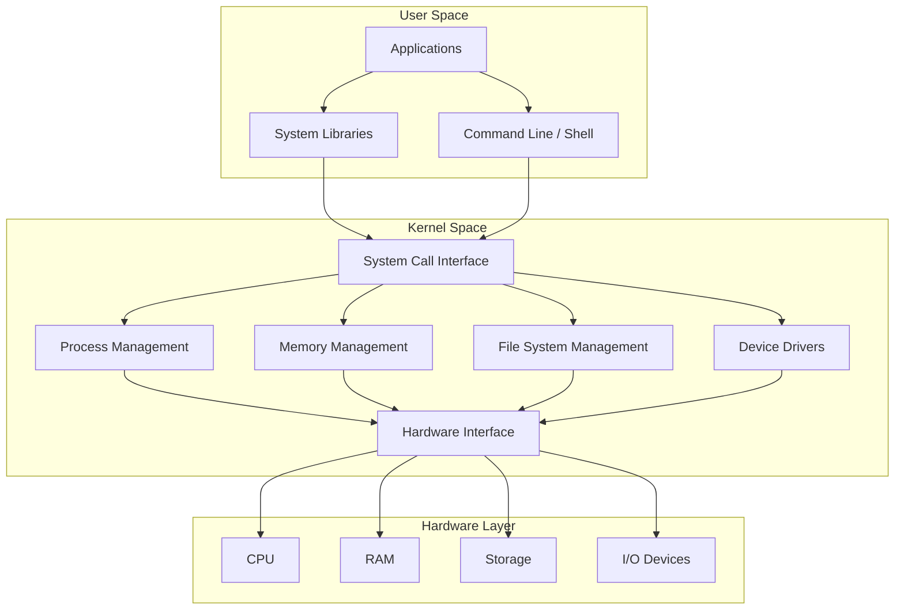
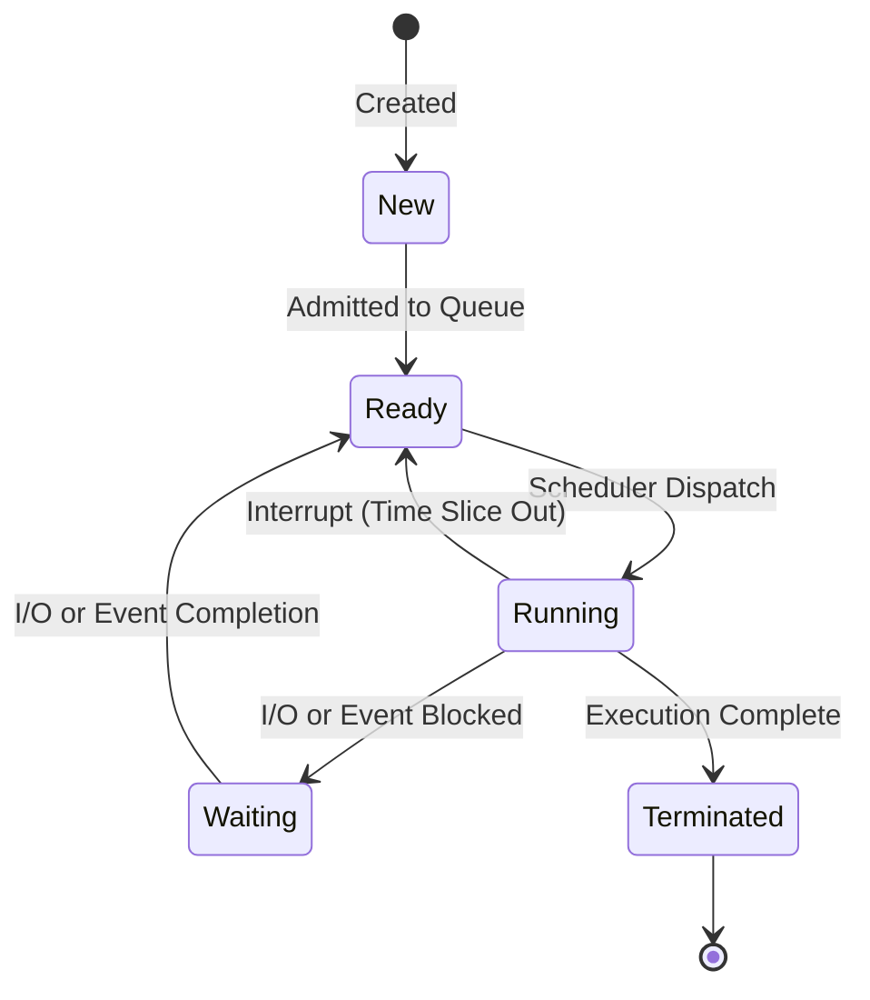

# Operating System Exploration and Implementation

This repository serves as a comprehensive resource and codebase for exploring the fundamental principles, design patterns, and practical implementations of Operating Systems. It is structured to provide a system-level understanding of how software interacts with physical hardware.

---

## Operating System Architecture

The following diagram illustrates the high-level architecture of a typical operating system, separating the User Space from the Kernel Space and showing the interfaces to the physical hardware.



---

## Core Concepts and Learning Paths

The materials and implementations in this repository focus on key functional areas of operating systems:

### Process and Thread Management
Understanding how the CPU is shared among multiple active programs.
*   **Process Lifecycle:** Creation, scheduling, execution, and termination.
*   **CPU Scheduling:** Algorithms such as First-Come-First-Serve, Shortest Job First, Priority Scheduling, and Round Robin.
*   **Concurrency Control:** Semaphores, mutexes, locks, critical sections, and deadlock handling.

### Process State Transitions

The lifecycle of a process as managed by the OS scheduler is outlined in the diagram below:



### Memory Management
How systems manage physical RAM and abstract it for executing programs.
*   **Memory Allocation:** Contiguous allocation, fragmentation, paging, and segmentation.
*   **Virtual Memory:** Demand paging, translation lookaside buffers (TLB), page faults, and page replacement policies (FIFO, LRU, Optimal).

### File Systems and Storage
The organization of persistent storage and interfaces to input/output devices.
*   **Storage Architecture:** Disk scheduling algorithms (SSTF, SCAN, LOOK).
*   **File Allocations:** Contiguous, linked, and indexed allocations.
*   **Device Management:** Buffering, caching, spooling, and device driver routing.

---

## Prerequisites

To effectively navigate and run code in this repository:
*   **Programming Language:** Solid understanding of C or C++.
*   **Computer Organization:** Basic knowledge of CPU registers, RAM, and hardware interrupts.
*   **Development Environment:** POSIX-compliant environment (GNU/Linux, macOS, or WSL on Windows).

---

## Getting Started

To replicate the environment and explore the modules locally:

1. Clone the repository:
   ```bash
   git clone https://github.com/Anshitva7mishra/OperatingSystem.git
   ```
2. Navigate to the project root:
   ```bash
   cd OperatingSystem
   ```
3. Review the source code and instructions in the respective concept folders.

---

## Contributing

Contributions to documentation, optimizations, or additional implementations are welcome.
1. Fork the repository.
2. Create a feature branch.
3. Commit changes with clear, structured messages.
4. Push the branch and submit a pull request.
